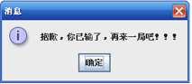

[TOC]

#必做题

##实验1：二分法求函数的根

###函数
$$
f(x) = x^3 -10 x + 23 
$$

###初始值

- $x_{low} = -10.0$
- $x_{high} = 5.0$
- $\delta = 0.001$

###二分法

1. $f(x_{high}) \cdot F(x_{low}) < 0$
2. $x_c = \frac{x_{high} + x_{low}}{2}$ 
3. 当$f(x_c) = 0$时，即得到根值，将$x_c$作为结果输出打印并退出程序
4. 否则，当$f(x_c) \neq 0$时，执行下述步骤$5$或$6$
5. 当$f(x_{high}) \cdot f(x_{c}) < 0$时，$x_{low}= c$
6. 当$f(x_{low}) \cdot f(x_{c}) < 0$时，$x_{high}= c$
7. 当$|x_{high}-x_{low}| \le \delta$时，将$x_c$作为结果输出打印并退出程序，否则执行步骤$2$。

##实验2：求$10,000,000$内最大的素数

###参考程序：求解100以内的全部素数

~~~java
public class PrimeApp {
	public static void main(String[] args) {
		int m, n;// 变量n为要判断的数字
		System.out.println("100以内的素数有：");
		A: for (n = 2; n <= 100; n++) {
			for (m = 2; m < n / 2; m++) {
				if (n % m == 0)
					continue A;
             // 如果能被整除则变量n肯定不是素数，跳出内层循环
			}

			System.out.print(n + " " + "\t");//输出素数
		}
	}
}
~~~

##实验3：K-Means算法实现对数据的聚类分析

K-Means算法的基本思想是初始随机给定K个簇中心，按照最邻近原则把待分类样本点分到各个簇。
然后按平均法重新计算各个簇的质心，从而确定新的簇心。
一直迭代，直到簇心的移动距离小于某个给定的值。

###工作原理是：

~~~
选择K个点作为初始质心(随机选择)
Repeat  
    计算数据集中每个点到各个簇的质心的距离，将数据点分配到距离最近的簇
    重新计算每个簇中所有点的均值并将该均值作为质心  
Until 簇不发生变化或达到最大迭代次数
~~~

- 其中K是用户指定的参数，即所期望的簇的个数。
- 常用的距离度量方法为：欧几里得距离
- 簇的质心都是其均值，即向量各维取平均即可

###Data Sets:

- KMeans_Set.txt
- KMeans_Set2.txt

##实验4：线性回归(Linear Regression)找到最佳拟合直线

在统计学中，线性回归(Linear Regression)是利用称为线性回归方程的最小平方函数对一个或多个自变量和因变量之间关系进行建模的一种回归分析。

设直线方程为
$$
f(x) = A x + B
$$

设数据集为$\{(x_k,y_k)\}_{k=1}^N $ 

误差均值为：

$$E_2(f)^2 = \frac{1}{N} \sum_{k=1}^N (Ax_k + B - y_k)^2$$ 

若
$$
\frac{\partial E (A, B)}{\partial A} = 0
$$
$$
\frac{\partial E (A, B)}{\partial B} = 0
$$
则
$$
0 = \sum_{k=1}^N  (A x_k^2 + B x_k - x_k y_k) = A \sum_{k=1}^N x_k^2 + B \sum_{k=1}^N x_k - \sum_{k=1}^N x_k y_k
$$
$$
0 = \sum_{k=1}^N  (A x_k + B  -  y_k) = A \sum_{k=1}^N x_k + NB - \sum_{k=1}^N y_k
$$
即：
$$
\left(  \sum_{k=1}^N x_k^2 \right) A + \left(  \sum_{k=1}^N x_k \right) B   = \sum_{k=1}^N x_k y_k 
$$
$$
\left(  \sum_{k=1}^N x_k \right) A + N B   =  \sum_{k=1}^N  y_k
$$

最后根据上述两式可以求出$A$和$B$

###Data Sets:

- LR_ex0.txt
- LR_ex1.txt

##实验5：统计学生成绩

###要求：

- 从指定的文本文件读取成绩
- 获取最高成绩和最低成绩
- 计算所有学生的平均成绩
- 分别统计$60$～$69$，$70$～$79$，$80$～$89$，$90～100$分数段的学生人数
- 所有结果要输出到一个文本文件

###Data Sets:

- score.cvs

#选做题

- 至少要选择三道选做题，
- 多做有加分。

##实验6：图形用户界面

###模拟计算器

复习教课书上的模拟计算器的程序例子，并实现该程序

###五子棋的游戏

实验要求：

- 棋盘为10行10列，棋盘底色可自己设定，棋盘格子间有一定间隙。

- 本游戏为单机版，故而为了模拟双方下棋的效果，可一人下棋时显示“O”， 另一人下棋时显示“X”，以示区分并相互交替。并且，一个格子如果已经下过棋子，则不可再改变它上的棋子，即不能再更改其上显示的字符，或者说按钮变得不可用。如下图所示。  

- 游戏规则：
当同一行或同一列或同一条对角线上有连续的五个相同棋子时判 赢。若最终棋盘满了仍未有五个相同棋子连成一线，则判输。若未有这两种情况，则继续下棋。（注：此功能需要一定的算法设计和数据结构知识，如果时间不足，可不做）  

- 无论最终是赢或输，都自动弹出一个消息框，并给出相应的提示，如下图所示。（注：可将本要求简化为，针对棋盘中的某两个特定格子，一个格子单击后弹出成功对话框，一个格子弹出失败对话框）

##实验7：JDBC方式操作数据库

###实现一个简单的信息管理系统

实现如下功能：

- 创建信息表；
- 实现记录的查询，修改，插入，删除；
- 实现记录的统计；
- 纪录数据的导入和导出（Excel文件）

###例如

- 以下例子仅供参考，但必须要完成上述所列的基本功能。
- 可根据实际需要作适当的修改，补充。

####学生信息管理系统

- 创建student表，包含学生的学号、姓名、年龄信息。
- 根据学号，可以查询到学生的姓名和年龄；
- 给定学生的学号、姓名、年龄，在表中追加一行信息；
- 给定学生的学号，可以从表中删除该学生的信息；

####图书信息管理系统

- 创建图书信息表，包含图书的书名、书号、作者、出版日期信息。
- 根据书名，可以查询到图书的书号、作者、出版日期信息；
- 给定图书的书名、书号、作者、出版日期信息，在表中追加一行信息；
- 给定图书的书名，可以从表中删除该图书的信息；

####商品信息管理系统

- 创建商品信息表，包含商品的名称、规格、生产厂商、价格信息。
- 根据商品的名称，可以查询到商品的、规格、生产厂商、价格信息；
- 给定商品的名称、规格、生产厂商、价格信息，在表中追加一行信息；
- 给定商品的名称，可以从表中删除该商品的信息；

##实验8：网络编程基础

实现Java爬虫，抓去设定网站的信息

- 设定一家知名的信息网站，例如百度新闻，今日头条，新浪新闻，网易新闻等，
- 使用InetAddress类的方法获取设定网站的主机的IP地址；
- 获取本地机的名称和IP地址。
- 使用URL类下载首页信息，
- 分析首页信息，进行信息过滤，将新闻报道的正文进行分门别类的整理。

##实验9：二维码的编码和解码

利用开源的QR库，实现一个简单的二维码的编码和解码应用程序。

实现如下基本功能：

- 将输入的一段字符串或URL转换为一幅对应的二维码图片；
- 从一幅输入的二维码图片之中解析出对应的字符串或URL。

参考开源的QR库：
<https://github.com/zxing/zxing>

##实验10：重复文件的查询

实现如下基本功能：

- 设定需要查询的文件目录；
- 在遍历整个文件目录的同时，获取每个文件的MD5 checksum值；
- 若在遍历工程之中若发现有的MD5 checksum值相同的文件时，将两个文件进行对比，确认两个文件是否相同；
- 若判断两个文件相同时，输出结果提示用户两个重复文件的路径以及文件名。

#实验报告的说明

##提交的实验报告格式

- DOC
- PDF（如使用MarkDown或Latex，请转换成PDF）

##实验报告文件名

>学号\_姓名.doc 

或

>学号\_姓名.pdf

##实验报告内容

###学院规定的实验报告封面

###每个实验题目设为单独的一个章节

包括：

- 实验题目

- 问题分析
需要解决的技术问题，以及采用的技术方案

- 实验的具体步骤
开发环境的设定，例如数据库的创建，选用第三方开源库的设定；
类以及数据结构的设计（UML）；
代码开发过程以及测试（必要的截图）

- 实现程序的完整代码

- 实验结果以及总结
运行结果，对应结果的截图
对结果的分析

---

本文档 Github ：
https://github.com/bushehui/Java_tutorial

