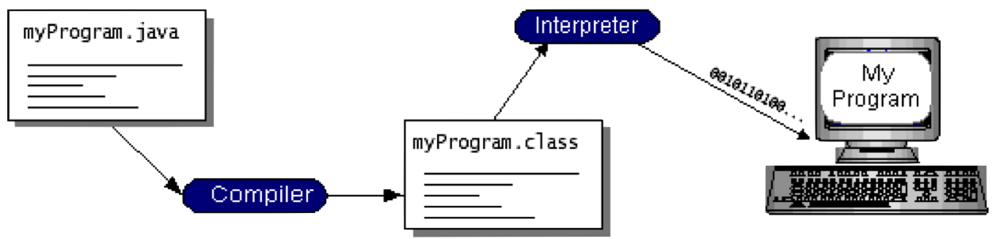
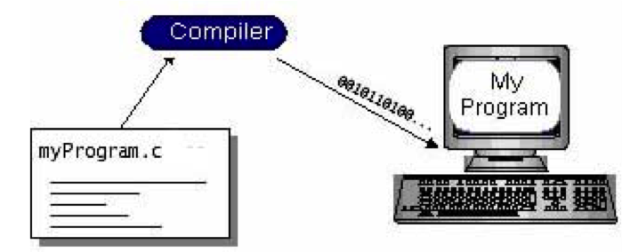
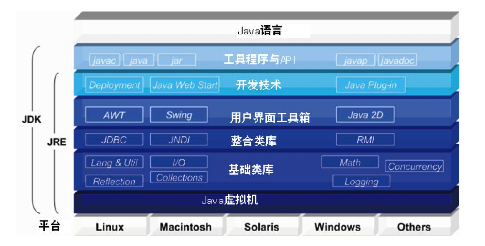
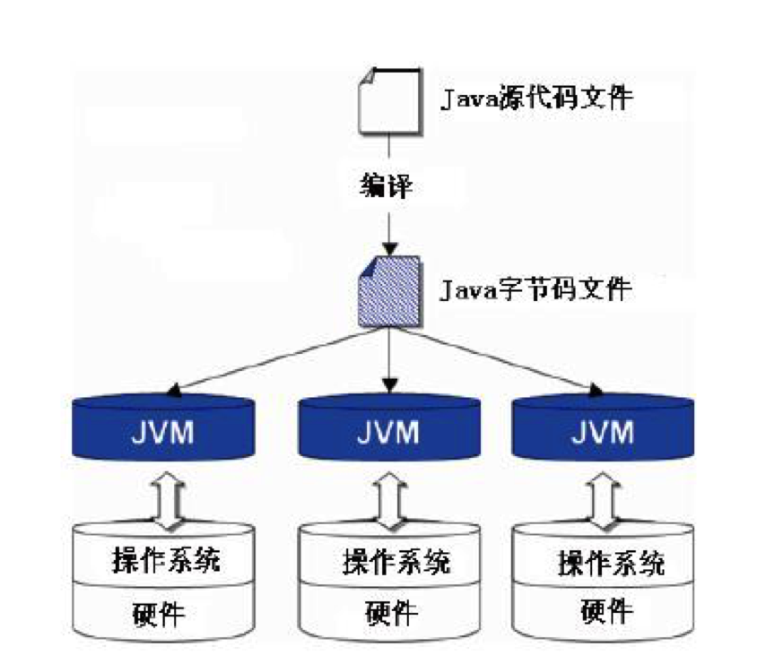
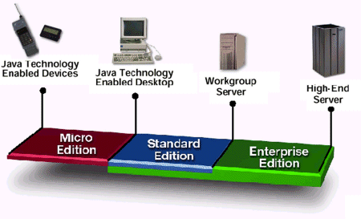

#Java语言概述

[TOC]

##什么是 Java? 
Java是由Sun Microsystems在1995年首先发布的编程语言和计算平台。
Java快速、安全、可靠。从笔记本电脑到数据中心，从游戏控制台到科学超级计算机，从手机到互联网，Java 无处不在！

Java是几乎所有类型的网络应用程序的基础，也是开发和提供嵌入式和移动应用程序、游戏、基于Web的内容和企业软件的全球标准。

Java在全球各地有超过$900$万的开发人员，使您能够高效地开发、部署和使用精彩的应用程序和服务。

- $97\%$的企业桌面运行 Java
- 全球有$900$万Java 开发人员
- 开发人员的头号选择
- 排名第一的部署平台
- 有$30$亿部移动电话运行Java
- $100\%$的蓝光盘播放器附带了Java
- 有$50$亿张Java卡在使用
- $1.25$亿台TV设备运行Java
- 前$5$个原始设备制造商均提供了Java ME

##产生

- __名字的来源__：Java是印度尼西亚爪哇岛的英文名称，因盛产咖啡而闻名。 

<!--Java语言中的许多库类名称，多与咖啡有关，如JavaBeans(咖啡豆)、NetBeans(网络豆)以及ObjectBeans (对象豆)等等。-->

- __标识__: 一杯正冒着热气的咖啡。 

- 发展历史： 

Time| Event
:------------ |:------------- 
1995年5月23日  | Java语言诞生
1996年1月21日  | JDK-JDK1.0诞生
1997年2月18日  | JDK1.1发布
1998年12月8日  | JAVA2企业平台J2EE发布
1999年6月      | SUN公司发布Java的三个版本：标准版（J2SE）、企业版（J2EE）和微型版（J2ME）
2000年5月8日   | JDK1.3发布
2000年5月29日  | JDK1.4发布
2001年9月24日  | J2EE1.3发布
2002年2月26日  | J2SE1.4发布，自此Java的计算能力有了大幅提升2004年9月30日  | J2SE1.5发布，更名为Java SE 5
2006年12月11日 | Java SE 6发布
2011年7月28日  | Java SE 7发布
2014年3月28日  | Java SE 8发布

- 2006年SUN在JavaOne公布Java 开放源代码项目，并推出__OpenJDK__项目。

- James Gosling（詹姆斯·戈士林）

Java编程语言的共同创始人之一，一般公认他为“Java之父”。
<https://en.wikipedia.org/wiki/James_Gosling>

<!--Scott McNealy（司考特·麦克尼利）-->

##为何选择Java

- Java已由专业的 Java 开发人员、设计师和爱好者团体进行测试、完善、扩展和验证。
-  Java 旨在竭尽所能为最广泛的计算平台开发可移植的高性能应用程序。通过使应用程序在异构环境之间可用，企业可以提供更多的服务，提高最终用户生产力并加强沟通与协作，从而显著降低企业和消费类应用程序的拥有成本。

### Java 是开发人员的无价之宝：

- 在一个平台上编写软件，然后即可在几乎所有其他平台上运行
- 创建可在 Web 浏览器中运行并可访问可用 Web 服务的程序
- 开发适用于在线论坛、存储、投票、HTML 格式处理以及其他用途的服务器端应用程序
- 将采用 Java 语言的应用程序或服务组合在一起，构成高度定制的应用程序或服务
- 为移动电话、远程处理器、微控制器、无线模块、传感器、网关、消费产品及几乎其他任何电子设备编写强大而高效的应用程序

SUN对Java语言的解释是：<mark>Java编程语言是个简单、面向对象、分布式、解释性、健壮、安全与系统无关、可移植、高性能、多线程和动态的语言</mark>

##语言的特点

- 1、__简单__ 
Java语言的语法与C和C++语言很接近，使得大多数程序员很容易学习和使用Java。另一方面，Java丢弃了C++ 中很少使用的、很难理解的、令人迷惑的那些特性，如操作符重载、多继承、自动的强制类型转换。特别地，Java语言不使用指针，并提供了自动的垃圾回收机制，使得程序员不必为内存管理而担忧。

- 2、__面向对象__ 
Java语言提供类、接口和继承等原语，为了简单起见，只支持类之间的单继承，但支持接口之间的多继承，并支持类与接口之间的实现机制（关键字为implements）。Java语言全面支持动态绑定，而C++ 语言只对虚函数使用动态绑定。总之，Java语言是一个纯的面向对象程序设计语言。

- 3、__分布式__ 
Java语言支持Internet应用的开发，在基本的Java应用编程接口中有一个网络应用编程接口（java.net），它提供了用于网络应用编程的类库，包括URL、URLConnection、Socket、 ServerSocket等。Java的RMI(远程方法激活)机制也是开发分布式应用的重要手段。 

- 4、__健壮__ 
Java的强类型机制、异常处理、自动垃圾回收等是Java程序健壮性的重要保证。对指针的丢弃是Java的明智选择。Java的安全检查机制使得Java更具健壮性。
- 5、__安全__ 
Java通常被用在网络环境中，为此，Java提供了一个安全机制以防恶意代码的攻击。除了Java语言具有的许多安全特性以外，Java对通过网络下载的类具有一个安全防范机制（类ClassLoader），并提供安全管理机制（类SecurityManager）让Java应用设置安全哨兵。 

- 6、__体系结构中立__ 
Java程序（后缀为java的文件）在Java平台上被编译为体系结构中立的字节码格式（后缀为class的文件）, 然后可以在实现这个Java平台的任何系统中运行。这种途径适合于异构的网络环境和软件的分发。 

- 7、__可移植__ 
这种可移植性来源于体系结构中立性，另外，Java还严格规定了各个基本数据类型的长度。Java系统本身也具有很强的可移植性，Java编译器是用Java实现的，Java的运行环境是用ANSI C实现的。

- 8、__解释型__ 
如前所述，Java程序在Java平台上被编译为字节码格式， 然后可以在实现这个Java平台的任何系统中运行。在运行时，Java平台中的Java解释器对这些字节码进行解释执行，执行过程中需要的类在联接阶段被载入到运行环境中。 

- 9、__高性能__ 
与那些解释型的高级脚本语言相比，Java的确是高性能的。事实上，Java的运行速度随着JIT(Just-In-Time)编译器技术的发展越来越接近于C++。 

- 10、__多线程__ 
在Java语言中，线程是一种特殊的对象，它必须由Thread类或其子（孙）类来创建。

- 11、__动态__ 
Java语言的设计目标之一是适应于动态变化的环境。Java程序需要的类能够动态地被载入到运行环境，也可以通过网络来载入所需要的类。这也有利于软件的升级。另外，Java中的类有一个运行时刻的表示，能进行运行时刻的类型检查。

##与C/C++语言的异同

### 类似
- Java编程语言的风格十分接近C++语言。
- 继承了C++语言面向对象技术的核心，

### 区别
- 舍弃了C++语言中容易引起错误的指针，改以引用取代，
- 移除原C++与原来运算符重载，也移除多重继承特性，改用接口取代，增加垃圾回收器功能。

<!--在Java SE 1.5版本中引入了泛型编程、类型安全的枚举、不定长参数和自动装/拆箱特性。-->

### 开发步骤
#### Java程序开发步骤（编码，编译，解释，执行 ）

#### C/C++程序开发步骤（编码，编译，执行 ）

##运行环境与开发环境

###JRE(Java Runtime Environment)
如果只想运行别人的Java程序可以只安装Java运行环境(Java Runtime Environment，JRE),
JRE由Java虚拟机(Java Virtual Machine，JVM)、Java的核心类、以及一些支持文件组成。

不包含开发工具(JDK)--编译器、调试器和其它工具。

###Java Virtual Machine(JVM)
- Java虚拟机
- Java的核心和基础，在java编译器和os平台之间的虚拟处理器。
- 是一种基于下层的操作系统和硬件平台并利用软件方法来实现的抽象的计算机，可以在上面执行Java的字节码程序。
- 不同的操作系统有不同的虚拟机。

- Java编译器只需面向JVM，生成JVM能理解的代码或字节码文件。Java源文件经编译器，编译成字节码程序，通过JVM将每一条指令翻译成不同平台机器码，通过特定平台运行。

- JVM是Java程序运行的容器,但是他同时也是操作系统的一个进程,因此他也有他自己的运行的生命周期,也有自己的代码和数据空间。

####Java字节代码运行的两种方式:

－ Interpreter(解释方式)

－ Just-in-time(即时编译):有代码生成器将字节代码转换成本机的机器代码，然后可以以较高速度执行.

####任务

－ 提供垃圾回收功能
－ 提供运行时环境
－ 提供中立的体系结构

---

###JDK(Java Development Kit)

JDK(Java Development Kit)是Java语言的软件开发工具包(SDK)。

##### SE(J2SE)，

- Standard Edition，标准版，是我们通常用的一个版本，从JDK 5.0开始，改名为Java SE。 

- J2SE(Java 2 Standard Edition)，商业版本，包含那些构成Java语言核心的类，定位在客户端，主要用于桌面应用的编程；

##### EE(J2EE)，

- Enterprise Edition，企业版，使用这种JDK开发J2EE应用程序，从JDK 5.0开始，改名为Java EE。 
- J2EE(Java 2 Platform Enterprise Edition)，平台企业版，是一套全然不同于传统应用开发的技术架构，核心是一组技术规范与指南；

##### ME(J2ME)，

- Micro Edition，主要用于移动设备、嵌入式设备上的java应用程序，从JDK 5.0开始，改名为Java ME。 
- J2ME(Java 2 Platform Micro Edition)，嵌入式设备及消费类电器版，又称为Java 2 微型版。

没有JDK的话，无法编译Java程序，如果想只运行Java程序，要确保已安装相应的JRE。

####JDK的基本组件包括：

- javac – 编译器，将源程序转成字节码
- jar – 打包工具，将相关的类文件打包成一个文件
- javadoc – 文档生成器，从源码注释中提取文档
- jdb – debugger，查错工具
- java – 运行编译后的java程序（.class后缀的）
- appletviewer：小程序浏览器，一种执行HTML文件上的Java小程序的Java浏览器。
- Javah：产生可以调用Java过程的C过程，或建立能被Java程序调用的C过程的头文件。
- Javap：Java反汇编器，显示编译类文件中的可访问功能和数据，同时显示字节代码含义。
- Jconsole: Java进行系统调试和监控的工具

####常用的包
- java.lang： 这个是系统的基础类，比如String等都是这里面的，这个包是唯一一个可以不用引入(import)就可以使用的包。
- java.io： 这里面是所有输入输出有关的类，比如文件操作等。
- java.nio：为了完善io包中的功能，提高io包中性能而写的一个新包 ，例如NIO非堵塞应用
- java.net: 这里面是与网络有关的类，比如URL，URLConnection等。
- java.util： 这个是系统辅助类，特别是集合类Collection，List，Map等。
- java.sql： 这个是数据库操作的类，Connection， Statement，ResultSet等。
- javax.servlet：这个是JSP，Servlet等使用到的类。

---

###Eclipse

一款非常受欢迎的Java开发工具，用它开发Java的人员是最多的。
<http://www.eclipse.org>

- Eclipse是一种可扩展的跨平台开源集成开发环境(IDE)。

- 最初主要用来Java语言开发，目前亦有人通过插件使其作为C++、Python、PHP等其他语言的开发工具。

- 历史: 
2001年11月，IBM公司捐出价值4,000万美元的源代码组建了Eclipse联盟，并由该联盟负责这种工具的后续开发。集成开发环境(IDE)经常将其应用范围限定在“开发、构建和调试”的周期之中。为了帮助集成开发环境(IDE)克服目前的局限性，业界厂商合作创建了Eclipse平台。Eclipse允许在同一IDE中集成来自不同供应商的工具，并实现了工具之间的互操作性，从而显著改变了项目工作流程，使开发者可以专注在实际的嵌入式目标上。
- 特点: 
能接受由Java开发者自己编写的开放源代码插件，这类似于微软公司的Visual Studio和Sun公司的NetBeans平台。
Eclipse为工具开发商提供了更好的灵活性，使他们能更好地控制自己的软件技术。

###Java程序分成三类:

- Application(应用程序)
- Applet（小应用程序）
- 特定的程序

####Java Application(应用程序)

- 独立的Java程序

- 在计算机中单独运行

- 程序入口方法: 

~~~java
public static void main(String[] args) { 
	… 
}
~~~

####小应用程序－Java Applet

- 嵌在HTML网页中运行
- 特定标记

~~~xml
<APPLET CODE="HelloWorld.class" WIDTH=150 HEIGHT=25> </APPLET>
~~~
- 在Web浏览器中运行(内嵌Java虚拟机)

####特定的程序

Servlet(服务器端小程序),EJB等
Servlet是运行在服务器端的小程序，它可以处理客户传来的请求（request），然后传给客户端（response）。

##“Hello Word!"程序

~~~java
class HelloWorldApp {
    public static void main(String[] args) {
        System.out.println("Hello World!"); // Prints the string to the console.
    }
}
~~~

###main方法(main Method)
每个Java应用程序==必须有且只能有的一个main方法，它是程序执行的入口，运行时被虚拟机自动执行==

#### main方法的声明格式是固定的，
- main方法必须声明为public
- main的参数必须为String对象的数组
- main方法必须为static

#### 类的名字必须和文件名相同。

#### 文件中必须存在某个类与该文件同名，
- 且这个类必须包含一个名为__main()__的方法

###Return关键字：

- 1、代表“已经做完，离开此方法”；
- 2、如果此方法产生了一个值，这个值要放在return语句后面。

<mark>如果不想返回值，可以指示此方法返回void（空）</mark>。

###static关键字
当声明一个事物是static时，就意味着这个域或方法不会与包含它的那个类的任何对象实例关联在一起。
因此，即使从未创建某个类的任何对象，也可以调用其static方法或访问其static域。
只须将static关键字放在定义之前，就可以将字段或方法设定为static。

####引用static方法：

- 1、通过对象引用；
- 2、通过类名直接引用。

static方法的一个重要用法是:__在不创建任何对象的前提下就可以调用它。__
这一特点对定义main()方法很重要，这个方法是运行一个应用时的入口点。

####引用static变量的方法与引用static方法相似

- 1、通过对象引用；
- 2、通过类名直接引用。

<mark>使用类名引用static变量是首选方式，不仅强调了变量的static结构，而且还为编译器优化提供了机会。</mark>

###常犯的错误

- 声明一个类的关键字__class__，写成了__Class__，要注意大小写。

- 声明main方法时，方法修饰符没有严格按照__public static void__的顺序, 并且其参数是一个字符串数组__String[]__ 

- 大小写问题，例如把main方法的参数args的类型String[]，改成了string[],把System写成了system。
>'JAVAC' is not recognized as an internal or external command,operable program or batch file.

解释：编译错误。包含javac.exe编译器的路径变量设置不正确，操作系统无法发现该执行文件。

- 类名和文件名不能保持一致。如：
>HelloWorldApp.java:5: class HelloWorldApp is public, should be declared in a file named HelloWorldApp.java
>       public class HelloWorldApp{

解释：	编译错误。当一个类被“public”修饰时，包含这个类的文件名应该和该类名完全一致。

- 不能发现需要执行的类。如：
> Exception in thread "main" java.lang.NoClassDefFoundError: HelloWorldApp 

解释：运行错误。有时即使该类的字节码文件就在当前目录下，也会报这种错误。这种错误的主要原因是由于没有为运行时环境提供正确的类加载说明，详细说明请参阅附录。

###编码风格：

- 类名的首字母要大写。

- 如果类名由几个单词构成，那么把它们并在一起，其中每个内部单词的首字母都大写。（驼峰风格）

- 变量、方法以及对象引用名称等，编码风格与类风格类似，只是标识符的第一个字母采用小写。

- 注意： 
public修饰的类名称必须与包含它的Java源程序文件名一致 

大小写敏感

<!--Java程序的基本结构-->

##参考资料

###书籍
- Thinking in Java
- Java参考大全J2SE 
- Core Java 2

- JDK1.7版的Java核心API文档<http://docs.oracle.com/javase/7/docs/api>

<!--J2SE 说明文档 http://java.sun.com/javase/6/docs-->

###搜索引擎
- Google
- Baidu
- bing

###Java技术论坛
- <http://docs.oracle.com/javase/index.html>
- <http://www.javaworld.com>
- <http://www.javaeye.com>
- <http://www.csdn.net>

- <https://github.com>

####马士兵java视频教程
从Java的背景知识讲起，包括JDK安装、开发环境搭建到编程基础知识！
<http://www.bjsxt.com/2014/down_0425/13.html>

<!--http://study.163.com/course/introduction/342010.htm#/courseDetail-->

---

本文档 Github ：
https://github.com/bushehui/Java_tutorial

