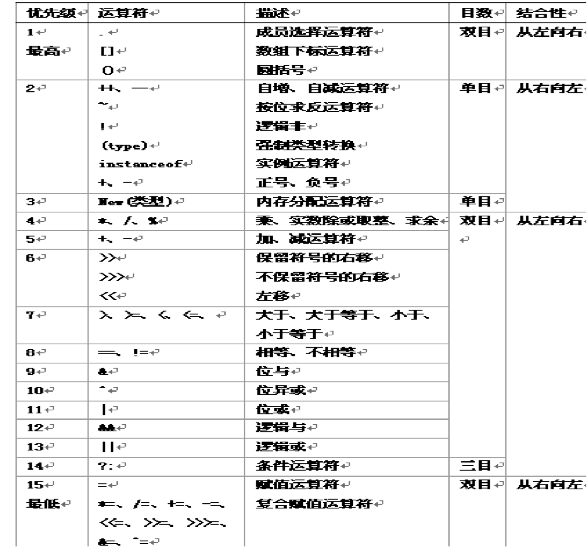

#认识程序

[TOC]

##什么是程序？

有一个著名的公式说:

>==__程序=数据结构+算法__==

##什么是数据结构？

- 简单的数据结构就是众所周知的整型、实型这样的数据表示，
- 复杂的数据结构可以是由简单的数据结构组合而成，如数组。

##什么是算法？

算法就是用什么样的==方法==处理给定的数据从而得到所需的结果。

- 例如, 圆面积的计算公式为：

$$area = \pi \times r^2$$

其计算过程如下所示：

~~~java
// 程序:一个计算圆面积的程序
public class ComputeArea {
	public static void main(String[] args) {
		int r = 10;
		double area=3.14*r*r;
		System.out.println(area);
	}
}
~~~

---

#数据类型，变量和常量

##标示符

为程序中的各个元素(类、对象、方法、变量、常量、接口和自定义数据类型)进行命名。

- 以字母"A~Z"，以及"a~z"、下划线"\_"、==美元符号"\$"开始==
- 后面可以跟字母、下划线、美元符号、数字等字符 
- 第一个字符不能是数字
- 使用Unicode字符集 (编号大于0xC0的所有Unicode字符)
- ==大小写敏感==
- 没有最大长度的限制(C++有长度限制:32字符)
- 不能和Java关键字和保留字相同

为增强程序可读性，Java作如下的约定：

- __类、接口__：通常使用名词，且每个单词的首字母要大写
- __方法__：通常使用动词，首字母小写，其后用大写字母分隔每个单词
- __常量__：全部大写，单词之间用下划线分隔
- __变量__：通常使用名词，首字母小写，其后大写字母分隔每个单词，避免使用\$符号。

Example：

|||||||||
|----|----|----|----|----|----|----|----|
|Body|\_test|if|hello|5Test|int|hello\*|world\#|
|class|static|from#12|my-Boolean|jack&rose|G.U.I|classe|2ndObj|

注意：

==在中文环境下，可以使用汉字作为标识符。==

例如，

>int 中文=5； 

<!--
凡是:
	
- Character.isJavaIdentifierStart()返回true，都可作为首字符
- Character.isJavaIdentifierPart()返回true，都可作为标识符的一部分
-->

##关键字

- 关键字(Key Word)是Java事先定义的，有特别意义的标识符，有时又叫==保留字(Reserved Word)==。 
Java的关键字对Java的编译器有特殊的意义，他们用来表示一种数据类型，或者表示程序的结构等，关键字不能用作变量名、方法名、类名、包名和参数。

类型|关键字
------------- | -------------
数据类型的关键字 | byte, short, int, long, float, double, char, boolean
流程控制语句的关键字 | if, else, switch, case, default, do, while, for, break, continue
方法、类型、变量的修饰关键字 | private, public, protected, final, static, abstract, synchronized, volatile
异常处理的关键字 | try, catch, finally, throw, throws
对象相关的关键字 | new, extends, implements, class, instanceof, this, super
字面值常量的关键字 | false, true, null
方法相关的关键字 | return, void
包相关的关键字 | package, import

- Java有50个关键字 
- Java语言规定关键字不能作为标识符。
- ==所有的关键字都是小写的==。 
如果被大写，就不是关键字了。
- "__const__"和"__goto__"这两个关键字在Java语言中并没有具体含义。
Java语言把它们列为关键字，只是因为"__const__"和"__goto__"是其他某些计算机语言的关键字。
- ==true==和==false==不是关键字 
- 对象值==null==也没有列入关键字，但是不能把它们派作其它用途。
- 还有些关键字，如cast、future、generic、inner、operator、outer、rest、var等都是Java保留的没有意义的关键字。 

具体请上网检索: "==Java关键字大全=="

Example：

下列哪个是关键字：

- NULL 
- new 
- instanceOf 
- wend

##分隔符

分隔符(separators)用于区分Java语言程序中的基本语法成分即单词符号。

分隔符包括：
- 空白符(white space)，
- 注释
- 普通分隔符

空白符包括:
- 空格(SP, space)，
- 制表符('\t',Tab键)
- 走纸换页('\f')，
- 回车('\r')和换行('\n')。

回车和换行顺序连在一起也成为行结束符。 
Java语言中单个空白符与多个空白符的作用是一样的。

普通分隔符具有确定的语法含义，
- 圆括号"()" -- 用于方法参数
- 花括号"{}" -- 用于定义类体，方法体，块语句和数组的初始化
- 方括号"[]" -- 用于数组下标
- 分号";" -- 语句的结束标志
- 逗号"," -- 分隔方法的各个参数，分隔变量说明的各个变量
- 点"." -- 用于获得对象的属性和方法
- 冒号":" -- 用于语句标号

##数据类型

Java是一种：
- 静态类型语言，每个变量和表达式在编译时都已经知道其类型。
- 强类型语言，类型限定了取值和可能的运算符，有助于编译时检查程序的有关错误。

数据类型规定一类数据的数据位长度，取值范围，以及对该类数据所能进行的操作。

###Java 提供两种不同的类型：
__基本类型（Primitive Type）__（或__内置类型__）和__引用类型（Reference Type）__（或__组合类型__）。

####Java的基本数据类型

- 基本类型的变量在堆栈(stack)中直接包含其数据，每个变量都有自己的数据副本，因此对变量的操作不影像另一个变量。
- 一般适合存储少量数据，可以实现高效处理。
- 预先定义的，都有固定的数据位，不随运行平台的变化而变化。

- Java为每个基本类型提供了封装类。

####Java的引用类型

- 都是用类或对象实现的。
- 引用类型的变量在堆栈(stack)中存储数据（对象）的引用（地址），数据（对象）存储在堆（Heap）中。
对于引用类型，两个变量可能引用同一个对象，因此对一个变量的操作可能影响另一个变量所引用的对象。

###Java的基本数据类型有8种：

- byte(字节)、short(短整型)、int(整数型)、long(长整型)、
- float(单精度浮点数类型)、double(双精度浮点数类型)、
- char(字符类型)、
- boolean(布尔类型)

类型|类型定义|字节数|取值范围|举例
:---|:---|:---|:---|:---
byte|整数|$1$| $-2^7$~$2^7$|$-128,54$,$127$
short|整数|$2$|$-2^{15}$~$2^{15}$|$1348$,$6543$
int|整数|$4$|$-2^{31}$~$2^{31}$|$0$,$-10000$,$345678$
long|整数|$8$|$-2^{63}$~$2^{63}$|$987657897$,$-12$
float|实数|$4$|$-1.4 \times 10^{－45}$~$3.4\times 10^{38}$|$23.987$,$87F$
double|实数|$8$|$-4.9\times 10^{－324}$~$1.79\times 10^{308}$|$2.0231$,$0.456D$
char|16位Unicode字符|$2$|'\u0000'～'\uffff'|400,A,z,x,-23
boolean|布尔值|无明确规定|true ，false	 

- Java语言没有无符号数，所有数值类型（byte、short、int、long）都是有符号数，有时将char看作$16$位无符号数进行运算。
- void类型仅在定义一个方法的返回值类型时才可能用到，表示该方法无返回值，不用于定义变量。
- java.lang包中提供了与基本数据类型相对应的Boolean、Integer、Long、Float、Double的定义的类，目的是为了加强对基本数据类型的处理能力。 
==注意区别String、Boolean、Integer、Long、Float、Double与基本数据类型的不同==
- java.lang包中提供了String数据类型，用来表示字符串。

For Example: 

- __int__是Java的原始数据类型
- __Integer__是Java为__int__提供的封装类

####整型
可以用来给整型变量赋值，可以用十进制、八进制和十六进制来表示。

- (1) ==十进制整型常量==由$0$至$9$的数字组成，没有前缀，不能以$0$开始，没有小数部分。 
例如：124，-36等。
- (2) ==八进制整型常量==，以$0$为前缀，其后由$0$到$7$的数字组成，没有小数部分。 
例如：0332，-0122等。
- (3) ==十六进制整型常量==，以$0x$或$0X$为前缀，其后由$0$到$9$的数字和$A$到$F$(大小写均可)字母组成，没有小数部分。 
例如：0x3A，－0X43f等。

<!--
 (4) JDK7.0版本中还可以使用二进制整型常量。二进制整型常量是以0b或0B为前缀，其后由0、1组成，没有小数部分，如0b110、0B1010等。
-->

~~~java
int max_loop;
int max_loop=5;
~~~

####浮点型

- (1) 十进制小数表示法，它是由整数部分和小数部分组成的。 
如：4.0 ，33.32等。小数点两边的数字不能同时省略且小数点不能省略。
- (2) 科学计数法表示，它常用来表示很大或很小的数，如$1.2 \times 10^{26}$在Java中表示为$1.2E26$。 表示方法是在小数表示法后加$e$(或$E$)及指数部分。 但要注意，==$e$(或$E$)前面必须有数字，指数部分可正可负，但都是整数(正号可省略)==。 
例如，4.2E-5， 3e6 

####布尔型
- 值只有 __true__ (表示“逻辑真”) 和 __false__ (“逻辑假”)
- __true__和__false__必须要小写
- 独立类型，不应对任何整数，不能进行整数运算

注意：

- （1）和C/C++不同，在Java中不能认为“非0值”是__true__，“0值”是__false__
- （2）布尔型不能转换成任何其他数据类型

~~~java
boolean truth = true; //声明一个布尔类型的变量，并初始化其值为truth
~~~

####字符

- 采用Unicode[^1]字符集的编码方案，是16位的无符号整数，占2个字节
- 表示的字符从'\u0000'～'\uffff'。
- 字符型分为==一般字符==和==转义字符==
- 对于可输入字符，用单引号将字符括起来，如‘a’, ‘A’, ‘我’等。对于不可输入字符，采用转义字符表示

[^1]: Unicode字符集定义了一套国际标准字符集。通常的ASCII码是8位的，而Unicode字符集中的每个字符占16位，即2个字节，整个字符集共包括65536个字符，兼容ASCII，排在Unicode字符集最前面的256个字符就是ASCII码。Unicode除了可以表示256个ASCII码外，还可以表示汉字、拉丁语、希腊字母、朝鲜语等。 详细资料请参见官网<http://www.unicode.org>

转义字符 | 含义
:------ | :------
\b | 退格(backspace) 
\t | 水平制表(tab) 
\f | 走纸换页，只对打印有效 
\n | 换行
\r | 回车 
\\\\ | 反斜线 
\' | 单引号 
\\" | 双引号 
\ddd| 1~3位八进制数所代表的ASCII字符
\uxxx| 1~4位十六进制数所代表的Unicode字符，从'\u0000'～'\uffff'可表示所有的Unicode字符，其中字母u可以任意多个连续

- 本质上是整数，可以参与整数运算。

####字符串

- 用双引号("")括起来的一串字符序列，字符串常量中可以包括转义字符。
- 并不是Java的基本数据类型，它是Java提供的位于java.lang包中的String类，字符串常量就是字符串类java.lang.String类的一个对象，故它可以使用类String中的方法，所有字符串常量值都用双引号括起来。
- 需要注意的是__null__可以简单视为一个引用类型的常量值，表示不引用任何对象。 
在Java编码规范中，规定__null__是所谓__null__类型的唯一值，且规定__null__可转换到任何引用类型。 

"+"可以用作为字符串的连接符

例：

>”Hello”+ “World” 
>"hello "+ name 
>"hello" + "张华" 
>"string is "+5+5  等价于"string is 55" 
>5+5+" is a string" 等价于"10 is a string" 

~~~java
System.out.println(6+7+’A’);   //78
System.out.println(6+7+”A”);   //13A
System.out.println(6+”A”+7);   //6A7
~~~

#####字符串常量

- 字符串常量是一个用双引号("")括起来的字符序列。 
如："This is a string literal" 
- 字符串常量中可以包含一些不能从键盘上输入的字符，这涉及到字符转义。 
例如："This is a \u03c0" 实际上就是 "This is a $\pi$"  

#####字符串对象

- 字符串常量和字符串对象是两个不同的概念
- 字符串常量在内存中由编译器分配到特定的区域，保存有字符序列。
- 字符串对象只是一个引用，不能通过字符串对象对常量进行修改 

~~~java
String str="This is a string literal";
str="This is other string literal";
~~~

声明字符串对象

~~~java
String str;    //声明了一个未初始化的变量
String str=null;   //初始化为空值
String str="hello";  //声明时同时进行初始化
String str=new String("hello");
~~~

#####字符串的串值比较__

字符串之间的比较主要有两种情况，值比较和对象比较。
值比较主要比较两个字符串的字符序列。 

~~~java
public class StringDemo {
	public static void main(String[] args) {
		String s1="Morning!";
		String s2="morning!";
		boolean eq=s1.equals(s2);
		System.out.println("\"Morning\".equals(\"morning\")结果是"+eq);
		int res=s1.compareTo(s2);
		System.out.println("\"Morning\".compareTo(\"morning\")结果是"+res);
	}
}
~~~

####引用类型

- 除去基本类型之外的所有类型都是引用类型；
- 引用对象的变量就是引用变量。

__例__ :

创建一个新的Card类型

~~~java
public class Card  ｛
      char suit;
      String rank; 
｝
~~~

声明一个变量

~~~java
Card  c = new Card(); 
~~~

访问成员

~~~java
c.rank = “K”;
~~~

#####包装类

基本类型|包装类名
:---|:---
byte|Byte
short|Short
int|Integer
long|Long
float|Float
double|Double
char|Character
boolean| Boolean

- 作为基本数据类型对应的类，方便涉及对象的操作
- 包含基本类型的相关属性（包括最大值和最小值）以及相关的操作方法

~~~java
int n = 10;
Integer in = new Integer(n);
~~~

---

##常量
__常量__：
- 字面常量(Literals)
- 程序运行过程中保持不变，并且不可进行修改的量。

###直接常量
也称为值常量，如12、-33、15.6；

####整型常量（byte、short、int、long）
可以用来给整型变量赋值，可以用十进制、八进制和十六进制来表示。

- (1) 十进制整型常量由0至9的数字组成，没有前缀，不能以0开始，没有小数部分。例如：124，-36等。
- (2) 八进制整型常量，以0为前缀，其后由0到7的数字组成，没有小数部分。例如：0332，-0122等。
- (3) 十六进制整型常量，以0x或0X为前缀，其后由0到9的数字和A到F（大小写均可）字母组成，没有小数部分。例如：0x3A，－0X43f等。
- (4) JDK7.0版本中还可以使用二进制整型常量。二进制整型常量是以0b或0B为前缀，其后由0、1组成，没有小数部分，如0b110、0B1010等。

####浮点型常量
有两种表示方式：
- (1) 十进制小数表示法，它是由整数部分和小数部分组成的。如：4.0 ，33.32等。小数点两边的数字不能同时省略且小数点不能省略。
- (2) 科学计数法表示，它常用来表示很大或很小的数，如1.2×1026在Java中表示为1.2E26。表示方法是在小数表示法后加e（或E）及指数部分。但要注意，e（或E）前面必须有数字，指数部分可正可负，但都是整数（正号可省略）。例如，4.2E-5，3e6等。 

####布尔型常量
- 值只有true和false，true和false必须要小写。
- true表示“逻辑真”，false表示“逻辑假”。
- 和C/C++不同，在Java中不能认为“非0值”是true，“0值”是false。
- 不能转换成任何其他数据类型。

####字符型常量
- Java中的字符采用Unicode字符集的编码方案，是16位的无符号整数，占2个字节，表示的字符从0～65535。 Unicode字符集可以支持各类文字的字符。 
- 字符型常量分为一般字符常量和转义字符常量。对于可输入字符，用单引号将字符括起来，如‘a’, ‘A’, ‘我’等。对于不可输入字符，采用转义字符表示。

####字符串常量
- 字符串常量是用双引号括起来的一串字符序列，字符串常量中可以包括转义字符。
- 字符串并不是Java的基本数据类型，它是Java提供的位于java.lang包中的String类，字符串常量就是字符串类java.lang.String类的一个对象，故它可以使用类String中的方法，所有字符串常量值都用双引号括起来。

####null常量
- 可以简单视为一个引用类型的常量值，表示不引用任何对象。
- 在Java编码规范中，规定null是所谓null类型的唯一值，且规定null可转换到任何引用类型。 

###符号常量

需要明确定义。

Java语言中使用关键字__final__来定义符号常量，如下所示：

~~~java
final double PI=3.1415926;// 声明同时初始化
final int MAX_LOOP;//先声明，随后初始化

...

MAX_LOOP=5
~~~

注意：==符号常量实质上是一种特殊的变量==，也是占用内存空间的，不同于C语言编译预处理定义的宏。 

==作为一种良好的编码习惯，常量名的定义一般均用大写来表示。==

##变量

- 用来存放数据且其值可以改变的量称为变量。 
- 每一个变量对应一个内存单元，它代表程序要处理的数据。
- 变量的使用原则是“先声明后使用”。 
==访问一个未经初始化的局部变量，将导致编译错误。==

Java语言中把变量分为4种类型，分别是：

- 实例变量（非静态变量）
- 类变量（静态变量）
- 局部变量
- 参数

其中实例变量和类变量是类中定义的数据成员。
在方法的定义体中定义的变量为局部变量，方法头部小括号中的变量称为参数。

变量具有四个元素，分别是__名字__、__类型__、__值__和__作用域__。

####变量名

- 每个变量都要有一个名字，变量名必须是合法的标识符，并且最好具有一定的意义，有意义的变量名可以提高程序的可读性。
- 变量名中的大小写字母是不等价的
- 建议变量名不要以\_和\$打头，一般情况下变量名中不会使用\$符号。
- 变量名中不能包含空白符。空白符包括空格、回车、换行和水平制表符(Tab键)等符号

####变量的定义
- 所有变量在使用之前必须被定义，变量定义是一种指定变量名称与数据类型的程序语句。
- 变量在使用过程中不能更改其数据类型。
- 变量定义的格式如下：

>数据类型关键字  变量名[ = 初始值];

例：

~~~java
// x为基本整型
int x;

// y为浮点数（单精度），并且赋给初始值3.14
float y=3.14;

// 可以在一个语句中声明多个同一类型的变量
long area,width,length;
~~~

####变量的赋值有两种方式：
- （1）在Java中定义变量后，给该变量赋值。
- （2）变量的初始化：在定义变量的同时给变量赋初值，如

>int i = 3;。

局部变量不能没有初始值，否则无法通过编译。
如下面的代码段在编译时会出错。

~~~java
void f(){
   int x;
   x = x + 1;     // 编译时会出现“可能尚未初始化变量x”的错误信息
}
~~~

Java中实例变量的初始化比较特殊，实例变量可以不赋初值，不同类型的实例变量有不同的初始值。

####为什么要进行变量声明

- 变量就是一个保存有值的内存位置的名字表示
- 声明变量，就是分配内存
- 通过类型声明，可以明确的知道每个变量占据内存的大小；
- 通过声明，对非局部变量定义了一个初值；
- 重要的也在于可以重复使用一个名字来表达某种类型的数值。

####变量的作用域

- 变量可以在代码块中声明，块以左大括号开始，以右大括号结束。
- 块用来定义作用域，每次创建一个新块后，就会创建一个新的作用域。
- 变量的作用域是一个作用的范围，每个变量都有自己的作用域。

作用域分，变量大致可分为：

- __局部变量__ : 局部变量是在方法内部或代码块中声明的变量，它的作用域为它所在的代码块，在程序设计中，以“{ …… }”为界。 
- __类成员变量__ :类成员变量，它的作用域是整个类。又可以细分为静态变量和实例变量 
- __方法参数__ :方法参数的作用域，是它所在的方法 
- __异常处理参数__ : 异常处理参数的作用域，是它所在的异常处理部分

比如下列代码段尽管在C/C++中是合法的，但在Java中是不允许的。 

~~~java
int a = 45;
{
	int a = 46;
}
~~~

编译器会认为变量a已被定义，Java认为这样做使程序产生了混淆。

####数据类型转换

数据类型转换分为 __自动类型转换__ (又称为隐式类型转换) 和 __强制类型转换__ (又称为显式类型转换)两种。

各种类型的变量在运算时，Java会进行以下类型转换。

- （1）自动类型转换 
Byte、short或char -> int -> long -> float -> double

~~~java
int i=32;//没有
long x=32;//int to long
long x=i; //int to long
~~~

- （2）强制类型转换 
强制类型转换格式如下：
> (type) expression

~~~java
int i=32L;//error
int i=(int)32L;//long to int
byte j=(byte)i;
~~~

==类型转换可能丢失信息==

- （3）字符串转换成数值型数据 
数字字符串转换成byte、short、int等基本数据类型，或将字符串"true"、"false"转换成相应的boolean类型， 
可以分别使用包装类Byte、Short、Integer等包装类提供的parseXXX(String s)静态方法完成。

如：

~~~java 
int i = Integer.parseInt("123");
boolean flag = Boolean.parseBoolean("true");
~~~

---

#运算符，表达式和语句

##表达式

一个Java表达式是由__操作数__和__运算符__按一定的__语法规则__组成的符号序列。 

- 表达式就是由变量、对象、运算符和方法调用构成的式子，
- 表达式应该按照Java语法来构造，才可以被编译系统理解、执行，
- 每个表达式都有一个某种类型的结果。 

Example：

~~~java
int a=10,b=2,max=0;
…
max = a>b?a:b;
a + (a>b?a:b);
~~~

##运算符

对各种类型的数据进行加工的过程称为__运算__，表示各种不同运算的符号称为__运算符__(operator)，参与运算的数据称为__操作数__(op)。

###运算符可以分为三类：

- 单目(一元)运算符 
支持前缀形式，也支持后缀形式。如：

~~~java
operator op             //前缀形式
op operator             //后缀形式
~~~

运算结果的类型与操作数的类型相同。

- 双目(二元)运算符 
都采用中缀表示，运算符在两个操作数中间。

~~~java
op1 operator op2        //中缀表示
~~~

对于二元运算符，运算结果的数据类型一般为两个操作数中表达范围较大的类型。 
例如，一个整数和浮点数运算的结果为浮点数。

- 三目(三元)运算符 
Java语言中只有一个三元运算符，也采用中缀表示。 

~~~java
op1 ? op2 : op3         //中缀表示
~~~

如果op1为真（true），则返回op2的值，否则返回op3的值

注意：如果op1为真（true），则不计算op3，例如：

~~~java
int i = 7;
int j = i > 6 ? i-1 : i++;
System.out.println(i+”, ”+j);
~~~
输出7，6

- ==instanceof是Java编程语言特有的运算符==

>op1 instanceof op2

如果op1是op2的实例，返回true

###赋值运算符

Java中，“=”被称为赋值运算符，它的作用是设置变量的值，即将一个数据赋给一个变量， 
实际上是==将特定的值写到变量所对应的内存单元中==。

赋值运算符是双目运算符，因为“=”两边都要有操作数。 
“=”左边是待赋值的变量，右边是要赋的值。

除了“=”基本赋值运算符外， 
另外还有几个复合赋值运算符：+=、-=、* =、/=和%=； 
五个由位运算符和赋值运算符组成的复合赋值运算符：<<=、>>=、&=、|=、和^=。

###算术运算符

Java提供的算术运算符包括：加（+）、减（-）、乘（*）、除（/）和取余（%）。 
算术运算符是双目运算符。

利用算术运算符连接起来的式子称为算术表达式。

在进行算术运算中需要注意以下几个问题：

- 只有整数类型的数据才可以进行取余运算，浮点数取余无法得出准确的结果。
如"10.1%3.3"的结果可能为$0.20000052$。

- 两个整数做除法运算时，结果是截取商数的整数部分，小数部分被丢弃。 
如果需要保留，应该对算术表达式进行强制类型转换。 

>1/2的结果是$0$ 
>((float)1/2)的结果是$0.5$ 
>(float)(1/2)的结果则是$0$。  

Java对"+"运算进行了扩展,可作字符串连接运算符,如"ab"+"efd"得"abefd"；
做"+"运算时,如果一个操作数是字符串,其它操作数自动转换成字符串.如:  String s; s="s:"+4*5;  //结果是s="s:20"；
byte，short，char等类型进行混合运算时，会先自动转换为int类型再运算。

###自增、自减运算符++、--

其功能是使变量的值增1或减1。

使用这两个运算符，可以让程序更为简化、更容易阅读。

++和--运算符有一个特点，就是它们既可以位于变量名的左边（称为前自增、前自减），又可以位于变量名的右边（后自增、后自减），但结果却是不一样的。 
++和—运算有以下四种情况： 

- (1) i++：使用i之后，i的值加1，即先取值，后自加。等价于i=i+1。
- (2) ++i：先使i加1，然后再使用i，即先自加，后取值。等价于i=i+1。
- (3) i--：使用i之后，i的值减1，即先取值，后自减。等价于i=i-1。   
- (4) --i：先使i减1，然后再使用i，即先自减，后取值。等价于i=i-1。

注意： 
==++和--运算符只能用于变量，不能用于常量和表达式。==
因为++和--蕴含着赋值操作。
++和--运算符经常用于循环程序设计中。 

###关系运算符

关系运算符又称比较运算符，因为关系运算实际上是比较大小的运算。

Java提供了6种关系运算符：>、>=、<、<=、==、!=。前4种优先级相同，且高于后面的两种。

用关系运算符连接的式子称为关系表达式。一般格式为：

>表达式1  关系运算符  表达式2

关系表达式的值代表着某种关系的真假。

比如，如果x的值是10，那么，x>5的值是“真”，而x<1的值是“假”。 

注意：

- 不存在连续比较，如"2 < i <5"是错误的，要采用逻辑运算进行描述"i > 2 && i < 5"
- 不要在浮点类型变量之间进行相等比较，可以采用如下形式来判断相等："f1 – f2 < 1e-4"

###逻辑运算符
Java提供了3种逻辑运算符，&&（与）、||（或）、!（非）。

- a&&b：只有a与b都为true，结果才为true，否则为false。
- a||b：只有a与b都为false，结果才为false，否则为true。
- !a：与a的值相反。

用逻辑运算符连接起来的式子称为逻辑表达式，用于表示复杂的运算条件。 

有一点需要指出，在逻辑表达式求值的过程中，并不是所有的逻辑运算都被执行，即在Java中要进行所谓的__短路计算__。

例如：

- (1) 在求解a&&b&&c的值时，只有a的值是真时，才会计算b的值；只有a和b均为真时，才会计算c 的值。如果a为假，则不会继续计算b和c的值，因为整个表达式的值已经确定了。
- (2) 在求解a||b||c的值时，只有a是假时，才会计算b的值；只有a和b均为假时，才会计算c的值。如果a是真，就不会计算b和c的值，因为整个表达式的值已经确定了。==Java编译程序按照“短路”计算方式来生成目标代码。==

###条件运算符

条件运算符是Java提供的唯一一个三目运算符。

用条件运算符连接起来的式子称为条件表达式。条件表达式的格式是：

>表达式1?表达式2:表达式3

条件表达式的运算规则如下：

- 如果表达式1的值为真，那么整个条件表达式的值就是表达式2的值，
- 否则整个条件表达式的值是表达式3的值。

例：

~~~java
4>6?3:9   // 整个表达式的值为9
~~~

###位运算符

位运算符的作用在于对整数数值的二进制表示进行运算，像二进制的AND与OR等运算。 

- (1) 按位求反运算符"～" 
对操作数的二进制数据的每一个二进制位都取反，即1变成0，而0变成1。如～8的结果为-9。

- (2) 位与运算符"\&" 
参与运算的两个操作数，相应的二进制数位进行位与运算。如5&11结果为1。

- (3) 位或运算符"\|" 
参与运算的两个操作数，相应的二进制数位进行位或运算。如5|11结果为15。

- (4) 位异或运算符"\^"  
参与运算的两个操作数，相应的二进制数位进行位异或运算。如5^11结果为14。

- (5) 保留符号位的右移运算符">>"  
将一个操作数的各个二进制位全部向右移若干位，这个位数由右操作数来决定，移到右端的低位被舍弃，左边空出的位全部用最高位的符号位来填充。如5>>1结果为2。－9>>1，结果为－5。

- (6) 不保留符号位的右移运算符">>>"  
与>>不同的是，>>>右移后左边空出的位用0填充。如5>>>1结果为2。－9>>>1，结果为2147483643。

- (7) 左移运算符"<<"  
将一个操作数的所有二进制位向左移若干位，右边空出的位填0。若高位左移后溢出，则舍弃溢出的数。如5<<1结果为10。 

>10110000 = ~01001111 
>00001101 =  00101101 & 01001111 
>01100010 =  00101101 ^ 01001111 
>01101111 =  00101101 | 01001111 

- 1表示为二进制为 
00000000 00000000 00000000 00000001（4个字节） 
- -1表示为二进制为 
11111111 11111111 11111111 11111111  （4个字节）

__注意事项__ 

- 除"~"为右结合外,其余为左结合。
- 操作数的类型一般为整型或字符型。
- &,|,^三个运算符可以用于boolean。
- ">>"右移是用符号位来填充右移后留下的空位,">>>"是用零来填充空位.
- 若两个数据的长度不同,如a&b,a为byte型,b为int型,系统首先会将a的左侧24位填满,若a为正,则填满0,若a为负,填满1即进行“符号扩充”。

####运算符的优先级与结合性 

##注释

###单行注释
单行注释以“//”开头，至该行结尾

###多行注释
~~~java
/*  注释文本
   ……
*/
~~~

###文档注释
~~~java
/**注释文本
*注释文本
*……
*/
~~~

---

#Java开发类库组成

Java提供了丰富的标准类来帮助程序设计者更方便快捷地编写程序，这些标准类组成了类包， 
主要有：

- java.lang                       
- java.awt
- java.applet                     
- java.awt.image
- java.awt.peer                   
- java.io
- java.net                        
- java.util

除了java.lang之外，其余类包都不是java语言所必须的。 

##java.lang
java.lang类包中包含了各种定义Java语言时必须的类，这些类能够以其它类不能使用的方式访问java的内部。
==任何java程序都将自动引入这个包。== 
其中的类包括：

- __Object类__：java中最原始、最重要的类，每个java类都是它的子类，它实现了每个类都必须具有的基本方法。
- __基本类型包装器__：Boolean, Character, Number, Double, Float, Integer, Long。
- __String类__：字符串类。
- __Math类__：数学函数的集合。
- __执行线程__：类Thread, ThreadGroup, 接口Runnable。
- __System类__和__Runtime类__：可以通过类Runtime和System访问外部系统环境。System类的两个常用功能就是访问标准输入/输出流和错误流、退出程序。
- __异常和错误__：类Exception, Error, 接口Throwable。
- __其它类__：接口Cloneable、运行时的类等。 

##java.applet
Java Applet是Java编程的一个主要魅力，java.applet类包提供了Applet的运行机制以及一些编写Applet非常有用的方法。

##java.awt
本类包是各种窗口环境的统一界面（AWT代表Abstract Windows Toolkit，即抽象窗口工具包），其中的类使得创建诸如窗口、菜单、滚动条、文本区、按钮以及复选框等图形用户界面（GUI）的元素变得非常容易。

##java.awt.image
本类包能够以独立于设备的方式加载并过滤位图图像。

##java.awt.peer
java.awt.peer是全部awt组件的对等对象接口的集合，每个接口都提供了机器相关的基本方法，awt使用这些方法来实现GUI，而不必关心是何种机器或操作系统。 

##java.io
Java的输入/输出模式是完全建立在流的基础之上的。流是一种字节从一个地方到另一个地方的单向流动，可以把流附加于文件、管道和通信链路等。java.io类包中定义的许多种流类通过继承的方式进行组织，其中也包括一些用来访问本地文件系统上的文件流类。

##java.net
java.net类包用来完成与网络相关的功能：URL、WWW连接以及更为通用的Socket网络通信。

##java.util
java.util类包包含了一些实用类和有用的数据结构，如字典(Dictionary)、散列表(Hashtable)、堆栈(Stack)、向量(Vector)以及枚举类(Enumeration)等,使用它们开发者可以更方便快捷地编程。 

##java.rmi包、java.rmi.registry包和java.rmi.server包
这三个包用来实现RMl(remote method invocation，远程方法调用)功能。利用RMI功能，用户程序可以在远程计算机(服务器)上创建对象，并在本地计算机(客户机)上使用这个对象。

##java.sql包
java.sql包是实现JDBC（Java database connection）的类库。利用这个包可以使Java程序具有访问不同种类的数据库（如Oracle，Sybase，DB2，SQLServer等）的功能，只要安装了合适的驱动程序，同一个Java程序不需修改就可以存取、修改这些不同的数据库中的数据。JDBC的这种功能，再加上Java程序本身具有的平台无关性，大大拓宽了Java程序的应用范围，尤其是商业应用的适用领域。

##java.security包、java.security.acl包和java.security.interfaces包
这三个包提供了更完善的Java程序安全性控制和管理，利用它们可以对Java程序加密，也可以把特定的Java Applet标记为“可信赖的”，使它能够具有与Java Application相近的安全权限；

##Java.corba包和java.corba.orb包
这两个包将CORBA(Common Object Request Broker Architecture，是一种标准化接口体系)嵌入到Java环境中，使得Java程序可以存取、调用CORBA对象，并与CORBA对象共同工作。这样，Java程序就可以方便、动态地利用已经存在的由Java或其它面向对象语言开发的部件，简化软件的开发。

---

#练习

下列类型转换合法吗？

~~~java
char c=‘A’;
i= (int)c;
boolean b=true;
i=(int)b;
float f=1000.34f;
int i=(int)f;
double d=1000.34;
i= (int)d;
int i=1000;
char c=(char)i;
int i=1000;
boolean b=(boolean)i
~~~

x=1,则下列表达式执行后，x的值

>（x > 1）&&(x++ > 1)
>
>（x > 1）&(x++ > 1)

---

有四个整数分别用a、b、c、d表示，请使用条件运算符找出其中最大值。

---

下面表达式是否正确？

>x > y > 0

---

下面表达式的含义是什么？

>i<30 && i%10!=0  
>(i<30) && ((i%10)!=0)

---

有半径r＝1.5，写出求圆周长、圆面积的表达式
有半径r＝1.5，圆柱高h＝3，写出求圆柱体积表达式

---

指出下面的错误声明，说明原因

~~~java
char ch = 'AB';

char ch1= “A”;
~~~

---

错误的表达式？

~~~java
long bigval = 6; 
int smallval = 99L;
double z = 12.414F
float z1 = 12.414; 
~~~

－－－

下面的代码段执行后

~~~java
int i = 10;
int n = i++%5;
~~~
i和n的值分别是多少？

---

设

> int a=1和double d=1.0,

写出下列表达式的结果

~~~java
a=46/9
a=46%9+4*4-2
a=45+43%5*(23*3%2)
a=45+1+45*50%(--a)
d=1.5*3+(++d)
d=1.5*3+d++;
a%=3/a+3
~~~

---

本文档 Github ：
https://github.com/bushehui/Java_tutorial

