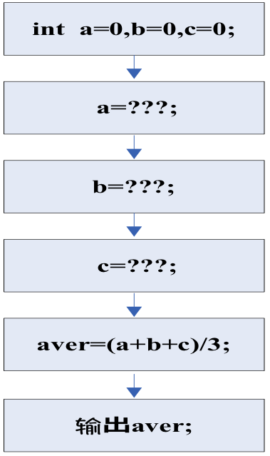
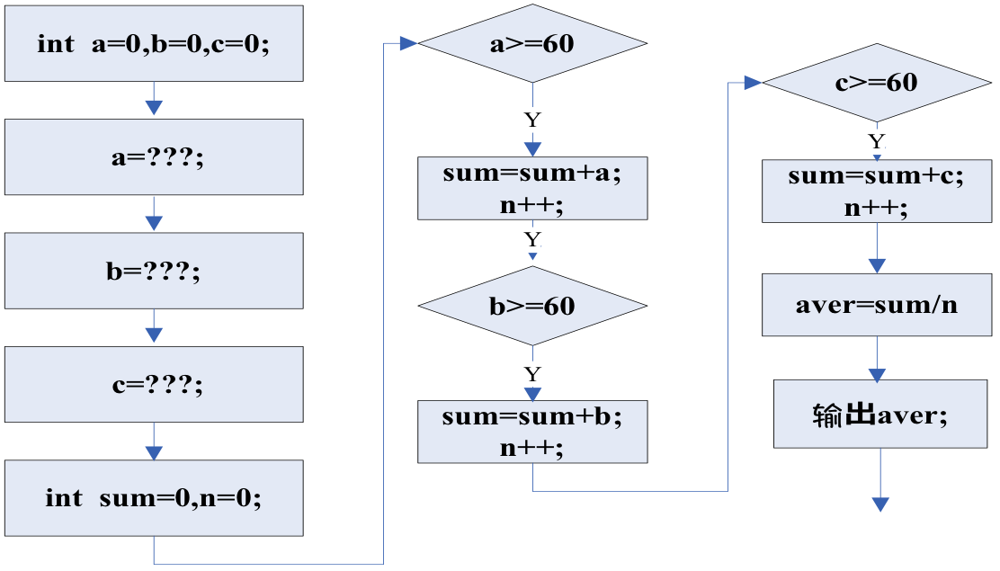
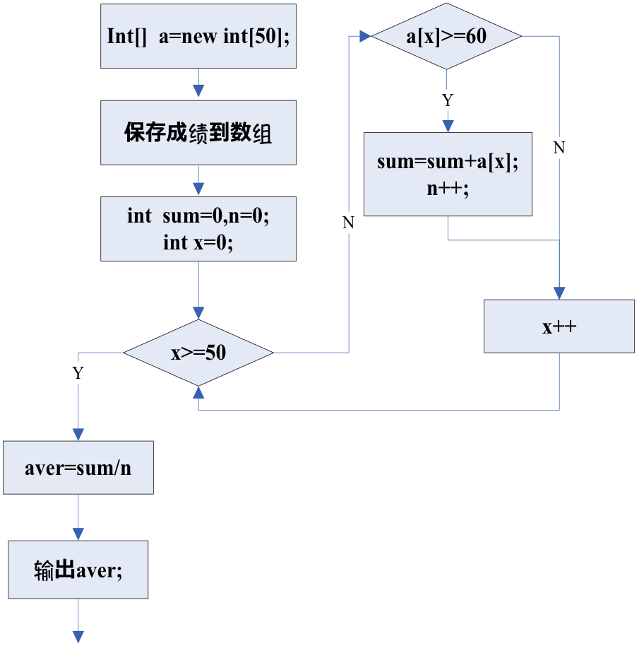

[TOC]

# 程序

- 程序表现为完成某个功能(目标)而编写的指令集合。
- 构成程序的基本元结构是__顺序__、__分支__和__循环__ 
在整体上，程序运行是按照事先编写的指令(语句)从前到后的顺序执行，但在执行的过程中，经常会遇到基于不同条件的决策来执行不同的指令，抑或重复执行事先定义的指令来达到某种目的，但==总体上程序总是顺序执行的==。

## Example:

编写一个程序，声明3个整型变量，用来保存$3$个学生的考试分数，计算他们的平均分(float类型)并输出。

### 进一步的
如果某个学生的成绩低于$60$分，则不参与平均分计算。

### 再进一步
如果有$50$个学生的成绩已经保存在一个整型数组中，同样基于上面规则来计算这批学生的平均分。

## 语句
在Java编程语言中，==语句是一行由分号(;)终止的代码==，它是一个完整的可执行单元。

例如：

~~~java
totals = a + b + c + d + e + f；
~~~

与下式相同

~~~java
total = a + b + c +
				d + e + f;
~~~

构成Java程序的最小单位是类，而类则是由属性和方法构成。 
方法代表了某个具体的能力，具体的一个方法就是由为完成某个功能而编写的若干条语句组成。

在Java中，主要有:

- 声明语句
- 表达式语句
- 控制语句

### 声明语句

~~~java
int a=0;    //声明了一个整型变量
Student stu;//声明了一个类型是Student的对象
~~~

### 表达式语句 

赋值表达式，自增表达式、方法调用、对象创建都可以和分号一起构成“表达式语句”

~~~java
System.out.println(“Welcome”); //输出字符串
a=Math.abs(-3.1);              //返回绝对值
value=100;                     //为变量赋值
a++;                           //a自增
Student stu = new Student(“张华”);   //创建一个Student类的实例，实例引用名为stu
~~~

### 控制语句

对程序语句的执行顺序进行的规定。 有三种结构：

- 顺序结构
- 分支结构
- 循环结构

为了实现程序执行点的流程控制，Java提供了如下的分支、循环语句：

- 分支控制语句包括：if-else、switch-case。
- 循环控制语句包括：while、do-while和for。
- 跳转语句：break、return和continue。

除了上面的流程控制语句，还有两类特殊的语句：

- (1) 异常处理语句：如try-catch-finally、throw等。参见第6章。
- (2) 注释语句。

Java与C/C++之间的差别很细微，可归纳为两点：

- (1) 在C语言中，条件表达式可以是数值型，而在Java条件语句中，条件表达式必须是布尔型，不能是数值。
- (2) Java取消了对goto语句的支持。 
goto语句的使用一直是程序设计者争论的话题，这是因为goto语句的使用不仅降低了程序的可读性，而且往往会带来一些不可预测的错误。 

### 顺序结构

顺序结构是最简单、最基本的结构，在顺序结构内，顺序执行各个语句。

~~~java
public class Swap {
	public static void main(String[] args) {
		int a=10,b=20;
		int t=0;
		
		t=a;
		a=b;
		b=t;
		
		System.out.println("a="+a);
		System.out.println("b="+b);
	}
}
~~~

__空语句__、__表达式语句__、__复合语句__是Java程序依次顺序执行的语句，故又称为顺序结构。

空语句是仅由分号构成的语句，表示什么动作都不做。

~~~java
{ 
	\\空语句
}
~~~

一个表达式加上一个分号就是一个表达式语句，只有少量的几种表达式才能构成表达式语句。 
它们是：由赋值运算符构成的表达式、由++或--构成的表达式、方法调用、new 表达式。

标号语句的格式为：

>标识符：<语句>  

其中：<语句>可为任何合法的Java语句。 

复合语句是指由一对花括号{}括起来的任意数量的语句，有时又称为块语句或组语句。

### 选择结构

Java提供了条件语句在两种或更多的情况做出选择，根据情况执行不同的程序语句；

#### if语句 

##### 简单if语句

~~~java
if (布尔表达式) { 
	语句(组)；
}
~~~

其执行过程是:

- 首先计算布尔表达式的值，若为真true，则执行块内语句，
- 否则，if语句终止执行，即不执行块内语句而执行if语句后面的其它语句。

##### if-else语句

~~~java
if (布尔表达式) {  
	语句(组)A；
} 
else {
	语句(组)B;
}
~~~

其执行过程是: 

- 首先计算布尔表达式的值，若为真，则执行语句(组)A，
- 否则执行语句(组)B。

例如

~~~java
if (score < 60) {
	System.out.println(“下次努力哦!”);
} 
else {
	System.out.println(“恭喜你通过考试!”);
}
~~~

##### if语句的嵌套
if语句中的任何一个子句可以是任意可执行语句，当然也可以是一条if语句，这种情况称为if语句的嵌套。

当出现if语句嵌套时，不管书写格式如何，else都将与它前面最靠近的未曾配对的if语句相配对，构成一条完整的if语句。

嵌套的深度没有限制，if语句的嵌套可以实现多重选择。

~~~java
if (布尔表达式1) {
	语句或块;
}
else if (布尔表达式2) {
	语句或块;
} else {
	语句或块；	
}  
~~~

例如

~~~java
if (score < 60) {
	System.out.println(“下次努力哦!”);
}
else if(score<80) {
	System.out.println(“恭喜你通过考试!”);
}
else {
	System.out.println(“你考的很棒!”);
}
~~~

#### switch语句
switch语句是多分支选择语句，又称开关语句。

 switch语句的一般形式如下：

~~~java
switch(表达式) {
	case 常量表达式1:
		语句组1;
		break;
	case 常量表达式2:
		语句组2;
		break;
       
       …
	
	case 常量表达式n:
		语句组n;
		break;
	default：
		语句组n+1;
}
~~~

- 在"switch(表达式)"语句中，"表达式"必须与int类型是赋值兼容的； 
byte, short或char类型可被升级； 
不允许使用浮点或long表达式。
从Java SE 7开始，switch支持字符串类型了，同时 case 标签必须为字符串常量或字面量。

- 每个case语句后的常量表达式必须是与表达式类型兼容的特定的一个常量(它必须为一个常量或者字面常量，而不是变量)。 
case语句只是起到一个标号作用，用来查找匹配的入口并从此处开始执行其后的语句序列。 
重复的case值是不允许的。

- 当变量或表达式的值与 case 语句的值相等时，那么 case 语句之后的语句开始执行，直到 break 语句出现才会跳出 switch 语句。

- 当变量或表达式的值不能与任何case值相匹配时，可选缺省符（default）指出了应该执行的程序代码。 
如果没有一个case常量与表达式的值相匹配，则执行default语句。 
default 语句一般在switch语句的最后。
default 分支不需要 break 语句。

- 如果没有break语句作为某一个case代码段的结束句，则程序的执行将继续到下一个case，而不检查case表达式的值。

- 在"switch(表达式)"语句中，表达式也可以是枚举类型 

~~~java
public enum Month {
JANUARY,
FEBRUARY,
MARCH,
APRIL,
MAY,
JUNE,
JULY,
AUGUST,
SEPTEMBER,
OCTOBER,
NOVEMBER,
DECEMBER}
~~~

### 循环结构

- 循环结构是指在一定条件下反复执行一个语句或程序块的结构。
- 循环结构也是只有一个入口，一个出口。
- 根据循环条件的不同，循环结构分为当型循环结构和直到型循环结构两种。

#### Java编程语言支持三种循环构造类型：
__for__, __while__和__do__ ~ __while__循环。

- for和while循环是在执行循环体之前测试循环条件 
意味着for和while循环==可能连一次循环体都未执行==，
- do 循环是在执行完循环体之后测试循环条件。 
==do循环将至少执行一次循环体==。

##### for循环
for语句是java语言中使用灵活方便的一种循环语句，它不仅用于循环次数已知的情况，还能用于循环次数预先不能确定只给出循环结束条件的情况。 

for语句的一般形式为： 

~~~java
for (initialization; condition; iteration) {
// body
...
}
~~~

例如：

~~~java
for (int i=0; i<10; i++) {
	System.out.println("i = "+i);
} 
~~~

以及

~~~java
for (int a=1,b=4; a<b; a++,b--) {
	System.out.println("a = " + a);
	System.out.println("b = " + b);
}
~~~

Java5 引入了一种主要用于数组的增强型 for 循环。

Java 增强 for 循环语法格式如下:

~~~java
for(声明语句 : 表达式)
{
   //代码句子
}
~~~

- **声明语句**：声明新的局部变量，该变量的类型必须和数组元素的类型匹配。其作用域限定在循环语句块，其值与此时数组元素的值相等。
- **表达式**：表达式是要访问的数组名，或者是返回值为数组的方法。

**实例**

~~~java
public class Test {
   public static void main(String args[]){
      int [] numbers = {10, 20, 30, 40, 50};
 
      for(int x : numbers ){
         System.out.print( x );
         System.out.print(",");
      }
      System.out.print("\n");
      String [] names ={"James", "Larry", "Tom", "Lacy"};
      for( String name : names ) {
         System.out.print( name );
         System.out.print(",");
      }
   }
}
~~~

以及使用增强型循环访问数组元素

~~~java
int[] score = new int[5];
……
for (int x : score) {
    System.out.print(x+",");
}
~~~

##### while循环
while语句用来实现“当型”循环结构，即先判断表达式，后执行语句。其一般形式如下：

~~~java
while (循环条件) {
	语句;  // 循环体
}
~~~

例如：

~~~java
int i = 0;

while (i < 10) {
	System.out.println("i = "+ i);
	i++;
}

System.out.println("Finally!");
~~~

##### do-while循环
do-while语句用来实现“直到型”循环结构，即先执行循环体，然后判断循环条件是否成立。

其一般形式如下：

~~~java
do {
	语句； // 循环体
} while (循环条件);
~~~

例如：

~~~java
int i = 0;

do { 
	System.out.println("i = " +i); 
	i++; 
} while (i < 10); 

System.out.println("Finally!"); 
~~~

#### 循环的嵌套
一个循环体内包含另一个完整的循环结构称为循环的嵌套，内嵌的循环中还可以嵌套循环，这就是多重循环。

~~~java
while（循环条件）{
	[语句；]
	
	while （循环条件）{
		[语句；]
	}
	
	[语句；]
}
~~~

#### 跳转

##### break & continue

Java中可以用__break__和__continue__两个循环跳转语句进一步控制循环。

这两个语句的一般格式如下：

~~~java
break [label];    // 从所在的switch语句、循环语句中跳出。
continue [label];  // 跳过循环体的剩余语句，开始执行下一次循环。
~~~

- __break__和__continue__可以用在三种循环语句中的任意一种。
- 这两个语句都可以带标号使用，也可以不带label(标号)使用。

__break__语句被用来从循环语句的块中退出到预先设定的label处。 
当程序运行到"break [label]"处时，程序跳出整个循环体的结尾处。

~~~java
for (int i=0; i<3; i++) {
	System.out.print("Pass " + i + ": ");

	for (int j = 0; j < 100; j++) {
		if (j == 10)
			break;
			
		System.out.print(j + " ");
	}
	
	System.out.println();
}
~~~

~~~java
boolean t = true;

first: {
	second: {
		third: {
			System.out.println("Before the break.");
			
			if (t)
				break second; 
				
			System.out.println("This won't execute");
		}
		
		System.out.println("This won't execute");
	}
	
	System.out.println("This is after second block.");
}
~~~

__continue__语句被用来略过并跳到循环体的结尾。 
当程序运行到"continue [标注]"处时，程序跳至标识外循环的下一次循环开始处继续执行。

~~~java
for (int i=1; i<20; i++) {
	System.out.print(i + " ");
   
   if (i % 5 != 0)
   		continue;
   		
   	System.out.println("");
}
~~~

~~~java
outer: for (int i=1; i<10; i++) {
			for (int j = 1; j < 10; j++) {
				if (j > i) {
					System.out.println();
					continue outer;
				}
				
				System.out.print(" " + (i * j));
			
			}
		}
~~~

##### label(标号)

Label被用来标识循环构造的复合语句。 
label(标号)是出现在一个语句之前的标识符，标号后面要加一个冒号，定义如下：

~~~java
label: statement;
~~~

例如：

~~~java
loop: while (true) {
	for (int i=0; i < 100; i++) { 
		switch (c = System.in.read()) { 
			case -1: 
			case ` \n ` : 
			// 跳到最后处
			break loop; 
			.... 
		} 
	} // end for 
} // end while 
~~~

### return语句、System.exit()方法 

__return__语句用来从当前方法中退出，返回到调用该方法的语句处，并从紧跟该语句的下一条语句继续执行。 
如果在main()方法中执行__return__语句，则使程序执行返回到Java运行系统，因为Java运行系统调用了main()方法。

要想从程序的任意地方直接一步到位地退出程序，而不是返回到调用该方法的语句处，可以使用System.exit()方法。 

---

# 数组

- 数组是有序数据的集合，是由数目固定、相同类型的元素组成的，用一个统一的数组名和下标来唯一地确定数组中的元素。 
数组的作用在于提供了一种用来处理一组同类型数据的存储和访问机制，因为在实际编程中，你无法为每一个这样的数据声明一个变量。 
数组就是一个具有固定长度的包容多个相同类型对象的数据结构。 
它的元素类型甚至可以是数组。

- 在Java语言中，数组元素可以是基本类型，也可是对象。 
实际上，==Java认为数组本身也是一个对象。== 
即，Java将数组作为对象来处理，数组是一种引用类型，从java.lang.Object继承而来，故Object类中的所有方法均可用。 

- 数组的声明、创建和初始化可以分别完成，也可以一次完成。

## 一维数组

具有一个下标的数组称为一维数组。

### 数组的声明

首先必须声明数组变量，才能在程序中使用数组。

- 现代方式(首选的方法)

~~~java
char[] s;
Point[] p, q; 
~~~

- 传统方式(效果相同，但不是首选方法)

~~~java
char s[];
Point p[],q[]; // Point是一个类类型,此处声明了两个数组
~~~

### 创建数组

数组声明后并不是就可以直接使用了，要想使用必须要实际创建数组，为它分配实际的存储空间，然后才能存储元素。

~~~java
s = new char [20];
p = new Point [100]; 
~~~

也可在运行时，用变量表示数组的大小。

~~~java
int[] a;
int len = 10;
a = new int[len];
~~~

数组变量的声明，和创建数组可以用一条语句完成

~~~java
int len = 10;
int[] a = new int[len];;
~~~

还可以使用如下的方式创建数组

~~~java
int[] a = {0, 1, ..., 100};
~~~

**注意**：

- ==数组的大小一旦指定，就不可更改。==
- 数组的元素是通过索引访问的。数组索引从 0 开始，所以索引值从 0 到数组length-1。

### 初始化数组

预防没有赋值就访问数组元素导致意外的情况。

一维数组定义之后，必须经过初始化才可以引用，数组经过初始化后，其长度（即可存放的元素个数）就不可再改变。

数组的初始化分为静态初始化和动态初始化两种：

#### 静态初始化：在定义数组的同时对数组元素进行初始。

~~~java
int[] intArray={1,2,3,4}; // 定义了一个含有4个元素的int型数组
~~~

注意：

- ① 在给数组赋初值时，不能同时指定数组的大小，Java会根据初值的多少自动计算数组的大小。
- ② 静态初始化必须使用上述一条语句完成 
- ③ 当创建数组后，如果没有初始化，系统会根据数组的不同数据类型，指定不同的缺省值。 

#### 动态初始化：用运算符new为数组分配空间

① 对于简单类型的数组，其格式如下：

~~~java
数据类型 数组名[]=new 数据类型[arraySize];

数据类型[] 数组名=new 数据类型[arraySize];
~~~

其中arraySize表示数组长度，通常为整型常量，用以指明数组元素的个数。

或先声明数组，再对数组进行初始化：

~~~java
数据类型[] 数组名;

数组名=new 数据类型[arraySize];
~~~

#### 当创建一个数组时，每个元素都将被默认初始化。

- char数组中，每个值都被初始化为$0$(\u0000-null)字符；
- 数值类型的数组元素默认值为$0$
- boolean类型的数组元素默认值为false
- 对象类型的数组元素默认值为null 

#### Java编程语言允许使用下列形式快速创建数组,并完成初始化任务:

~~~java
String names[] = {
      “Georgianna”,
      “Jen”,
      “Simon”
};
~~~

其结果与下列代码等同：

~~~java
String names[] ;
names = new String [3];
names [0] = “Georgianna”;
names [1] = “Jen”;
names [2] = “Simon”;
~~~

### 访问数组

可以通过下标（整数数值或整型变量）来引用数组内的指定位置的元素，下标不能超出数组元素个数。 

~~~java
public class ArrayAccessDemo {
  public static void main(String[] args) {
       int[] a={1,3,7,2,6,5};

       for(int i=0;i<a.length;i++){
              System.out.println(第"+i+"个元素值为"+a[i]);
       }
  }
} 
~~~

#### 注意：

- 在Java编程语言中，==所有数组的下标都从$0$开始==。访问数组元素可以通过下标进行，如a[5]或者a[i].
- 与C/C++不同的是，Java对数组元素的下标要进行越界检查，以保证访问的安全性。若数组下标越界，Java会抛出java.lang.ArrayIndexOutOfBoundsException异常。
- 一个数组中元素的数量被作为具有length属性的部分而被数组对象存储; 这个值被用来检查所有运行时访问的界限。如果发生了一个越出界限的访问，那么运行时的报错（异常）也就出现了. 
length是属于数组对象的数据域而不是方法。因此，使用length()会出错，length只有在数组创建后才能访问。创建前，数组的引用是null。

#### 存储元素到数组

~~~java
int[] a=new int[10];
a[0]=10;
a[5]=2;
a[7]=8;
~~~

### main方法中的参数(String[] args)
命令行的参数

~~~java
public class CommandParameters {
	public static void main(String[] args) {
		for(int i=0;i<args.length;i++){
			System.out.printf("第%d个输入的参数是%s\n", i,args[i]);
		}
	}
}
~~~

### foreach 循环

JDK 1.5 引进了一种新的循环类型，被称为 foreach 循环或者加强型循环，它能在不使用下标的情况下遍历数组。

**示例**
显示数组myList中的所有元素：

~~~java
public class TestArray {
   public static void main(String[] args) {
      double[] myList = {1.9, 2.9, 3.4, 3.5};
 
      // 打印所有数组元素
      for (double element: myList) {
         System.out.println(element);
      }
   }
}
~~~

### 数组作为函数的参数
数组可以作为参数传递给方法。

例如:

~~~java
public static void printArray(int[] array) {
  for (int i = 0; i < array.length; i++) {
    System.out.print(array[i] + " ");
  }
}
~~~

下面例子调用 printArray 方法打印出 3，1，2，6，4 和 2：
~~~java
printArray(new int[]{3, 1, 2, 6, 4, 2});
~~~

### 数组作为函数的返回值

~~~java
public static int[] reverse(int[] list) {
  int[] result = new int[list.length];
 
  for (int i = 0, j = result.length - 1; i < list.length; i++, j--) {
    result[j] = list[i];
  }
  return result;
}
~~~

## 多维数组

Java编程语言没有像其它语言那样提供多维数组，因为一个数组可被声明为具有任何基础类型，所以你可以创建数组的数组(和数组的数组的数组，等等)。 

二维数组

- 如果数组的元素类型也是数组，这种结构就是多维数组。
- 多维数组的维数没有限制，可以为二维、三维等。
- 最常用的二维数组是一个特殊的一维数组，它的每个元素都是一个一维数组，又叫做数组的数组。 
表示矩阵或表格需要使用二维数组。

#### 二维数组的声明

~~~java
int[][] twoDim = new int [4][];
twoDim[0] = new int[5];
twoDim[1] = new int[5];
twoDim[2] = new int[5];
twoDim[3] = new int[5];
~~~

上述数组的声明也可以修改为：

~~~java
int[][] twoDim =  new int[4][5];
~~~

#### 不规则的多维数组 

~~~java
int[][] twoDim =  new int[4][];
twoDim[0] = new int [2];
twoDim[1] = new int [4];
twoDim[2] = new int [6];
twoDim[3] = new int [8];
~~~

#### 非法的声明，

~~~java
new int [][4]
~~~

编译器无法预先为之分配空间。 

#### 多维数组的初始化
类似一维数组的初始化，多维数组的初始化即可以在声明时直接初始化，也可以在创建时初始化。下面的例子演示了在声明时直接对数组进行初始化：

~~~java
int [][] factors = {{2}, {3}, {2, 4}, {5}, {2, 3, 6}, {7}}; 
~~~

## Arrays类

java.util.Arrays 类能方便地操作数组，它提供的所有方法都是静态的。

具有以下功能：

- 给数组赋值：通过 fill 方法。
- 对数组排序：通过 sort 方法,按升序。
- 比较数组：通过 equals 方法比较数组中元素值是否相等。
- 查找数组元素：通过 binarySearch 方法能对排序好的数组进行二分查找法操作。

具体说明请查看下表：

序号|方法|说明
---|:---|:---
1|public static int binarySearch(Object[] a, Object key)| 用二分查找算法在给定数组中搜索给定值的对象(Byte,Int,double等)。数组在调用前必须排序好的。如果查找值包含在数组中，则返回搜索键的索引；否则返回 (-(插入点) - 1)。
2|public static boolean equals(long[] a, long[] a2)| 如果两个指定的 long 型数组彼此相等，则返回 true。如果两个数组包含相同数量的元素，并且两个数组中的所有相应元素对都是相等的，则认为这两个数组是相等的。换句话说，如果两个数组以相同顺序包含相同的元素，则两个数组是相等的。同样的方法适用于所有的其他基本数据类型（Byte，short，Int等）。
3|public static void fill(int[] a, int val)| 将指定的 int 值分配给指定 int 型数组指定范围中的每个元素。同样的方法适用于所有的其他基本数据类型（Byte，short，Int等）。
4|public static void sort(Object[] a)| 对指定对象数组根据其元素的自然顺序进行升序排列。同样的方法适用于所有的其他基本数据类型（Byte，short，Int等）。

# 字符串

- 字符串是多个字符的序列，是编程中常用的数据类型。 

- 在纯面向对象的Java语言中，将字符串数据类型封装为字符串类，无论是字符串常量还是字符串变量，都是用类的对象来实现的，在对象中封装了一系列方法来进行字符串处理。 

## String类

==一个字符串常量使用双引号括住的一串字符==，字符常量是用单引号括住的一个字符。
一个字符串常量是一个String对象，故可以使用String类中的各种方法。

**注意**：

若Java程序中多处出现字符串常量如"ABC"，则Java编译程序只创建一个String对象，所有的字符串常量"ABC"将使用同一个String对象。如：

~~~java
String s1="ABC";
String s2="ABC";
String s3=new String("ABC"); 
~~~

上述三条语句创建了三个对象，其中s1和s2是同一个对象，而s1和s3是2个不同的对象，尽管它们所表示的字符序列相等。

### String类的构造方法

String类中提供了多种构造方法来创建String类的对象。 

~~~java
public String();
~~~
功能：创建一个字符串对象，其字符串值为空。

~~~java
public String(String value);
~~~
功能：用字符串对象value创建一个新的字符串对象。

~~~java
public String(char value[]);
~~~
用字符数组value来创建字符串对象。

~~~java
public String(char value[],int offset,int count)
~~~
从字符数组value中下标为offset的字符开始，创建有count个字符的字符串对象。

~~~java
public String(byte ascII[])
~~~
用byte型字符串数组ASCII，按缺省的字符编码方案创建字符串对象。

~~~java
public String(byte ascII[]，int offset int count))
~~~
从字节型数组ascII中下标为offset的字符开始，按缺省的字符编码方案创建count个字符的串对象。

~~~java
public String(StringBuffer buffer)
~~~
用缓冲字符串buffer创建一个字符串对象。

### String类的常用成员方法 

创建一个String类的对象后，使用相应类的成员方法对创建的对象进行处理。

####字符串长度计算
使用String类中的length()方法可以获取一个字符串的长度。

length()方法的定义如下：

~~~java
public int length()
~~~
该方法返回字符串中的16-bit的Unicode字符的数量。

例如:

~~~java
String s= "we are students",tom= "我们是学生";
int n1,n2,n3;
n1=s.length();              // n1 的值是15
n2=tom.length();            // n2的值5
n3=”我的爱好”.length();      //n3值是4
~~~

#### 字符串比较

字符串比较的方法有equals()、equalsIgnoreCase()、startsWith(),endsWith()、regionMatches()、compareTo(),compareToIgnoreCase()等方法

#####equals和equalsIgnoreCase方法
在String类中equals()定义如下：

~~~java
    public boolean equals(String s)
~~~

该方法用来比较当前字符串对象的实体是否与参数指定的字符串s的实体是否相同。例如

~~~java
String tom=new String( "we are students");
String boy=new String( "We are students");
String jerry= new String("we are students");
~~~
tom.equals(boy)的值是false,tom.equals(jerry)的值是true.

在String类中equalsIgnoreCase()定义如下：

~~~java
public boolean equalsIgnoreCase(String s)
~~~

字符串对象调用比较当前字符串对象是否与参数指定的字符串s相同,比较时忽略大小写。例如：

~~~java
String tom =new String(“ABC”), 
Jerry=new String(“abc”);
tom.equalsIgnoreCase(Jerry)的值是true。
~~~

##### startsWith、endsWith方法
字符串对象调用

~~~java
public boolean srartsWith(String s)
~~~
方法,判断当前字符串对象的前缀是否是参数指定的字符串s,
如

~~~java
String tom= "220302620629021",jerry= "21079670924022";
~~~
tom.startsWith("220")的值是true； 
jerry.startsWith("220")的值是false。

可以使用

~~~java
public boolean endsWith(String s) 
~~~
方法,判断一个字符串的后缀是否是字符串s,如

~~~java
String tom= "220302620629021", jerry= "21079670924022";
~~~

tom.endsWith("021")的值是true 
jerry.endsWith("021")的值是false.

##### 例
通过学号判断某学生是否是2004级的男生。

假设某学生学号为“200400581”，前4位为学号，最后1位为性别标志位，0表示女生，1表示男生。

程序如下：

~~~java
public class StringStart{
	public static void main(String args[]){
		String john="200400581",start="2004";
		
		if((john.startsWith(start)) && (john.endsWith("1")))
			System.out.println("该生是2004级男学生。");
		else
			System.out.println(“该生不是2004级男学生。");
	}
}
~~~

程序的运行结果如下：
>该生是2004级男学生。 

##### regionMatches方法
该方法的申明格式为：

~~~java
public boolean regionMatches(int firstStart,String other,int ortherStart,int length)
~~~

和

~~~java
public boolean regionMatches(boolean b,int firstStart,String other,int ortherStart,int length)
~~~

- 从当前字符串参数firstStart指定的位置开始处,取长度为length的一个子串,并将这个子串和参数other 指定的一个子串进行比较。
- 其中other指定的子串是从参数othertStart指定的位置开始,从other中取长度为length的一个子串。
- 如果两个子串相同该方法就返回true,否则返回false。

==注意，字符串的位置编号从0开始。==

##### compareTo,compareToIgnoreCase方法
String类中中compareTo和compareToIgnoreCase方法申明的格式为：

~~~java
public int compareTo(String s)
public int compareToIgnoreCase(String s)
~~~

- compareTo方法,按字典顺序与参数s指定的字符串比较大小。
- 如果当前字符串与s相同,该方法返回值0 ，
- 如果当前字符串对象大于s,该方法返回正值，
- 如果小于s,该方法返回负值。

例如

~~~java
String str= "abcde"；
str.compareTo("boy")；  //小于0 
str.compareTo(“aba”)；     //大于0 
str.compareTo(“abcde”)；  //等于0
~~~

按辞典序比较两个字符串还可以使用compareToIgnoreCase(String s)方法, 该方法忽略大小写

#### 字符串检索

搜索指定字符或字符串在字符串中出现的位置，用于字符或字符串在字符串中的定位。方法申明格式如下：

~~~java
public int indexOf(int ch)
public int indexOf(int ch,int fromIndex)
public int indexOf(String str)
public int indexOf(String str,int fromIndex)
~~~

- 上述四个重载的方法分别用于在字符串中定位指定的字符和字符串，并且在方法中可以通过fromIndex来指定匹配的起始位置。
- 如果没有检索到字符或字符串,该方法返回的值是-1。

例如

~~~java
String strSource="I love Java"；
int nPosition；
nPosition=strSource.indexOf(‘v’)；      // nPosition的值为：4
nPosition=strSource.indexOf(‘a’,9)；    // nPosition的值为：11
nPosition=strSource.indexOf("love")；   // nPosition的值为：2
nPosition=strSource.indexOf("love",0)； // nPosition的值为：2
~~~

另外，String类还提供字符串中的最后位置的定位，方法申明格式如下：

~~~java
public int lastIndexOf(int ch)
public int lastIndexOf(int ch,int fromlndex)
public int lastIndexOf(String str)
public int lastIndexOf(String str,int fromIndex)
~~~

- 上述四个重载的方法分别用于在字符串中定位指定的字符和字符串最后出现的位置，并且在上述方法中可以通过fromIndex来指定匹配的起始位置。
- 如果没有检索到字符或字符串,该方法返回的值是-1。

#### 字符串的截取

在字符串中截取子字符串，其申明格式如下：

~~~java
public String substring(int beginIndex)
~~~

该方法将获得一个当前字符串的子串,该子串是从当前字符串的beginIndex处截取到最后所得到的字符串。

~~~java
public String substring(int beginIndex,int endIndex)
~~~

该方法将获得一个当前字符串的子串,该子串是从当前字符串的beginIndex处截取到endIndex-1结束所得到的字符串。

如下面的代码所示：

~~~java
String strSource=new String("Java is interesting");
String strNewl=strSource.substring(5); // strNew1=”is interesting”
String strNew2 =strSource.substring(5,6); // strNew2=”i”
~~~

#### 字符串的替换

在String类中字符串替换的申明格式如下：

~~~java
public String replace(char oldChar,char newChar)
~~~

字符串对象s调用该方法可以获得一个串对象,这个串对象是用参数newChar 指定的字符替换s 中由oldChar 指定的所有字符而得到的字符串。  

~~~java
public String replaceAll(String old ,String new)
~~~

字符串对象s调用该方法可以获得一个串对象,这个串对象是通过用参数new指定的字符串替换s中由old指定的所有字符串而得到的字符串。

~~~java
public String trim()
~~~

一个字符串s通过调用方法trim()得到一个字符串对象,该字符串对象是s去掉前后空格后的字符串。

如下面的代码所示：

~~~java
String s= "I mist theep "；
Strong temp=s.replace( ‘t’ ,’ s’ )；//结果是“I miss sheep"
String s="  I am a student  "；
String temp=s.trim();               //结果是"I am a student"
~~~

#### 类型转换

- String类的静态方法valueOf()实现简单数据转化为字符串。

申明格式如下：

~~~java
public static String valueOf(boolean b)   
public static String valueOf(char c)
public static String valueOf(char[] data)
public static String valueOf(char[ ]data,int offset,int count) 
public static String valueOf(double d)
public static String valueOf(float f)
public static String valueOf(long l)
public static String valueOf(Object obj)
~~~

例如

~~~java
public class CovertString {
	public static void main(String args[]) {
		int nInt = 10;
		float fFloat = 3.14f;
		double dDouble = 3.1415926;       //转换为整型
		Integer obj1 = new Integer(nInt);  //转换为浮点数类型
		Float obj2= new Float(fFloat);        //转换为双精度类型
		Double obj3 = new Double(dDouble);    //分别调用toString方法转换为字符串
		String strString1 = obj1.toString(); // strString1=String.valueOf(nint);
		System.out.println(strString1);
		String strString2 = obj2.toString();
		System.out.println(strString2);
		String strString3 = obj3.toString();
		System.out.println(strString3);
	}
}
~~~

- 类Integer、Double、Float和Long中也提供了方法valueOf()把一个字符串转化为对应的数字对象类型 

其申明格式如下：

~~~java
public static Double valueOf(String s) throws NumberFormatException
public static Integer valueOf(String s) throws NumberFormatException
public static Float valueOf(String s) throws NumberFormatException
public static Long valueOf(String s) throws NumberFormatException
public static Double valueOf(String s) throws NumberFormatException
~~~

- 特别注意的是，若该String不能作为相应数据类型对象的转换，则抛出异常。
- 用户可以调用Integer、Double、Long、Float类中的ValueOf方法将字符串转换为相应的封装数据类型，进而转换为简单数据类型。

~~~java
Integer i1=Integer.valueOf(“1234”);
Float     f1=Float.valueOf(“12.34f”);
~~~

- Double、Float、Integer、Long等类都提供了doubleValue(), floatValue(), intValue(), longValue()等方法将对象转换成其他简单数据类型的方法。

例如：

~~~java
String strPI=”3.1415926”;
Double dpi=Double.valueOf(strPI);
double ddPI=dpi.doubleValue( );
float  ffPI=dpi.floatValue();
~~~

同时Boolean、Byte、Double、Float、Integer、Long等类也分别提供了静态方法parseDouble(String)、 parseFloat(String)、parseInt(String)、 parseLong(String) 等方法将对象转换成其他简单数据类型的方法。

其方法声明格式如下：

~~~java
static boolean parseBoolean(String s)
static int parseInt(String s[, int radix]) 
static byte parseByte(String s) static double parseDouble(String s)          ……
static float	parseFloat(String s) 
~~~

## StringBuffer 和 StringBuilder 类

- 当对字符串进行修改的时候，需要使用 StringBuffer 和 StringBuilder 类。

- 和 String 类不同的是，StringBuffer 和 StringBuilder 类的对象能够被多次的修改，并且不产生新的未使用对象。
	String 是被 final 修饰的，他的长度是不可变的，就算调用 String 的concat 方法，那也是把字符串拼接起来并重新创建一个对象，把拼接后的 String 的值赋给新创建的对象，
	StringBuffer 的长度是可变的，调用StringBuffer 的 append 方法，来改变 StringBuffer 的长度，并且，相比较于 StringBuffer，String 一旦发生长度变化，是非常耗费内存的！

- StringBuilder 类在 Java 5 中被提出，它和 StringBuffer 之间的最大不同在于 StringBuilder 的方法不是线程安全的（不能同步访问）。

- 由于 StringBuilder 相较于 StringBuffer 有速度优势，所以多数情况下建议使用 StringBuilder 类。然而在应用程序要求线程安全的情况下，则必须使用 StringBuffer 类。

~~~java
public class Test{
  public static void main(String args[]){
    StringBuffer sBuffer = new StringBuffer("stackoverflow官网：");
    sBuffer.append("https://");
    sBuffer.append(".stackoverflow");
    sBuffer.append(".com");
    System.out.println(sBuffer);  
  }
}
~~~

以上实例编译运行结果如下：
>stackoverflow官网：https://stackoverflow.com

### StringBuffer 方法

序号|方法|描述
---|---|---
1|public StringBuffer append(String s)|将指定的字符串追加到此字符序列。
2|public StringBuffer reverse()|将此字符序列用其反转形式取代。
3|public delete(int start, int end)|移除此序列的子字符串中的字符。
4|public insert(int offset, int i)|将 int 参数的字符串表示形式插入此序列中。
5|replace(int start, int end, String str)|使用给定 String 中的字符替换此序列的子字符串中的字符。

### 与String 方法类似

序号|方法|描述
---|:---|:---
1|int capacity()|返回当前容量。
2|char charAt(int index)|返回此序列中指定索引处的 char 值。
3|void ensureCapacity(int minimumCapacity)|确保容量至少等于指定的最小值。
4|void getChars(int srcBegin, int srcEnd, char[] dst, int dstBegin)|将字符从此序列复制到目标字符数组 dst。
5|int indexOf(String str)|返回第一次出现的指定子字符串在该字符串中的索引。
6|int indexOf(String str, int fromIndex)|从指定的索引处开始，返回第一次出现的指定子字符串在该字符串中的索引。
7|int lastIndexOf(String str)|返回最右边出现的指定子字符串在此字符串中的索引。
8|int lastIndexOf(String str, int fromIndex)|返回最后一次出现的指定子字符串在此字符串中的索引。
9|int length()| 返回长度（字符数）。
10|void setCharAt(int index, char ch)|将给定索引处的字符设置为 ch。
11|void setLength(int newLength)|设置字符序列的长度。
12|CharSequence subSequence(int start, int end)|返回一个新的字符序列，该字符序列是此序列的子序列。
13|String substring(int start)|返回一个新的 String，它包含此字符序列当前所包含的字符子序列。
14|String substring(int start, int end)|返回一个新的 String，它包含此序列当前所包含的字符子序列。
15|String toString()|返回此序列中数据的字符串表示形式。

<!--

赋值表达式

我们可以用常量对变量赋值，也可以用变量对变量赋值，还可以用任何表达式对变量赋值。用赋值运算符连接起来的式子称为赋值表达式。赋值表达式的值就是被赋值的变量的值。赋值表达式加上分号就构成了赋值语句，是极为常用的Java语句

medical image analysis registration
classification

MRI 
CT

Diagnostic imaging in Merkel cell carcinoma: lessons to learn from 16 cases with correlation of sonography, CT, MRI and PET

hogefuga

hogefuga

<mark>So good</mark>

<del>Much wow</del>

<b>AA</b>

sudo apt-get install texlive-full latex-beamer dvipdfmx 
sudo apt-get install latex-cjk-all

sudo apt-get update

sudo apt-get install lsb-core

sudo apt-get install ntfs-3g ntfs-config
-->

# 正则表达式

- 正则表达式是一个特殊的字符序列，有助于你用一种专门的语法模式来匹配或找到其他字符串或字符串集。
一个正则表达式就是由普通的字符（例如字符a到z）以及特殊字符（元字符）组成的文字模式，用以描述在查找文字主体时待匹配的一个或多个字符串。
- 正则表达式作为一个模板，将某个字符模式与所搜索的字符串进行匹配，即用来搜索编辑或是操纵文本和数据。

正则表达式并不仅限于某一种语言，但是在每种语言中有细微的差别。
Java正则表达式和Perl的是最为相似的。

##正则表达式语法

###正则表达式通用匹配符号

|正则表达式|说明|
|:---|:---|
| \^ |匹配输入字符串开始的位置。 | 
| \$ |匹配输入字符串结尾的位置。 |
| xy |x匹配后面紧接着y的匹配。|
| x\|y |匹配 x 或 y。例如，'z|food' 匹配"z"或"food"。'(z|f)ood' 匹配"zood"或"food"。|
| x && y |匹配 x 与 y这两个字符串的交集。|
| [xyz] | 字符集。匹配包含的任一字符。例如，"[abc]"匹配"plain"中的"a"。|
|[\^xyz] | 反向字符集。匹配未包含的任何字符。例如，"[\^abc]"匹配"plain"中"p"，"l"，"i"，"n"。|
|[a-z] |字符范围。匹配指定范围内的任何字符。例如，"[a-z]"匹配"a"到"z"范围内的任何小写字母。|
|[\^a-z]|反向范围字符。匹配不在指定的范围内的任何字符。例如，"[\^a-z]"匹配任何不在"a"到"z"范围内的任何字符。|
|. | 匹配除"\n"之外的任何单个字符。若要匹配包括"\n"在内的任意字符，请使用诸如"[\s\S]"之类的模式。|

<!-- 如果设置了 RegExp 对象的 Multiline 属性，\^ 还会与"\n"或"\r"之后的位置匹配。-->
<!-- 如果设置了 RegExp 对象的 Multiline 属性，\$ 还会与"\n"或"\r"之前的位置匹配。-->

例：

|正则表达式|说明|
|:---|:---|
|[A-Z]| 条件限制在大写A to Z范围中一个字符|
|[a-zA-Z]| 条件限制在小写a to z或大写A to Z范围中一个字符|
|[0-9]| 条件限制在小写0 to 9范围中一个字符|
|[0-9a-z]| 条件限制在小写0 to 9或a to z范围中一个字符|
|[0-9[a-z]]| 条件限制在小写0 to 9或a to z范围中一个字符(交集)|
|[...]| 匹配括号内的任意单个字符。|
|[\^...]| 匹配不在括号内的任意单个字符。|
|[\^A-Z]|     条件限制在非大写A to Z范围中一个字符|
|[\^a-zA-Z]| 条件限制在非小写a to z或大写A to Z范围中一个字符|
|[\^0-9]|     条件限制在非小写0 to 9范围中一个字符|
|[\^0-9a-z]| 条件限制在非小写0 to 9或a to z范围中一个字符|
|[\^0-9[a-z]]| 条件限制在非小写0 to 9或a to z范围中一个字符(交集)|

### Java正则表达式元字符

|字符|说明|
|:---|:---|
| \\ |将下一字符标记为特殊字符、文本、反向引用或八进制转义符。 例如，"n"匹配字符"n"。"\n"匹配换行符。序列"\\ \\"匹配"\\"，"\\("匹配"(" |
|\t | 间隔 ('\u0009')|
|\n | 换行 ('\u000A')|
|\r | 回车 ('\u000D')|
|\d | 任意数字，等价于[0-9]|
|\D | 任意非数字，等价于[\^0-9]|
|\s | 任意空白字符，等同于[\t\n\x0B\f\r]|
|\S | 任意非空白字符，等同于[^\s]|
|\w | 任意英文字符，等同于[a-zA-Z_0-9]|
|\W | 任意非英文字符，等同于[^\w]|
|\f | 换页符|
|\e | Escape|
|\b | 单词的边界|
|\B | 非单词的边界|
|\G | 前一个匹配的结束|

有两种方法可以在正则表达式中像一般字符一样使用元字符。

- 在元字符前添加反斜杠(\\)
- 将元字符置于\Q(开始引用)和\E(结束引用)间

### 正则表达式量词

量词指定了字符匹配的发生次数。

|正则表达式|说明|
|:---|:---|
|\* |零次或多次匹配前面的字符或子表达式。例如，zo* 匹配"z"和"zoo"。\* 等效于 {0,}。|
|\+ |一次或多次匹配前面的字符或子表达式。例如，"zo+"与"zo"和"zoo"匹配，但与"z"不匹配。\+ 等效于 {1,}。 |
|? |零次或一次匹配前面的字符或子表达式。例如，"do(es)?"匹配"do"或"does"中的"do"。? 等效于 {0,1}。|
|{n} | n 是非负整数。正好匹配 n 次。例如，"o{2}"与"Bob"中的"o"不匹配，但与"food"中的两个"o"匹配。|
|{n,} |n 是非负整数。至少匹配 n 次。例如，"o{2,}"不匹配"Bob"中的"o"，而匹配"foooood"中的所有 o。"o{1,}"等效于"o+"。"o{0,}"等效于"o*"。|
|{n,m} | m 和 n 是非负整数，其中 n $\le$ m。匹配至少 n 次，至多 m 次。例如，"o{1,3}"匹配"fooooood"中的头三个 o。'o{0,1}' 等效于 'o?'。注意：您不能将空格插入逗号和数字之间。|

量词可以和character classes和capturing group一起使用。
例如，

- [abc]+表示a,b或c出现一次或者多次。
- (abc)+表示capturing group “abc”出现一次或多次。我们即将讨论capturing group。
 
<!--
| (pattern) | 匹配 pattern 并捕获该匹配的子表达式。可以使用 \$0…\$9 属性从结果"匹配"集合中检索捕获的匹配。若要匹配括号字符 ( )，请使用"\\("或者"\\)"。|
| (?:pattern) | 匹配 pattern 但不捕获该匹配的子表达式，即它是一个非捕获匹配，不存储供以后使用的匹配。这对于用"or"字符 (\|) 组合模式部件的情况很有用。例如，'industr(?:y\|ies) 是比 'industry\|industries' 更经济的表达式。 |
| (? = pattern) | 执行正向预测先行搜索的子表达式，该表达式匹配处于匹配 pattern 的字符串的起始点的字符串。它是一个非捕获匹配，即不能捕获供以后使用的匹配。例如，'Windows (?=95\|98\|NT\|2000)' 匹配"Windows 2000"中的"Windows"，但不匹配"Windows 3.1"中的"Windows"。预测先行不占用字符，即发生匹配后，下一匹配的搜索紧随上一匹配之后，而不是在组成预测先行的字符后。|
| (?!pattern) | 执行反向预测先行搜索的子表达式，该表达式匹配不处于匹配 pattern 的字符串的起始点的搜索字符串。它是一个非捕获匹配，即不能捕获供以后使用的匹配。例如，'Windows (?!95\|98\|NT\|2000)' 匹配"Windows 3.1"中的 "Windows"，但不匹配"Windows 2000"中的"Windows"。预测先行不占用字符，即发生匹配后，下一匹配的搜索紧随上一匹配之后，而不是在组成预测先行的字符后。|

~~~java
package com.journaldev.util;

import java.util.regex.Matcher;
import java.util.regex.Pattern;
 
public class RegexExamples { 
    public static void main(String[] args) {
        // using pattern with flags
        Pattern pattern = Pattern.compile("ab", Pattern.CASE_INSENSITIVE);
        Matcher matcher = pattern.matcher("ABcabdAb");
        
        // using Matcher find(), group(), start() and end() methods
        while (matcher.find()) {
            System.out.println("Found the text \"" + matcher.group()
                    + "\" starting at " + matcher.start()
                    + " index and ending at index " + matcher.end());
        }
 
        // using Pattern split() method
        pattern = Pattern.compile("\\W");
        String[] words = pattern.split("one@two#three:four$five");
        
        for (String s : words) {
            System.out.println("Split using Pattern.split(): " + s);
        }
 
        // using Matcher.replaceFirst() and replaceAll() methods
        pattern = Pattern.compile("1*2");
        matcher = pattern.matcher("11234512678");
        
        System.out.println("Using replaceAll: " + matcher.replaceAll("_"));
        System.out.println("Using replaceFirst: " + matcher.replaceFirst("_"));
    }
}
~~~

上述程序的输出是：

>Input String matches regex - true
>Exception in thread "main" java.util.regex.PatternSyntaxException: Dangling meta >character '*' near index 0
>*xx*
>^
>	at java.util.regex.Pattern.error(Pattern.java:1924)
>	at java.util.regex.Pattern.sequence(Pattern.java:2090)
>	at java.util.regex.Pattern.expr(Pattern.java:1964)
>	at java.util.regex.Pattern.compile(Pattern.java:1665)
>	at java.util.regex.Pattern.(Pattern.java:1337)
>	at java.util.regex.Pattern.compile(Pattern.java:1022)
>	at com.journaldev.util.PatternExample.main(PatternExample.java:13)

-->

例：

|正则表达式|说明|
|:---|:---|
|J* | 0个以上J|
|.* | 0个以上任意字符|
|J.*D| J与D之间0个以上任意字符|
|J+| 1个以上J|
|.+ | 1个以上任意字符|
|J.+D| J与D之间1个以上任意字符|
|JA?| J或者JA出现|
|J{2}| JJ|
|J{3}| JJJ|
|J{3,} | JJJ,JJJJ,JJJJJ,(3次以上J并存)|
|J{3,5} | JJJ或JJJJ或JJJJJ|
|J\|A |J或A|
|Java\|Hello | Java或Hello|
 

## 正则表达式类以及应用举例

Java提供了java.util.regex包来与正则表达式进行模式匹配。

java.util.regex 包主要包含了三个类： __Pattern类__, __Matcher类__, __PatternSyntaxException__

### Pattern类
一个 Pattern 对象是正则表达式编译表示。 Pattern 类没有提供公共的构造函数。要创建一个 Pattern 对象，你必须首先调用他的公用静态编译方法来获得 Pattern 对象。这些方法的第一个参数是正则表达式。

Pattern的方法如下：

|Return Value| 方法 |说明|
|:---|:---|:---|
|static Pattern | compile(String regex) | 将给定的正则表达式编译并赋予给Pattern类 |
|static Pattern | compile(String regex, int flags) | 同上，但增加flag参数的指定，可选的flag参数包括：CASE INSENSITIVE,MULTILINE,DOTALL,UNICODE CASE， CANON EQ |
|int | flags() | 返回当前Pattern的匹配flag参数. |
|Matcher | matcher(CharSequence input) | 生成一个给定命名的Matcher对象 |
|static boolean | matches(String regex, CharSequence input) | 编译给定的正则表达式并且对输入的字串以该正则表达式为模开展匹配,该方法适合于该正则表达式只会使用一次的情况，也就是只进行一次匹配工作，因为这种情况下并不需要生成一个Matcher实例。|
|String | pattern() | 返回该Patter对象所编译的正则表达式。|
| String[] | split(CharSequence input) | 将目标字符串按照Pattern里所包含的正则表达式为模进行分割。|
| String[] | split(CharSequence input, int limit) | 作用同上，增加参数limit目的在于要指定分割的段数，如将limi设为2，那么目标字符串将根据正则表达式分为割为两段。|

在使用Pattern.compile函数时，可以加入控制正则表达式的匹配行为的参数：
Pattern Pattern.compile(String regex, int flag)

flag的取值范围如下：

|flag参数|说明|
|:---|:---|
|Pattern.CANON_EQ | 当且仅当两个字符的"正规分解(canonical decomposition)"都完全相同的情况下，才认定匹配。比如用了这个标志之后，表达式"a/u030A"会匹配"?"。默认情况下，不考虑"规范相等性(canonical equivalence)"。|
|Pattern.CASE_INSENSITIVE(?i) | 默认情况下，大小写不明感的匹配只适用于US-ASCII字符集。这个标志能让表达式忽略大小写进行匹配。要想对Unicode字符进行大小不明感的匹 配，只要将UNICODE_CASE与这个标志合起来就行了。|
|Pattern.COMMENTS | 在这种模式下，匹配时会忽略(正则表达式里的)空格字符(译者注：不是指表达式里的"\\s"，而是指表达式里的空格，tab，回车之类)。注释从#开始，一直到这行结束。可以通过嵌入式的标志来启用Unix行模式。|
|Pattern.DOTALL | 在这种模式下，表达式'.'可以匹配任意字符，包括表示一行的结束符。默认情况下，表达式'.'不匹配行的结束符。|
|Pattern.MULTILINE |在这种模式下，'\^'和'\$'分别匹配一行的开始和结束。此外，'\^'仍然匹配字符串的开始，'\$'也匹配字符串的结束。默认情况下，这两个表达式仅仅匹配字符串的开始和结束。|
|Pattern.UNICODE_CASE | 在这个模式下，如果你还启用了CASE_INSENSITIVE标志，那么它会对Unicode字符进行大小写不明感的匹配。默认情况下，大小写不敏感的匹配只适用于US-ASCII字符集。|
|Pattern.UNIX_LINES | 在这个模式下，只有'\n'才被认作一行的中止，并且与'.'，'\^'，以及'\$'进行匹配。|

### Matcher类
一个 Matcher 对象是用来解释模式和执行与输入字符串相匹配的操作。和 Pattern 类一样 Matcher 类也是没有构造方法的，你需要通过调用 Pattern 对象的 matcher 方法来获得 Matcher 对象。

Matcher方法如下：

|Return Value| 方法 |说明|
|:---|:---|:---|
|Matcher | appendReplacement(StringBuffer sb, String replacement)| 将当前匹配子串替换为指定字符串，并且将替换后的子串以及其之前到上次匹配子串之后的字符串段添加到一个StringBuffer对象里。|
|StringBuffer | appendTail(StringBuffer sb) | 将最后一次匹配工作后剩余的字符串添加到一个StringBuffer对象里。|
|int | end() | 返回当前匹配的子串的最后一个字符在原目标字符串中的索引位置 。|
|int | end(int group) | 返回与匹配模式里指定的组相匹配的子串最后一个字符的位置。|
|boolean | find() | 尝试在目标字符串里查找下一个匹配子串。|
|boolean | find(int start) | 重设Matcher对象，并且尝试在目标字符串里从指定的位置开始查找下一个匹配的子串。|
|String|group()|返回当前查找而获得的与组匹配的所有子串内容|
|String|group(int group)|返回当前查找而获得的与指定的组匹配的子串内容|
|int|groupCount()|返回当前查找所获得的匹配组的数量。|
|boolean|lookingAt()|检测目标字符串是否以匹配的子串起始。|
|boolean|matches()|尝试对整个目标字符展开匹配检测，也就是只有整个目标字符串完全匹配时才返回真值。|
|Pattern|pattern()|返回该Matcher对象的现有匹配模式，也就是对应的Pattern 对象。|
|String|replaceAll(String replacement)|将目标字符串里与既有模式相匹配的子串全部替换为指定的字符串。|
|String|replaceFirst(String replacement)|将目标字符串里第一个与既有模式相匹配的子串替换为指定的字符串。|
|Matcher|reset()|重设该Matcher对象。|
|Matcher|reset(CharSequence input)|重设该Matcher对象并且指定一个新的目标字符串。|
|int|start()|返回当前查找所获子串的开始字符在原目标字符串中的位置。|
|int|start(int group)|返回当前查找所获得的和指定组匹配的子串的第一个字符在原目标字符串中的位置。|

一个Matcher实例是被用来对目标字符串进行基于既有模式（也就是一个给定的Pattern所编译的正则表达式）进行匹配查找的，所有往Matcher的输入都是通过CharSequence接口提供的，这样做的目的在于可以支持对从多元化的数据源所提供的数据进行匹配工作。

一个Matcher对象是由一个Pattern对象调用其matcher()方法而生成的，一旦该Matcher对象生成,它就可以进行三种不同的匹配查找操作：

- matches()方 法 尝试对整个目标字符展开匹配检测，也就是只有整个目标字符串完全匹配时才返回真值。
- lookingAt()方法 将检测目标字符串是否以匹配的子串起始。
- find()方法 尝试在目标字符串里查找下一个匹配子串。

Matcher类同时提供了四个将匹配子串替换成指定字符串的方法：

- replaceAll()
- replaceFirst()
- appendReplacement()
- appendTail()

### PatternSyntaxException
一个 PatternSyntaxException 对象是一个不被检查的异常，来指示正则表达式中的语法错误。

### 应用举例

#### 在字符串包含验证时

~~~java
//查找以Java开头,任意结尾的字符串
  Pattern pattern = Pattern.compile("^Java.*");
  Matcher matcher = pattern.matcher("Java不是人");
  boolean b= matcher.matches();
  //当条件满足时，将返回true，否则返回false
  System.out.println(b);
~~~

####以多条件分割字符串时

~~~java
Pattern pattern = Pattern.compile("[, |]+");
String[] strs = pattern.split("Java Hello World  Java,Hello,,World|Sun");
for (int i=0;i<strs.length;i++) {
    System.out.println(strs[i]);
} 
~~~

#### 文字替换（首次出现字符）

~~~java
Pattern pattern = Pattern.compile("正则表达式");
Matcher matcher = pattern.matcher("正则表达式 Hello World,正则表达式 Hello World");
//替换第一个符合正则的数据
System.out.println(matcher.replaceFirst("Java"));
~~~

####文字替换（全部）

~~~java
Pattern pattern = Pattern.compile("正则表达式");
Matcher matcher = pattern.matcher("正则表达式 Hello World,正则表达式 Hello World");
//替换第一个符合正则的数据
System.out.println(matcher.replaceAll("Java"));
~~~

####文字替换（置换字符）

~~~java
Pattern pattern = Pattern.compile("正则表达式");
Matcher matcher = pattern.matcher("正则表达式 Hello World,正则表达式 Hello World ");
StringBuffer sbr = new StringBuffer();
while (matcher.find()) {
    matcher.appendReplacement(sbr, "Java");
}
matcher.appendTail(sbr);
System.out.println(sbr.toString());
~~~

#### 验证是否为邮箱地址

~~~java
String str="ceponline@yahoo.com.cn";
Pattern pattern = Pattern.compile("[//w//.//-]+@([//w//-]+//.)+[//w//-]+",Pattern.CASE_INSENSITIVE);
Matcher matcher = pattern.matcher(str);
System.out.println(matcher.matches());
~~~

#### 去除html标记

~~~java
Pattern pattern = Pattern.compile("<.+?>", Pattern.DOTALL);
Matcher matcher = pattern.matcher("<a href=/"index.html/">主页</a>");
String string = matcher.replaceAll("");
System.out.println(string);
~~~

#### 查找html中对应条件字符串

~~~java
Pattern pattern = Pattern.compile("href=/"(.+?)/"");
Matcher matcher = pattern.matcher("<a href=/"index.html/">主页</a>");
if(matcher.find())
  System.out.println(matcher.group(1));
}
~~~

#### 截取http://地址

~~~java
//截取url
Pattern pattern = Pattern.compile("(http://|https://){1}[//w//.//-/:]+");
Matcher matcher = pattern.matcher("dsdsds<http://dsds//gfgffdfd>fdf");
StringBuffer buffer = new StringBuffer();
while(matcher.find()){              
    buffer.append(matcher.group());        
    buffer.append("/r/n");              
System.out.println(buffer.toString());
}
~~~
        
#### 替换指定{}中文字

~~~java
String str = "Java目前的发展史是由{0}年-{1}年";
String[][] object={new String[]{"//{0//}","1995"},new String[]{"//{1//}","2007"}};
System.out.println(replace(str,object));

public static String replace(final String sourceString,Object[] object) {
            String temp=sourceString;    
            for(int i=0;i<object.length;i++){
                      String[] result=(String[])object[i];
               Pattern    pattern = Pattern.compile(result[0]);
               Matcher matcher = pattern.matcher(temp);
               temp=matcher.replaceAll(result[1]);
            }
            return temp;
}
~~~

#### 以正则条件查询指定目录下文件

~~~java
 //用于缓存文件列表
        private ArrayList files = new ArrayList();
        //用于承载文件路径
        private String _path;
        //用于承载未合并的正则公式
        private String _regexp;
        
        class MyFileFilter implements FileFilter {

              /**
               * 匹配文件名称
               */
              public boolean accept(File file) {
                try {
                  Pattern pattern = Pattern.compile(_regexp);
                  Matcher match = pattern.matcher(file.getName());                
                  return match.matches();
                } catch (Exception e) {
                  return true;
                }
              }
            }
        
        /**
         * 解析输入流
         * @param inputs
         */
        FilesAnalyze (String path,String regexp){
            getFileName(path,regexp);
        }
        
        /**
         * 分析文件名并加入files
         * @param input
         */
        private void getFileName(String path,String regexp) {
            //目录
              _path=path;
              _regexp=regexp;
              File directory = new File(_path);
              File[] filesFile = directory.listFiles(new MyFileFilter());
              if (filesFile == null) return;
              for (int j = 0; j < filesFile.length; j++) {
                files.add(filesFile[j]);
              }
              return;
            }
    
        /**
         * 显示输出信息
         * @param out
         */
        public void print (PrintStream out) {
            Iterator elements = files.iterator();
            while (elements.hasNext()) {
                File file=(File) elements.next();
                    out.println(file.getPath());    
            }
        }

        public static void output(String path,String regexp) {

            FilesAnalyze fileGroup1 = new FilesAnalyze(path,regexp);
            fileGroup1.print(System.out);
        }
    
        public static void main (String[] args) {
            output("C://","[A-z|.]*");
        }
~~~

因为正则表达式是一个很庞杂的体系，所以我仅例举些入门的概念，更多的请参阅相关书籍及自行摸索。 

如果读者要对正则表达进一步了解的话，推荐阅读Jeffrey Frieldl的__Mastering Regular Expressions__。

---

本文档 Github ：
https://github.com/bushehui/Java_tutorial

