[TOC]

#输入/输出流

##输入/输出流概述

输入/输出处理是程序设计中非常重要的一部分，比如从键盘读取数据、从文件中读取数据或向文件中写数据等等。

Java把这些不同类型的输入、输出源抽象为__流__（__stream__），用统一接口来表示，从而使程序简单明了。

Jdk提供了包__java.io__，其中包括一系列的类来实现输入/输出处理。

进行I/O操作时可能会产生I/O异常，属于非运行时异常，应该在程序中处理。如：

- FileNotFoundException, 
- EOFException, 
- IOException

##什么是流

流实际上是一个数据序列。 
采用流的机制可以使数据有序地输入和输出。 
有起点和终点的数据集合 

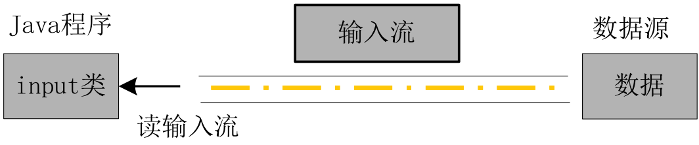

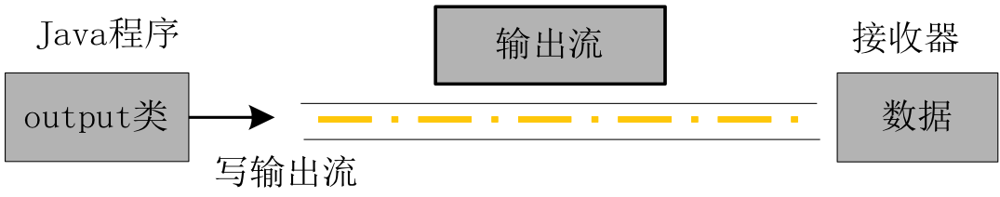

Java有各种各样的执行I/O的流，在java.io包中定义了这些流，其层次结构图如图所示。
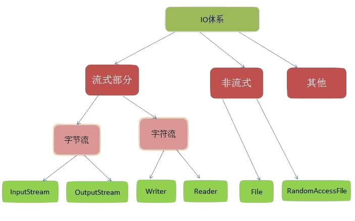

编写程序时，java.io包必须被执行输入输出的程序导入。

输入输出流可以从以下几个方面进行分类：

- 从流的方向划分：__输入流__和__输出流__；
- 从流的分工划分：__节点流__(从特定的地方读写的流类，例如：磁盘或一块内存区域)和__处理(过滤)流__(使用节点流作为输入或输出。过滤流是使用一个已经存在的输入流或输出流连接创建的)；
- 从流的内容划分：__面向字符的流__和__面向字节的流__。

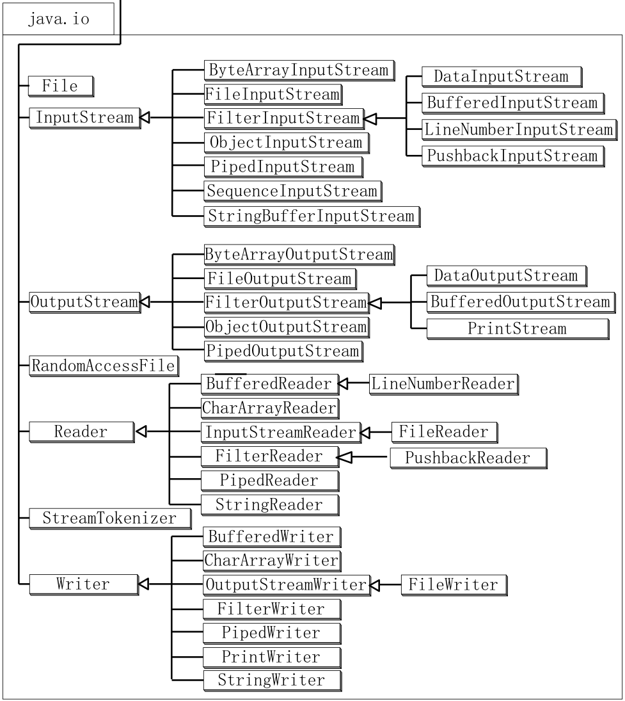

###字符流
Java中的字符使用的是__Unicode__编码，每个字符占有两个字节，即$16$位。 
字符流是以$16$位的Unicode码表示的字符为基本处理单位，进行文本数据的读写，可以实现Java程序中的内部格式和文本文件、显示输出、键盘输入等外部格式之间的转换。 
__Reader__和__Writer__是java.io包中所有字符流的抽象基类。

####Reader类

－ 处理所有字符流输入类的超类。
－ 是定义Java的字符流输入模式的抽象类。
－ 该类的所有方法在出错情况下都将引发IOException异常。 

主要方法有：

- 读取字符

~~~java
public int read() throws IOException;
	//读取一个字符，返回值为读取的字符

public int read(char cbuf[]) throws IOException;
	//读取一系列字符到数组cbuf[]中，返回值为实际读取的字符的数量

public abstract int read(char cbuf[],int off,int len) throws IOException;
	//读取len个字符，从数组cbuf[]的下标off处开始存放，返回值为实际读取的字符数量，该方法必须由子类实现
~~~

- 标记流

~~~java
public boolean markSupported();
	//判断当前流是否支持做标记

public void mark(int readAheadLimit) throws IOException;
	//给当前流作标记，最多支持readAheadLimit个字符的回溯。

public void reset() throws IOException;
	//将当前流重置到做标记处
~~~

- 关闭流

~~~java
public abstract void close() throws IOException;
~~~

- Reader的类层次

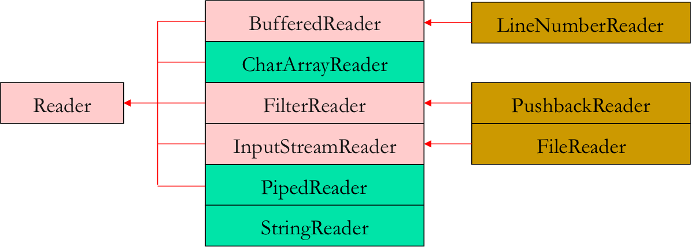

####Writer类

－ 处理所有字符流输出类的超类。
－ 是定义Java的字符流输出模式的抽象类。
－ 该类的所有方法都返回一个void值，在出错情况下都将引发IOException异常。 

- 向输出流写入字符

~~~java
public void write(int c) throws IOException;
	//将整型值c的低16位写入输出流

public void write(char cbuf[]) throws IOException;
	//将字符数组cbuf[]写入输出流

public abstract void write(char cbuf[],int off,int len) throws IOException;
	//将字符数组cbuf[]中的从索引为off的位置处开始的len个字符写入输出流

public void write(String str) throws IOException;
	//将字符串str中的字符写入输出流

public void write(String str,int off,int len) throws IOException;
//将字符串str 中从索引off开始处的len个字符写入输出流
~~~

- 刷空输出流，并输出所有被缓存的字节。

~~~java
flush()
~~~

- 关闭流

~~~java
public abstract void close() throws IOException;
~~~

- Writer的类层次
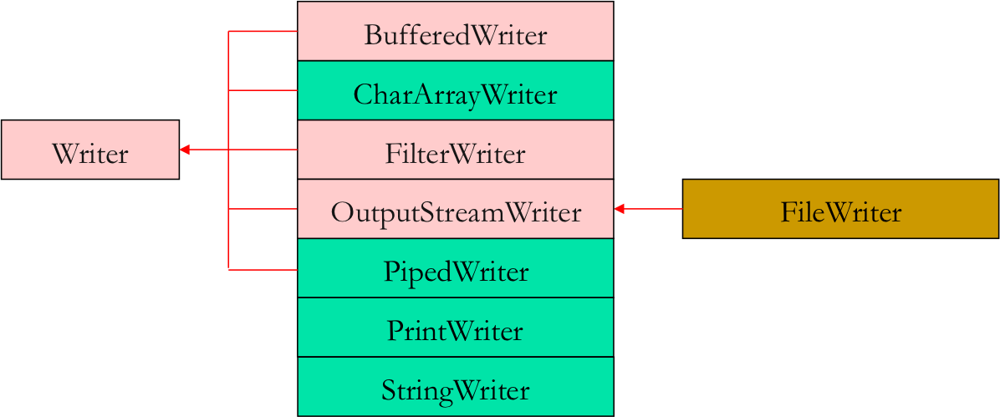

####Reader与Writer的子类

从Reader(直接子类6个)和Writer(直接子类7个)派生出的一系列类，这类流以$16$位的Unicode码表示的字符为基本处理单位。

|InputStreamReader|OutputStreamWriter|
|:-----|:-----|
|CharArrayReader|CharArrayWriter|
|PipedReader|PipedWriter|
|FilterReader|FilterWriter|
|BufferedReader|BufferedWriter|
|StringReader|StringWriter|
|            |PrintWriter|

###字节流的写入和读取

字节流类是从抽象类__InputStream__和__OutputStream__派生出来的一系列类。 
这类流以字节(byte)为基本处理单位。

####InputStream

InputStream类直接继承Object类。其主要方法如下:

- 从流中读取数据：

~~~java
abstract int read( ); 
	//读取一个字节，返回值为所读的字节

int read( byte b[ ] ); 
	//读取多个字节，放置到字节数组b中，通常读取的字节数量为b的长度，返回值为实际读取的字节的数量

int read( byte b[ ], int off, int len );
	//读取len个字节，放置到以下标off开始字节数组b中，返回值为实际读取的字节的数量

int available( );
	//返回值为流中尚未读取的字节的数量

long skip( long n );
	//读指针跳过n个字节不读，返回值为实际跳过的字节数量
~~~

- 关闭流：

~~~java
close( ); 
	//流操作完毕后必须关闭
~~~

- 使用输入流中的标记

~~~java
void mark( int readlimit ); 
	//记录当前读指针所在位置，readlimit表示读指针读出readlimit个字节后所标记的指针位置才失效
void reset( ); 
	//把读指针重新指向用mark方法所记录的位置
boolean markSupported( );　
	//当前的流是否支持读指针的记录功能测试当前流是否支持mark和reset方法
~~~

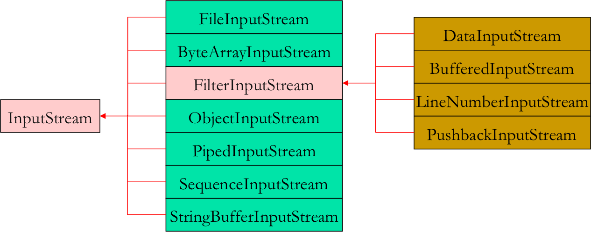

####OutputStream

- 输出数据

~~~java
void write(int b);
	//往流中写一个字节b

void write(byte b[ ]);	
	//往流中写一个字节数组b

void write(byte b[ ], int off, int len);
	//把字节数组b中从下标off开始，长度为len的字节写入流中
~~~

- 刷空输出流，并输出所有被缓存的字节

~~~java
flush( ) 　
	//刷空输出流，并输出所有被缓存的字节
~~~

由于某些流支持缓存功能，该方法将把缓存中所有内容强制输出到流中。

- 关闭流

~~~
close( );
	//流操作完毕后必须关闭
~~~

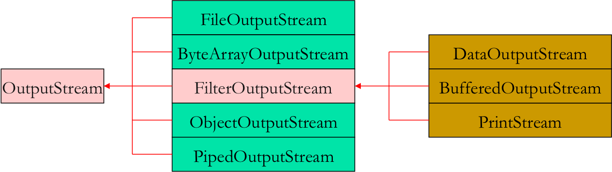

###Input/OutputStream的子类

|FileInputStream|FileOutputStream|
|:----|:----|
|PipedInputStream|PipedOutputStream|
|ByteArrayInputStream|ByteArrayOutputStream|
|ObjectInputStream|ObjectOutputStream|
|FilterInputStream|FilterOutputStream|
|StringBufferInputStream||
|SequenceInputStream||

###基本的流类

- FileInputStream和FileOutputStream 
节点流，用于从文件中读取或往文件中写入字节流。 
如果在构造FileOutputStream时，文件已经存在，则覆盖这个文件。
- BufferedInputStream和BufferedOutputStream 
过滤流，需要使用已经存在的节点流来构造，提供带缓冲的读写，提高了读写的效率。
- DataInputStream和DataOutputStream 
过滤流，需要使用已经存在的节点流来构造，提供了读写Java中的基本数据类型的功能。
- PipedInputStream和PipedOutputStream 
管道流，用于线程间的通信。一个线程的PipedInputStream对象从另一个线程的PipedOutputStream对象读取输入。 
要使管道流有用，必须同时构造管道输入流和管道输出流。

###标准输入/输出

在Java应用程序开始执行时(也就是当main方法被执行时)，Java就会通过系统类System自动创建3个与设备关联的流对象：__System.in__、__System.out__和__System.err__。 

~~~java
static PrintStream err 
static InputStream in  
static PrintStream out 
~~~

- __System.in__ 对象(标准输入流对象)是 __InputStream__ 类型的，是连接程序与标准输入设备(通常是键盘)的一个输入流对象，当执行 __System.in.read()__ 操作时，从键盘得到的信息通过 __System.in__ 流到了程序中。 

- __System.out__ 对象(标准输出流对象)是 __PrintStream__ 类型的，是连接程序和标准输出设备(通常是显示器)的一个输出流对象，当执行 __System.out.println()__ 语句时，信息流从程序通过 __System.out__ 流到了屏幕上。 
支持Java任意基本类型作为参数。 
PrintStream类扩充支持数据的格式化输出printf()方法。

~~~java
public PrintStream printf(String format, Object... args)
public PrintStream printf(Locale l, String format, Object...args)
~~~

例如：
从标准输入读取正数

~~~java
import java.util.Scanner;
public class TestScanner {
	public static void main(String[] args) {
		Scanner cin = new Scanner(System.in);
		int a = cin.nextInt(), b = cin.nextInt();
		System.out.println(a + b);
	}
}	
~~~

##过滤流与流的串接 

过滤流在读/写数据的同时可以对数据进行处理，它提供了同步机制，使得某一时刻只有一个线程可以访问一个I/O流，以防止多个线程同时对一个I/O流进行操作所带来的意想不到的结果。

类 __FilterInputStream__ 和 __FilterOutputStream__ 分别作为所有过滤输入流和输出流的超类。

过滤流类层次结构
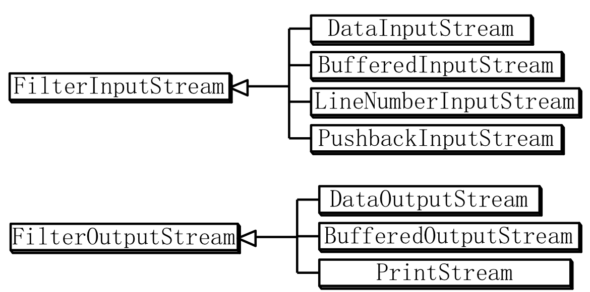

I/O流的链接
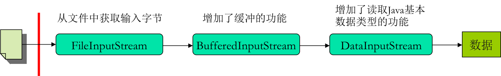
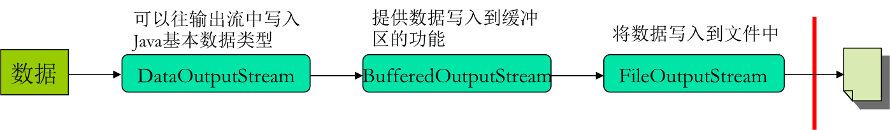

要使用过滤流，首先必须把它串接到某个输入/输出流上，以达到数据转换的目的。

通常在构造方法的参数中指定所要连接的流：

~~~java
FilterInputStream(InputStream in);
FilterOutputStream(OutputStream out);
~~~

###BufferedInputStream和BufferedOutputStream

__BufferedInputStream__ 和 __BufferedOutputStream__ 实现了带缓冲的过滤流，它提供了缓冲机制，把任意的I/O流串接到缓冲流上，自动利用内存缓冲，不必每次存取外设，可以提高该I/O流的存取效率。

对于 __BufferedOutputStream__ ，只有缓冲区满时，才会将数据真正送到输出流，但可以使用 __flush()__ 方法人为地将尚未填满的缓冲区中的数据送出。

~~~java
BufferedInputStream(InputStream input)
BufferedInputStream(InputStream input, int bufSize)
BufferedOutputStream(OutputStream output)
BufferedOutputStream(OutputStream output, int bufSize)
~~~

###DataInputStream和DataOutputStream

数据流类DataInputStream和DataOutputStream的处理对象除了字节或字节数组外，还可以实现对文件的不同数据类型的读写，将基本字节输入输出流，自动转成按基本数据类型进行读写的过滤流。

它们分别实现了接口DataInput和DataOutput，提供了一种较为高级的数据输入输出方式：
除了可处理字节和字节数组外，还可以处理int、float、boolean等基本数据类型，这些数据在文件中的表示方式和它们在内存中的一样，无须转换。

####文件流、缓冲流与数据流的串接 

BufferedInput/OutputStream
自动利用内存缓冲，不必每次存取外设
还可在其外面再加包装

~~~java
new DataInputStream(
	new BufferedInputStream(FileInputStream(“File1.dat”)
	)
);
~~~

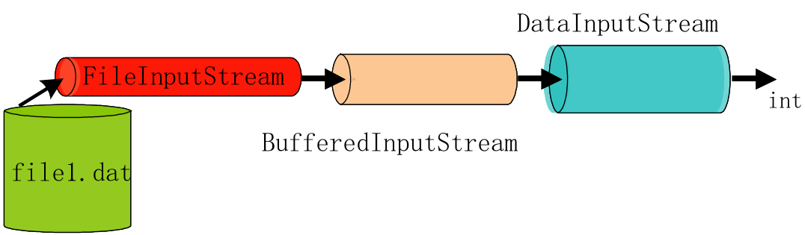

- LineNumberInputStream
LineNumberInputStream主要用于对文本文件的处理，提供了行号控制功能。

- PushBackInputStream
PushBackInputStream在编译程序的词法分析阶段，经常要超前读入一个字节以界定当前词的属性，然后再将该字节退回（因为下面的处理可能还会用到该字节）。 PushBackInputStream就提供了这样的能力，它提供了unread()方法将刚刚读入的字节或字节数组退回到输入流中去。

- PrintStream
PrintStream的作用是将Java语言中的不同类型的数据以字符表示形式输出到相应的输出流中去。
PrintStream类（FilterOutputStream类的子类）包含了把各种原始类型数据（整型或浮点型等）输出为文本的方法，可将文本输出到指定流中。

---

####字节流和字符流的转化

- 字节流和字符流是Java提供的两种输入输出处理方式。

- 字节流以单个字节为读/写单位，字符流以字符为读/写单位。 
一般字符由多个字节组成。

- InputStreamReader和OutputStreamWriter用来在字节和字符之间作为中介，可以把以字节形式表示的流转化为特定的平台上的字符表示。

- 可以从一个字节流构造一个字符流对象。
 我们可以在构造这些流对象时指定字符编码规范，也可以用当前平台的缺省编码规范。 

~~~java
public InputStreamReader(InputStream in)
public InputStreamReader(InputStream in, 
	String charsetName) throws UnsupportedEncodingException
public InputStreamReader(InputStream in, Charset cs)
public InputStreamReader(InputStream in, CharsetDecoder dec)
~~~

~~~java
public OutputStreamWriter(OutputStream out)
public OutputStreamWriter(OutputStream out, String charsetName) throws 	UnsupportedEncodingException
public OutputStreamWriter(OutputStream out, Charset cs)
public OutputStreamWriter(OutputStream out, CharsetEncoder enc)
~~~

---

#文件流类与文件操作 

##I/O处理中，最常见的是对文件的操作

- java.io包中有关文件处理的类有：File、FileDescriptor、 FileInputStream、FileOutputStream、RamdomAccessFile
- 处理字符文件的FileReader、FileWriter；
- 接口有：FilenameFilter。
- 在进行文件的读/写操作时，会产生非运行时异常IOException，必须捕获或声明抛弃。

##文件的操作步骤

对于文件的操作也就是实现对文件的读写，而不管是文本文件还是二进制文件都可采用相同的步骤：

- 1.把一个合适的流连接到文件；
- 2.使用循环读或写数据；
- 3.关闭流。 

##File类

File类提供了与平台无关的方法来对磁盘上的文件或目录进行操作,以及获取信息。

- 对于目录，Java把它当作一种特殊类型的文件，即文件名单列表。
- 通过File类的方法，可以得到文件或者目录的描述信息，包括名称、所在路径、读写性、长度等，还可以创建目录、创建文件，改变文件名、删除文件、列出目录中的文件等。 
- File类的对象并不打开文件，也不提供任何文件处理功能。
- java.io包中的其它类经常使用File对象来指定所要操作的文件或目录。

###File类提供4个构造方法。

~~~java
public File(String name)
	//指定与File对象关联的文件或目录的名称,name可以包含路径信息及文件或目录名

public File(String pathToName,String name)
	//使用参数pathToName（绝对路径或相对路径）来定位参数name所指定的文件夹或目录

public File(File directory,String name)
	//使用现有的File对象directory（绝对路径或相对路径）来定位参数name所指定的文件夹或目录

public File(URL url)
	//使用给定的统一资源定位符URl对象来定位文件
~~~

例如

~~~java
File f1 = new File("D:/Java");
File f2 = new File("D:/Java","test.txt");
File f3 = new File(f1,"test.txt");
File f4 = new File("file://D:/Java/test.txt");
~~~

###File类的方法

| | |
|:----|:----|
|boolean canRead()|测试文件是否可读|
|boolean delete()|删除文件|
|File getAbsoluteFile()|返回绝对文件名|
|File getAbsoluteFile()|返回绝对文件名|
|boolean isDirectory()|是否是目录|
|long lastModified()|上次修改时间，从1970年1月1号开始的标准时间(UTC)的毫秒数|

###FileInputStream、FileOutputStream类与读写二进制文件 

FileInputStream和FileOutputStream 分别是InputStream和OutputStream的子类 
用于进行文件的输入输出处理，其数据源和接收器都是文件。  
==用于处理文件字节流，每次一个字节。==

####FileInputStream类
- 用于顺序访问本地文件，对文件进行操作，不支持mark方法和reset方法。 
例如用来打开一个输入文件，若要打开的文件不存在，则会产生例外FileNotFoundException，这是一个非运行时例外，必须捕获或声明抛弃。

- 它的两个常用的构造函数如下： 

~~~java
FileInputStream(String filepath)
FileInputStream(File fileObj)
~~~

- 例如

~~~java
FileInputStream f1 = new FileInputStream("Test.java")
File f = new File("Test.java");
FileInputStream f2 = new FileInputStream(f);
~~~

####FileOutputStream类

- 用于向一个文本文件写数据
- 它从超类中继承write，close等方法
- 若要打开的文件不存在，则会创建一个新的文件，否则默认原文件的内容会被新写入的内容所覆盖（也可设置为追加）
- 它常用的构造函数如下：

~~~java
FileOutputStream(String filePath)
FileOutputStream(File fileObj)
FileOutputStream(String filePath, boolean append)
FileOutputStream(File fileObj, boolean append)
~~~

- 它们可以引发IOException或SecurityException异常 
- FileOutputStream重写了抽象类OutputStream的写数据的方法:

~~~java
public void write(byte[] b) throws IOException
public void write(byte[] b, int off, int len)throws IOException
public void write(int b) throws IOException
~~~

b是int类型时，占用4个字节，只有最低的一个字节被写入输出流，忽略其余字节。

__实例__

下面是一个演示InputStream和OutputStream用法的例子：

~~~java
import java.io.*;

public class fileStreamTest{

   public static void main(String args[]){
   
   try{
      byte bWrite [] = {11,21,3,40,5};
      OutputStream os = new FileOutputStream("test.txt");
      for(int x=0; x < bWrite.length ; x++){
         os.write( bWrite[x] ); // writes the bytes
      }
      os.close();
     
      InputStream is = new FileInputStream("test.txt");
      int size = is.available();

      for(int i=0; i< size; i++){
         System.out.print((char)is.read() + "  ");
      }
      is.close();
   }catch(IOException e){
      System.out.print("Exception");
   }	
   }
}
~~~

以上代码由于是二进制写入，可能存在乱码，你可以使用以下代码实例来解决乱码问题：

~~~java
//文件名 :fileStreamTest2.java
import java.io.*;

public class fileStreamTest2{
	public static void main(String[] args) throws IOException {
		
		File f = new File("a.txt");
		FileOutputStream fop = new FileOutputStream(f);
		// 构建FileOutputStream对象,文件不存在会自动新建
		
		OutputStreamWriter writer = new OutputStreamWriter(fop, "UTF-8");
		// 构建OutputStreamWriter对象,参数可以指定编码,默认为操作系统默认编码,windows上是gbk
		
		writer.append("中文输入");
		// 写入到缓冲区
		
		writer.append("\r\n");
		//换行
		
		writer.append("English");
		// 刷新缓存冲,写入到文件,如果下面已经没有写入的内容了,直接close也会写入
		
		writer.close();
		//关闭写入流,同时会把缓冲区内容写入文件,所以上面的注释掉
		
		fop.close();
		// 关闭输出流,释放系统资源

		FileInputStream fip = new FileInputStream(f);
		// 构建FileInputStream对象
		
		InputStreamReader reader = new InputStreamReader(fip, "UTF-8");
		// 构建InputStreamReader对象,编码与写入相同

		StringBuffer sb = new StringBuffer();
		while (reader.ready()) {
			sb.append((char) reader.read());
			// 转成char加到StringBuffer对象中
		}
		System.out.println(sb.toString());
		reader.close();
		// 关闭读取流
		
		fip.close();
		// 关闭输入流,释放系统资源

	}
}
~~~

###RandomAccessFile

RandomAccessFile类提供了一种称为“随机访问文件”方式，可以：

- 对一个文件同时进行读写操作[^a]
- 可以在文件的任意位置进行读写操作
- 直接继承object，并且同时实现了接口DataInput和DataOutput，提供了支持随机文件操作的方法,利用这个类可以在文件的任何位置读取或写入数据。

[^a]: 对于InputStream和OutputStream，他们都是顺序访问流，从头至尾访问流，并且输入流只能读，不能写，输出流只能写，不能读，即对一个文件不能同时进行读写。

~~~java
RandomAccessFile(String name,String mode) throws FileNotFoundException;
RandomAccessFile(File file,String mode) throws FileNotFoundException;
~~~
其中，

- file识别文件路径，mode指定参数访问模式：r表示读，w表示写，rw表示读写。
- 当文件不存在时，构造方法将抛出FileNotFoundException。

方法：

|||
|:---|:---|
|public long length()| 返回文件的长度|
|void setLength（long len）|设置文件的新长度|
|public void seek(long pos)|改变文件指针位置|
|public final int readInt()|读入一个整数类型|
|public final void writeInt(int v)|写一个整数|
|public long getFilePointer()|获取文件指针位置|
|public int skipBytes(int n)|跳过n个字节|
|close()|关闭文件|

- RandomAccessFile类提供了一个文件指针，用来标志要进行读写操作的下一数据的位置。
- 由于RandomAccessFile类实现了DataOutput与DataInput接口，因而利用它可以读写Java中的不同类型的基本类型数据readXXX()或writeXXX()：如ReadInt(), ReadLine(), WriteChar(), WriteDouble()等。 

###写文本文件

FileWriter类是一个以字符方式写文件内容的Writer类的子类。

~~~java
FileWriter(String filePath)
FileWriter(String filePath, boolean append)
FileWriter(File fileObj)
~~~

- 应把字符输出流与文件连接起来，通过输出流输出字符到文件中。 字符文件输出流创建如下： 

~~~java
FileWriter out=new  FileWriter(file); 
~~~

- 利用流的write()方法将JTextArea中显示的文本写到这个流中，代码如下：

~~~java
out.write(text.getText());
~~~

- 关闭文件输出流：

~~~java
out.close();
~~~

###读文本文件

FileReader类是一个以字符方式读取文件内容的Reader类的子类。

~~~java
FileReader(String filePath)
FileReader(File fileObj)
~~~

- 把字符输入流与文件连接起来，需要使用FileReader类，为提高效率，可在FileReader类基础之上串接Reader类的包装类，BufferedReader类具有readLine()方法，

~~~java
BufferedReader in=new BufferedReader(new FileReader(file));
~~~

- 利用BufferedReader类的readLine()方法通过循环控制一行一行从文件流中读取字符：
 
~~~java
while((line=in.readLine())!=null)
	text.append(line+"\n");
~~~

- 关闭流：

~~~java
in.close();
~~~

对于文件的操作也就是实现对文件的读写，而不管是文本文件还是二进制文件都可采用相同的步骤：

1. 把一个合适的流连接到文件；
2. 使用循环读或写数据；
3. 关闭流。

##对象序列化

Java是一种面向对象的语言，因而对象的永久存储是非常重要的。
在实际问题中，经常需要保存对象的信息，在需要的时候，再读取这个对象，这就是对象序列化。
对象序列化（Serialization）的目的是为Java的运行环境提供一组特性，将对象转换为字节流保存起来，并在以后还原这个对象。

对象流

能够输入输出对象的流称为对象流。可以将对象序列化后通过对象输入输出流写入文件或传送到其他地方。在Java中，允许可序列化的对象通过对象流进行传输。
要序列化一个对象，必须与一定的对象输出输入流联系起来，通过对象输出流将对象状态保存下来（将对象保存到文件中，或者通过网络传送到其他地方），再通过对象输入流将对象状态恢复。

序列化举例

要实现一个对象的序列化，可用两个步骤完成：第一步创建可序列化对象；第二步构造对象的输入输出流。 
1. 创建可序列化对象
在java.io包中，接口Serializable用来作为实现对象序列化的工具，只有实现了Serializable接口或Externalizable接口的类的对象才可以被序列化。

例如，定义一个实现Serialiable接口的类Student：

~~~java
public class Student implements Serializable{
	int id;            	// 学号
	String name;      	// 姓名
	String department;	// 系别
	
	public Student(int id,String name,int age,String department){
		this.id = id;
		this.name = name;
		this.department = department;
	}
}
~~~

构造对象的输入/输出流

使用ObjectInputStream和ObjectOutputStream将数据流功能扩展至可读写对象。 

~~~java
Student stu=new Student(030102,"Liu Ming", “JSJ");
FileOutputStream fo=new FileOutputStream(“data.ser”);　
ObjectOutputStream so=new ObjectOutputStream(fo);
try{
	so.writeObject(stu);
	so.close();
}
catch(IOException e) {
	System.out.println(e);
}
~~~

从文件输入流中读取对象

~~~java
FileInputStream fi=new FileInputStream("data.ser");
　　ObjectInputStream si=new ObjectInputStream(fi);　　
  try{
　　　　stu=(Student)si.readObject();
　　　　si.close();
　   }catch(IOException e)
　　{System.out.println(e);} 
~~~

---

#异常处理

##什么是异常

- 异常就是在程序的运行过程中所发生的意外事件，它中断指令的正常执行。
- Java中提供了一种独特的处理异常的机制，通过异常来处理程序设计中出现的异常。

异常发生的原因有很多，通常包含以下几大类：

- 用户输入了非法数据。
- 要打开的文件不存在。
- 网络通信时连接中断，或者JVM内存溢出。

这些异常有的是因为用户错误引起，有的是程序错误引起的，还有其它一些是因为物理错误引起的。

##为何使用异常处理

如：有程序是处理文件，这个流程中充满了异常可能。

~~~java
readFile {
	① 打开文件;（打不开怎么办?）
	② 判断大小;（大小判断失败怎么办?）
	③ 分配内存;（内存不够怎么办?）
	④ 读入内存;（文件读不出来怎么办?）
	⑤ 关闭文件;（文件关不掉怎么办?）
} 
~~~

解决方法：
==写大量的if语句。==

~~~java
errorCodeType readFile {   
	initialize errorCode = 0;
	
	① 打开文件;
	if (打开文件成功) {
		② 判断文件长
		if (文件长取到) {
			③ 分配内存
			if (分配内存成功) {
				④ 读入内存
				if (读文件失败) {
					errorCode = -1;
				} //读文件判断
			}
			else {
				errorCode = -2;
			} //分配内存失败
		}
		else {
			errorCode = -3;
		} //取不到文件长
	
		⑤ 关闭文件;
		if (文件没关 && errorCode == 0) {
			errorCode = -4;
		}
		else {
			errorCode = errorCode and -4;        
		}
	}
	else {
		errorCode = -5;
	} //文件未打开
	
	return errorCode;
}
~~~

从上面的流程可看出真正有用的代码不多，就五条而已，其它全部是判断异常用的。

- 主要逻辑都被错误处理代码混得看不清了；
- 程序可读性差；
- 出错返回信息量太少；
- 只把能够想到的错误考虑到，对以外的情况无法处理。

在Java中，处理这种情况的方法是利用异常处理，把异常（出错）处理和正常代码分开，
Java异常处理通过$5$个关键字__try__, __catch__, __finally__, __throw__和__throws__进行管理。 

~~~java
readFile {//结构清楚，无需自己判断，代码量小。
	try {
		打开文件；  
		判断大小;　 
		分配内存;　 
		读入内存; 
		关掉文件;     
	} 
	catch (文件打开失败) { 处理代码；} 
	catch (大小取不到失败) { 处理代码; }
	catch (内存分配失败) { 处理代码; }
	catch (读取失败) { 处理代码; }
	catch (文件关闭失败) { 处理代码; }
}
~~~

##使用异常处理的优点:

- 使用Java异常处理机制，把错误代码从常规代码中分离出来，结构清楚，无须自己判断，克服了传统方法的错误信息有限等问题。
- 此外，Java通过面向对象的方法进行异常处理，把各种不同的异常进行分类，并进行分组管理，从而可用专门的方法处理某个异常，也可用通用的方法处理一类异常。
- 异常处理还有一个好处是当不能确定和处理异常时，可以不予处理，而把问题提交上去。

##异常类的层次结构

在Java语言中，每个包中都定义了异常类，而所有的异常类都直接或间接地继承于java.lang.Throwable类。

当Java程序遇到不可预料的错误时，会实例化一个从Throwable类继承的对象。 

标准运行时异常类的子类是最常见的异常类。由于java.lang包是默认加载到所有的Java程序的，所以大部分从运行时异常类继承而来的异常都可以直接使用。

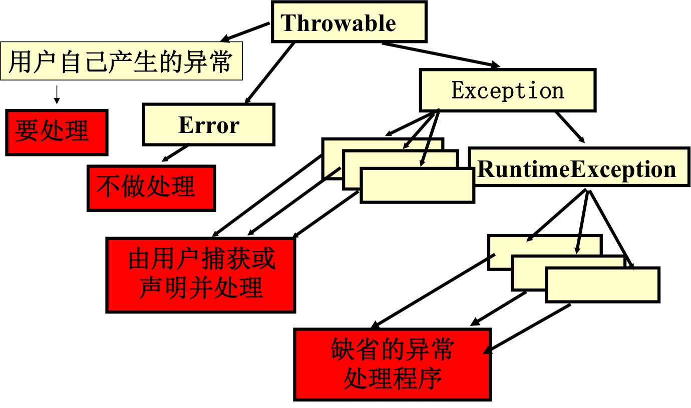

<!---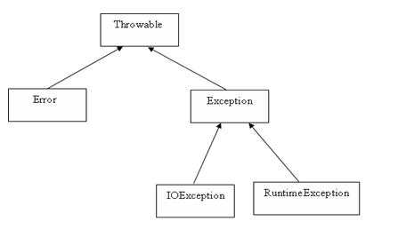--->

###Error
错误Error类指的是系统错误或运行环境出现的错误，这些错误一般是很严重的错误，即使捕捉到也无法处理(错误不是异常，而是脱离程序员控制的问题; 错误在代码中通常被忽略)，由Java虚拟机生成并抛出，包括系统崩溃、动态链接失败、虚拟机错误等，在Java程序中不做处理。 
例如，当栈溢出时，一个错误就发生了，它们在编译也检查不到的。

###Exception 
异常Exception类则是指一些可以被捕获且可能恢复的异常情况，是一般程序中可预知的问题。

异常可分为两类：

- (1) 运行时异常：运行时异常是可能被程序员避免的异常。在编译时被忽略,运行时由系统检测, 用户的Java程序中可以不做处理，系统将它们交给缺省的异常处理程序
- (2) 非运行时异常：在程序中必须对其进行处理，否则编译器会指出错误。 

- __检查性异常__：最具代表的检查性异常是用户错误或问题引起的异常，这是程序员无法预见的。例如要打开一个不存在文件时，一个异常就发生了，这些异常在编译时不能被简单地忽略。

异常类有两个主要的子类：__IOException__类和__RuntimeException__类。

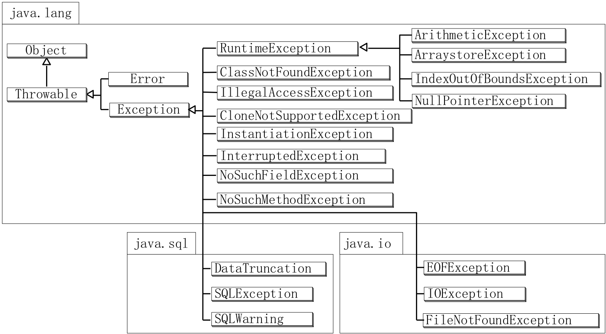

####Exception类的构造方法

Exception类有两种构造方法：

- Exception()：没有指定的消息串，直接构造一个Exception。
- Exception(String message)：根据参数提供的消息串，创建一个Exception。

例如，创建一个异常对象：

~~~java
Exception myExp=new Exception(“异常！”);
~~~

####常用方法
Exception类的方法均继承自Throwable类，可以为程序提供一些有关异常的信息，常用方法如下：

- String getMessage() ：返回该异常所存储的描述性字符串，即返回关于发生的异常的详细信息。这个消息在Throwable 类的构造函数中初始化了。
- String toString()：返回异常对象的详细信息，包含该类名和指出所发生问题的描述性消息的字符串（使用getMessage()的结果返回类的串级名字）。
- void printStackTrace()：将异常发生的路径，即引起异常的方法调用嵌套序列打印到标准错误流（错误输出流）。
- public Throwable getCause()： 返回一个Throwable 对象代表异常原因。
- public StackTraceElement [] getStackTrace() ：返回一个包含堆栈层次的数组。下标为0的元素代表栈顶，最后一个元素代表方法调用堆栈的栈底。
- public Throwable fillInStackTrace()： 用当前的调用栈层次填充Throwable 对象栈层次，添加到栈层次任何先前信息中。

例如：

~~~java
System.out.println(myExp.getMessage());
~~~

此语句可以将异常对象myExp的异常信息描述打印输出，在屏幕上显示“异常！”。 

####自定义异常类

在Java程序中，可以创建自定义的异常类。

- 用户定义的异常必须继承自Throwable或Exception类,建议用Exception类.
- 用户定义的异常同样要用try--catch捕获,但必须由用户自己抛出 throw new MyException.

可按照下面的方法自定义一个异常类：

- (1) 创建一个继承Exception类或者其它已存在的异常类的子类。
- (2) 在该类中创建一个默认的无参数构造方法，该构造方法以适当的错误消息作为输入，调用它的超类的构造方法。
- (3) 再增加一个带字符串参数的构造方法，该构造方法以适当的错误消息作为输入（还包括输入的字符串）来调用其超类相应的构造方法。 

例如，
定义一个继承于Exception类的用户自定义异常类，语句如下：

~~~java
class MyException extends Exception {
	MyException() {
		super(“数据错误！”);
	}
   
   MyException(String exp) {
		super(exp);
	}
}
~~~

__实例__

~~~java
// 文件名InsufficientFundsException.java
import java.io.*;

public class InsufficientFundsException extends Exception
{
   private double amount;
   public InsufficientFundsException(double amount)
   {
      this.amount = amount;
   } 
   public double getAmount()
   {
      return amount;
   }
}
~~~

##异常的处理机制

每当Java程序运行过程中发生一个可识别的运行错误时，即该错误有一个异常类与之相对应时，系统都会产生一个相应的该异常类的对象，即产生一个异常。

一旦一个异常对象产生了，系统中就一定有相应的机制来处理它，确保不会产生死机、死循环或其他对操作系统的损害，从而保证了整个程序运行的安全性。

Java中处理异常有两种方式：

- 捕获异常 
就地解决，并使程序继续执行。
- 声明抛出异常。 
也就是将异常向外转移，即将异常抛出方法之外，由调用该方法的环境去处理。

###捕获异常

- 当Java运行时系统得到一个异常对象时，它将会沿着方法的调用栈逐层回溯，寻找处理这一异常的代码。
- 找到能够处理这种类型的异常的方法后，运行时系统把当前异常对象交给这个方法进行处理，这一过程称为捕获(catch)异常。
- 这是积极的异常处理机制。如果Java运行时系统找不到可以捕获异常的方法，则运行时系统将终止，相应的Java程序也将退出。 

捕获并处理异常的程序结构：try-catch-finally

~~~java
try {
	//接受监视的程序块,在此区域内发生的异常,
	//由catch中指定的程序处理
}
catch (要处理的异常种类和标识符) {
	//处理异常
}
catch (要处理的异常种类和标识符) {
	//处理异常
}

…

finally {
	//最终处理
}
~~~

__实例__

下面的例子中声明有两个元素的一个数组，当代码试图访问数组的第三个元素的时候就会抛出一个异常。

~~~java
// 文件名 : ExcepTest.java
import java.io.*;
public class ExcepTest{

   public static void main(String args[]){
      try{
         int a[] = new int[2];
         System.out.println("Access element three :" + a[3]);
      }catch(ArrayIndexOutOfBoundsException e){
         System.out.println("Exception thrown  :" + e);
      }
      System.out.println("Out of the block");
   }
}
~~~

####try
捕获异常的第一步是用try{…}选定捕获异常的范围，try模块中的语句是程序正常流程要执行的语句，但是在执行过程中有可能出现异常。所有可能抛出异常的语句都放入try模块中。

####catch(必有)
每个try代码块可以伴随一个或多个catch语句，用于处理try代码块中所生成的异常事件。catch语句只需要一个形式参数指明它所能够捕获的异常类型,这个类必须是Throwable的子类,运行时系统通过参数值把被抛弃的异常对象传递给catch块。 
在catch块中是对异常对象进行处理的代码，与访问其它对象一样，可以访问一个异常对象的数据成员或调用它的方法。 
getMessage( )是类Throwable所提供的方法，用来得到有关异常事件的信息，类Throwable还提供了方法printStackTrace( )用来跟踪异常事件发生时执行堆栈的内容。 
例如：

~~~java
try{
......
}
catch (FileNotFoundException e) {	System.out.println("message: "+e.getMessage());
	e.printStackTrace(System.out);
}
catch (IOException e) {
	System.out.println(e.getMessage() );
}
~~~

catch语句的顺序： 
捕获异常的顺序和catch语句的顺序有关，当捕获到一个异常时，剩下的catch语句就不再进行匹配。 
因此，在安排catch语句的顺序时，首先应该捕获最特殊的异常，然后再逐渐一般化。也就是一般先安排子类，再安排父类。

__实例__

~~~java
try
{
   file = new FileInputStream(fileName);
   x = (byte) file.read();
}catch(IOException i)
{
   i.printStackTrace();
   return -1;
}catch(FileNotFoundException f) //Not valid!
{
   f.printStackTrace();
   return -1;
}
~~~

####finally(可选)
捕获异常的最后一步是通过finally语句为异常处理提供一个统一的出口，使得在控制流转到程序的其它部分以前，能够对程序的状态作统一的管理。 
不论在try代码块中是否发生了异常事件，finally块中的语句都会被执行。
~~~java
try{
    // 程序代码
 }catch(异常类型1 异常的变量名1){
    // 程序代码
 }catch(异常类型2 异常的变量名2){
    // 程序代码
 }finally{
    // 程序代码
 }
~~~

__实例__

~~~java
public class ExcepTest{

   public static void main(String args[]){
      int a[] = new int[2];
      try{
         System.out.println("Access element three :" + a[3]);
      }catch(ArrayIndexOutOfBoundsException e){
         System.out.println("Exception thrown  :" + e);
      }
      finally{
         a[0] = 6;
         System.out.println("First element value: " +a[0]);
         System.out.println("The finally statement is executed");
      }
   }
} 
~~~

注意下面事项：

- catch不能独立于try存在。
- 在try/catch后面添加finally块并非强制性要求的。
- try代码后不能既没catch块也没finally块。
- try, catch, finally块之间不能添加任何代码。

###常见的异常

- ArithmeticException
- ArrayIndexOutOfBandsException
- ArrayStoreException
- IOException
- FileNotFoundException
- NullPointerException
- MalformedURLException
- NumberFormatException
- OutOfMemoryException

如果在使用能够产生异常的方法而没有捕获和处理，将不能通过编译

###声明抛出异常

####抛出异常

在Java程序的执行过程中，如果出现了异常事件，就会生成一个异常对象。 
生成的异常对象将传递给Java运行时系统，这一异常的产生和提交过程称为抛出(throw)异常。 

抛出异常就是产生异常对象的过程，首先要生成异常对象，异常或者由虚拟机生成，或者由某些类的实例生成，也可以在程序中生成。 
在方法中，抛出异常对象是通过throw语句实现的。 
例如：

~~~java
IOException e=new IOException();
throw e;
~~~

注意：　
可以抛出的异常必须是Throwable或其子类的实例。下面的语句在编译时将会产生语法错误：

~~~java
throw new String("want to throw");
~~~

####声明抛出异常

一个方法不处理它产生的异常,而是沿着调用层次向上传递,由调用它的方法来处理这些异常,叫声明抛出异常（throws）。 
声明抛出异常是一种消极的异常处理机制。 

如果在一个方法中生成了一个异常，但是这一方法并不确切地知道该如何对这一异常事件进行处理，这时，一个方法就应该声明抛弃异常，使得异常对象可以从调用栈向后传播，直到有合适的方法捕获它为止。 
也就是说抛出异常的方法和处理异常的方法不是同一个方法时，则需声明抛出异常。 

用方法声明中的throws子句指明。

例如：

~~~java
public int read () throws IOException{

...

}
~~~

throws子句中同时可以指明多个异常，之间由逗号隔开。例如：

~~~java
public static void main(String args[])
	throws IOException, IndexOutOfBoundsException 
{

…

}
~~~

下面方法的声明抛出一个RemoteException异常：

~~~java
import java.io.*;
public class className
{
   public void deposit(double amount) throws RemoteException
   {
      // Method implementation
      throw new RemoteException();
   }
   //Remainder of class definition
}
~~~

一个方法可以声明抛出多个异常，多个异常之间用逗号隔开。

例如，下面的方法声明抛出RemoteException和InsufficientFundsException：

~~~java
import java.io.*;
public class className
{
   public void withdraw(double amount) throws RemoteException,
                              InsufficientFundsException
   {
       // Method implementation
   }
   //Remainder of class definition
}
~~~

###对异常处理的进一步讨论

- （1）对Error类或其子类的对象，程序中不必进行处理。 
- （2）对RuntimeException类或其子类，程序中可以不必进行处理。 
- （3）除此之外的异常，程序员都应该在程序中进行处理。 
        要么用try-catch-finally进行捕获处理 
        要么明确表示不处理从而声明抛出异常 
        要么先捕获处理然后再次抛出。 
- （4）Java的异常处理机制（try-catch-finally语句、throws 子句、throw 语句）带来Java程序代码结构上的改变。 
- （5）不能滥用异常机制。简单的出错判断建议用if语句。 
- （6）不要过分细分异常。

###练习：

－ 1．什么是Java异常？解释抛出、捕获异常的含义。
－ 2．简述Java的异常处理机制。
－ 3．Java中，所有的异常类都继承于哪一个类？
－ 4．如何自定义异常类？
－ 5．设计一个Java程序，程序中要进行数组操作和除法运算，所设计的程序对可能出现的异常进行处理。

