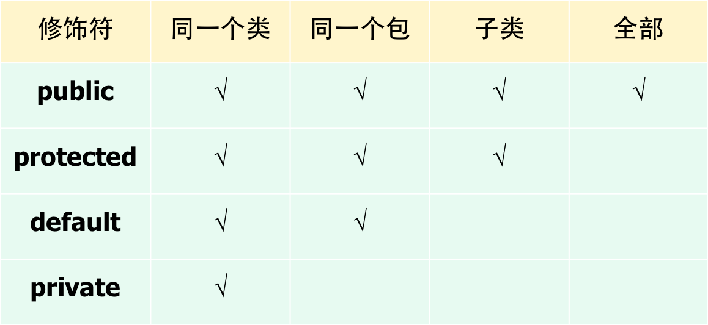

[TOC]

#包(package)

包(package)是Java提供的文件(即公共类)的组织方式。 
一个包对应一个文件夹，一个包中可以包括许多类文件。 
包中还可以再有子包，称为包等级。 

##包的作用有四个：

- (1) 定位类：具有相似功能的类可以放置在同一个包中，这样可以很容易地查找定位类。
- (2) 避免命名冲突：在开发由其他程序员共享的可复用类时，会发生命名冲突，可以把类放在不同包中，通过包名引用类可以避免命名冲突。
- (3) 可以方便地分发软件。
- (4) 控制类之间的访问

注意：

- 包是一个类名空间，同一个包中的类和接口不能重名，不同包中的类可以重名。
- 根据Java的命名规则，包名均为小写字母。
- 类之间的访问控制是通过类修饰符来实现的，若类修饰符为__public__，则表明该类不仅可供同一包中的类访问，也可以被其他包中的类访问。
- 若类无修饰符，则表明该类仅供同一包中的类访问。
- Java的包等级和Windows的文件组织方式完全相同，只是表示方法不同。

##包的定义

包的定义就是将源程序文件中的接口和类纳入指定的包。

一般情况下，Java源程序由四部分组成：

- (1) 一个包(package)定义语句(可选项)。其作用是将本源文件中的接口和类纳入指定包。 源文件中若有包说明语句，必须是第一个语句；
- (2) 若干个(import)语句(可选项)。其作用是引入本源文件中所需要使用的包；
- (3) 一个__public__的类声明。 在一个源文件中只能有一个__public__类；
- (4) 若干个属于本包的类声明(可选)。 

包的定义语句格式：

>package 包名1[.包名2[.包名3…]];

- 创建包就是在当前文件夹下创建一个子文件夹，存放这个包中包含的所有类和接口的.class文件。
- 语句中的符号“．”代表了目录分隔符，说明这个语句创建了两个文件夹。

==习惯上，包名都用小写字母。==

Java规定，如果一个Java文件中有package语句，那么package语句必须写在Java源程序的第一行，该行前只能有空格和注释行。 
Package语句在每个Java源程序中只能有一条，一个类只能属于一个包。

例如：

~~~java
package cn.edu.hebiace;
~~~

定义了包，语句中的包名分隔符“.”相当于目录分隔符。 
使用package语句指定一个源文件中的类属于一个特定的包。

Java要求包名与文件系统的目录结构一一对应。 
对于名为cn.edu.hebiace的包，必须创建一个如图所示的目录结构。

若源文件中未使用package语句创建包，则该源文件中的接口和类位于Java的无名包中(无名包又称默认包，指当前目录)，会把源文件中的类存储在当前目录(即存放Java源文件的目录)下。

==无名包中的类不能被其他包中的类引用和复用==

##设置类路径

包是一种组织代码的有效手段，包名指出了程序中需要使用的".class"文件的所在之处。 
另一个能指明".class"文件所在的位置是环境变量CLASSPATH。 

对于Java Application程序，还可以通过为Java解释器设置参数来指定类文件路径。

例如，
对于JDK中的Java解释器java.exe，有开关参数-classpath；

假设当需要解释执行的test.class文件不在当前目录而在e盘的TEMP目录下时，可以使用如下的命令行语句：

>java -classpath e:\temp Test

来运行这个程序

##包的使用

Java提供了丰富的标准类来帮助程序设计者更方便快捷地编写程序，这些标准类组成了类包，主要有：

- java.lang                       
- java.applet                    
- java.io
- java.net                        
- java.util
- java.awt
- java.awt.image
- java.awt.peer                

使用Swing组件进行GUI设计，使用javax.swing包中的类

==除了java.lang之外，其余类包都不是java语言所必须的。== 
若要使用，必须进行包的导入。

将类组织成包的目的是为了更好地利用包中的类。
通常一个类只能引用与它在同一个包中的类。

如果需要使用其它包中的public类，则可以使用如下的几种方法。

- (1) 在引入的类前加包名 
例如：

~~~java
pack1.pack2.Format.format(23.4533,2); 
~~~

- (2) 单类型导入（single-type-import） 
例如上面的语句在程序开始处增加了：

~~~java
import  pack1.pack2.Format；
~~~

语句之后，就可以直接写成：

~~~java
Format.format(23.4533,2);
~~~

- (3) 按需类型导入（type-import-on-demand）

~~~java
import pack1.pack2.*; 
~~~

##内部类和匿名类

###内部类
一个类被嵌套定义于另一个类中，称为内部类（Inner Classes）或内隐类，包含内部类的类称为外部类。 

外部类与内部类的访问原则是：

- 在外部类中，一般通过一个内部类的对象来访问内部类的成员变量或方法；
- 在内部类中，可以直接访问外部类的所有成员变量和方法(包括静态成员变量和方法、实例成员变量和方法及私有成员变量和方法)。

内部类和其他常规类类似，有下列特征：

- （1）Java将内部类作为外部类的一个成员，内部类可以调用包含它的外部类的成员变量和成员方法，所以不必把外部类的引用传递给内部类的构造方法。
- （2）内部类的类名只能用在外部类和内部类自身中，内部类的类名不能与外部类的类名相同。当外部类引用内部类时，须给出完整的名称（外部类名.内部类名）。
- （3）内部类只是用来支持其外部类的工作，编译后，它的名称形如“外部类名称$内部类名称.class”。
- （4）内部类可以声明为public、protected或private，其意义与用在类的其他成员上相同。

和普通的类一样，内部类也可以有静态的。 
__static__型内部类只能访问外部类中的__static__成员。 
若要访问非static成员，须先创建一个外部类对象，然后通过该对象进行访问。

###匿名类

有时在定义事件处理代码时，由于代码短小，不必再明确定义一个类，可使用匿名内部类。

匿名内部类是__final__(最终)类，非static类，匿名内部类将类的声明和创建类的实例一步完成。 

主要应用在事件处理的代码编写中。

~~~java
JButton jb = new JButton("Exit");

jb.addActionListener(new ActionListener() {
	public void actionPerformed(ActionEvent e) {
		System.exit(-1);
	}
};
~~~

注意：在使用匿名内部类时，要记住以下几个原则：

- （1）匿名内部类不能有构造方法；
- （2）匿名内部类不能定义任何静态成员、方法和类。
- （3）匿名内部类不能是__public__, __protected__, __private__, __static__。
- （4）只能创建匿名内部类的一个实例。 
一个匿名内部类一定是在__new__的后面，用其隐含实现一个接口或实现一个类。 
因匿名内部类为局部内部类，所以局部内部类的所有限制都对其生效。
 内部类只能访问外部类的静态变量或静态方法。
- （5）当在匿名类中用__this__时，这个__this__则指的是匿名类或内部类本身。 
这时如果要使用外部类的方法和变量，则应该加上外部类的类名

##访问控制和类的封装性

对类的成员变量和成员方法而言，其应用范围可以通过施以一定的访问权限来限定。

注意：

- __private__修饰符只能用来修饰类的数据成员和成员方法，而不能用来修饰类。
- 修饰符__private__、 __public__、 __protected__都不能用来修饰方法中的局部变量。
在大部分情况下，一个类的构造方法都是__public__的。
但是，如果不想创建类的实例，可以定义__private__构造方法。

###类的封装性

保证模块正确性的措施是由信息的隐藏性来实现的。

类包括成员变量和方法两部分。

- 那些允许其他包程序访问和修改的成员变量和方法可以定义为__public__类型；
- 只允许同一个包中的其他类，以及该类的子类访问和修改的成员变量可以定义为__protected__类型；
- 不允许其他类(内部类除外)访问和修改的成员变量可以定义为__private__类型。 

---

本文档 Github ：
https://github.com/bushehui/Java_tutorial

