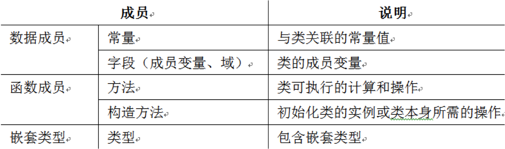

[TOC]

#类

类是一个数据结构，类定义:

- __数据类型的数据__(字段)
- __行为__(方法和其他函数成员)。

对象是基于类的具体实体，有时称为类的实例(instance)。 
==类与对象的关系类似于车型设计和具体的车==

进行Java程序设计，实际上就是定义类的过程。 
一个Java源程序文件往往是由许多个类组成的。

从用户的角度看，Java源程序中的类分为两种：

- 1. 系统定义的类，即Java类库。 
基类：所有Java的类都派生自__Object__。 
Java提供的标准类库分布在一系列的包中，如java.lang，java.awt，java.net等,
Java的类可组织在包(__package__)中。 
- 2. 用户自己定义的类。 
编程的过程就是继承基类或标准类而创建、定义特殊子类的过程。

##类的定义

Java中类包括__成员变量__和__成员方法__两部分。

- 类的__成员变量__可以是基本数据类型的数据或数组，也可以是一个类的实例； 
用于描述状态的数据成员
- 类的__方法__用于处理该类的数据。 
用于描述操作的函数成员

###类的定义格式：

~~~
[类的修饰字] class 类名称 [extends 父类名称][implements 接口名称列表]
{ 
	变量定义及初始化；

	方法定义及方法体；
}
~~~

~~~java
class Circle {
	point center; // 属性或成员
	float radius; // 属性或成员
	
	double getArea(){ // 方法
		return radius*radius*3.1415926;   
	}
}

public class Rectangle extends Shapes implement Display{ 
   …… //  类体
}      
//下面的Rectangle类继承了Shapes父类，实现了接口Display，是一个公共类。
~~~

__类名称__：

- 习惯上类名的第一个字母大写,但这不是必须的。
- 类的名字不能是Java中的关键字,要符合标识符规定,即名字可以由字母,下划线,数字或美圆符号组成,并且第一个字符不能是数字。
- 但给类命名时,最好遵守如下习惯： 
如果类名使用拉丁字母,那么名字的首写字母使用大写字母,例如Hello、Time、People等。 
类名最好见名知意,当类名由几个”单词”复合而成时,每个单词的首写字母使用大写,如BeijingTime，CarNumber等。

###关于类定义的说明

####类的修饰字：

>[public | default(可缺省，非公开类)] [abstract | final]

|类的修饰字| |
|:---|:---|
|public|允许其他类（没有限制）访问本类，一个源文件仅可以有一个public类，且与文件同名。|
|default（缺省）|可被当前包中的其他类访问；|
|abstract|没有实例的抽象概念类，类不能被实例化，包含有未实现的方法。 |
|final|不能再被扩展，不包含子类的类；易于安全性的实现，或用于创建固定功能的类|

注意：

__abstract__和__final__不能同时作为一个类的修饰符。 

每个类都拥有自己的名字空间，即指类及其方法和变量可以在一定的范围内知道彼此的存在，可以使用。

####父类继承声明：

>extends 父类名（见继承）

- 用来表明新创建的类继承哪个类，被继承的类称为此类的父类。
- extends后面只能跟一个父类名。 

####实现接口(interface)：

>implements 接口名

用来表明这个类实现了哪些接口，接口名可以有多个。

例如下面的类是合法的：

~~~java
class MyC1ass { 
	//空类，没有任何用处，但是合法
}
~~~

又如：下面的Rectangle类继承了Shapes父类，实现了接口Display，是一个公共类。

~~~java
public class Rectangle extends Shapes implement Display{      
	…… //类体
}
~~~

####类体

类体中定义了该类所有的成员变量和该类所支持的方法，其格式说明如下： 

~~~java
{
	[成员变量说明] 
	[成员方法说明] 
}
~~~

~~~java
{
	[public | protected | private ] [static]
	[final] [transient] [volatile] 
	type variableName;　//成员变量
	
	[public | protected | private ] [static]
	[final | abstract] [native] [synchronized]
	returnType methodName([paramList]) [throws exceptionList]
	{statements} //成员方法
}
~~~

####类定义中成员变量的声明

成员变量又称值域。 
成员变量的说明类似于方法的局部变量说明，所不同的是，成员变量定义在类中，是类成员的一部分，整个类都可以访问它。

Java中成员变量说明形式如下

>[变量修饰字] 变量数据类型 变量名1,变量名2[=变量初值]…;

例如：

~~~java
private int number;
~~~

类的成员变量在定义它的类内部，可以直接通过成员变量名来访问。

~~~java
class Circle {
	static final float PI=3.1415926f; // 常量
	
	private Point center; // 属性或成员
	private float radius; // 属性或成员
	
	static Color  color;
	
	public float area;

	float getArea(){ // 方法
		return radius*radius*PI; //内部访问成员变量
	}
}
~~~

如果从类的外部访问，类变量和类对象变量的使用方法是不同。 
访问类变量的格式如下： 

>类名.类变量名 

例如我们可以采用下面形式访问上例中的静态变量color的：

>Circle.color，

由此可见，访问类变量与类的对象构造和对象都无关。 
类变量名必须用static修饰。
访问实例变量的格式如下： 

>对象名.实例变量名 

例如

~~~java
Circle c1=new Circle(); //c1是对象名
System.out.println(“area=”+c1.area); 
System.out.println(“Color=”+Circle.color); 
~~~

####类定义中方法的声明

在Java中，方法总是Java类的一个组成部分。 
通过类的方法，改变对象的状态。 
方法说明分为方法首部说明和方法体两部分。  
方法首部说明的格式如下： 

~~~
[方法修饰字] 返回类型  方法名称(参数1,参数2,…) [throws exceptionList]
{
	…(statements;) //方法体：方法的内容
}
~~~

可能的选项有：

~~~
[public | protected | private ] 
[static][final | abstract] [native] [synchronized] 
returnType methodName([paramList])[throws exceptionList]//方法声明{……} 
~~~

#####方法体

- 方法体是实现这个方法的代码段，它由“{”和“}”括起来的语句序列构成。
- 方法体也可以是一个分号“；”，表示无方法体，该方法没有实现。
- 当且仅当方法的修饰符中有abstract或native时，方法才无方法体。

例如:求解三角形问题时可以编写Triangle类。

~~~java
class Triangle{ 
	double sideA,sideB,sideC;    //三角形的三边

	void setSide(double a,double b,double c){ //该方法用来赋初值
		sideA=a;
		sideB=b;
		sideC=c;
	}

	boolean isOrNotTriangle(){   //判断是否是三角形的方法
		if(sideA+sideB>sideC&&sideA+sideC>sideB&&sideB+sideC>sideA){
			return true;
		} 
		else {
			return flase;
		}
	}
}
~~~

#####方法的调用

成员方法又分为__类方法__(静态方法)和__对象方法__(实例方法)两类。

他们的调用是有区别的。

<!---前面已经简单讨论了类变量。
类变量不属于由类定义的个别实例对象，而是属于定义它的类；实例变量是针对实例的。这些讨论同样也适用于类方法。 
--->
类方法调用形式如下： 

>类名.类静态方法名(实参列表) 

对象方法调用形式如下： 

>类对象名.类非静态方法名(实参列表) 

例如

~~~java
Circle c1=new Circle(); // r1是对象名
System.out.println(“area=”+c1.getArea()); 
~~~

####修饰符

|访问控制符|访问权限|
|:---|:---|
|public|可被所有其他类引用|
|protected|该类自身、子类、同一包中的其他类|
|private|仅可被该类自身引用和修改，不能被其他任何类（包括子类）引用|
|default(缺省)|本包中的类|
|static| 类变量或类字段，对所有的实例一致，引用时前缀可使用类名或对象名，属于类|
|final|数值不变常量，定义同时应对其进行初始化|
|volatile|异步控制修饰符，表示多个并发线程共享的变量，这使得各线程对该变量的访问保持一致|
|transient|与对象序列化有关|

#####static：静态方法，又称类方法 
使用类名或对象名作为前缀，建议使用类名 
在方法体中只能使用static变量和static方法或访问自己的局部变量 
当类成员声明中含有static修饰符时，它声明为静态成员；否则为实例成员（非静态成员）

Static的作用:

- 类初始化

- 静态成员变量（共享数据）

~~~
public class MathUtil{
	//定义了一个类静态常量PI
	public static final double PI=3.1415926;
}
~~~

这个PI被static修饰后，要想使用，必须通过“类名.类成员变量名"这种方法使用。 
其它例子如前面程序经常使用的System.out.println()，out是System类的一个类成员，其类型是PrintStream ，所以就通过类名System就直接引用了。 
再比如，Integer.MAX_VALUE则表示的是一个整型类能够表示的最大数。 

- 静态方法（共享操作）

在没有任何对象的前提下，仅通过类本身来调用静态方法； 
没有this参数的方法； 
类的静态方法可以访问其他类的静态方法和静态域，虽然Java没有全局方法； 
一个特例：main方法；

~~~java
public class Circle {
	public static final double PI=3.1415926;//类成员变量
	
	//构造方法，之所以定义为私有，是因为不希望用new运算符创建实例。
	private Circle() {
		super();
	}
	
	public static double getArea(double r){
		return PI*r*r;
	}

	public static void main(String[] args) {
		System.out.println("半径为10的圆面积是"+Circle.getArea(10));
		System.out.println("半径为8的圆面积是"+Circle.getArea(8));
	}
}
~~~

#####abstract：
只有接口没有语句，要在子类中通过重新定义（override）来实现 

#####final：
不能被重新定义（override） 

常量字段必须在声明时赋值或在类的构造方法内或初始化代码块中被赋值一次 
常量字段的值不能更改 
给常量字段赋初值时，一个常量字段可以依赖于同一程序内之前声明的其他常量，但不能依赖于同一程序内之后声明的其他常量 
静态常量字段属于静态成员，一般通过类名来引用：类名.静态字段名 
实例常量字段必须通过对象实例来引用：对象.实例字段名 

例：定义圆类 Circle.java

~~~java
// Circle.java

public class Circle { 
	private double radius = 1; // 圆的半径
	private static int numberOfObjects = 0; // 创建的圆的个数
	
	// 以半径1创建一个圆，圆的个数加1
	public Circle() {
		numberOfObjects++;
	}
	
	// 以半径newRadius创建一个圆，圆的个数加1
	public Circle(double newRadius) {
		radius = newRadius;
		numberOfObjects++;
	}
	
	// 获取圆的半径
	public double getRadius() {
		return radius;
	}
  
	// 设置圆的半径
	public void setRadius(double newRadius) {
		radius = (newRadius >= 0) ? newRadius : 0;
	}
  
	// 获取圆的个数
	public static int getNumberOfObjects() {
		return numberOfObjects;
	}
   
	// 返回圆的面积
	public double findArea() {
		return radius * radius * 3.14159;
	}
}
~~~

解析

- 该类中定义了私有成员变量radius，而方法setRadius中的局部变量radius与其同名，在setRadius方法体内成员变量radius被隐藏，所以使用this关键字访问成员变量。
- setRadius方法的功能是：若形参radius的值大于等于$0$，则把形参radius的值赋给成员变量radius，否则给成员变量radius赋值为$0$。
- 该类的定义中没有使用setArea()方法设置圆的面积，而是在创建一个圆时就设置了圆的面积，符合自然规律。
- 当使用setRadius方法重新设置圆的半径时，相应地修改圆的面积。

###方法重载

方法重载(Method Overloading)就是一个类中可以有多个方法具有相同的名字,但这些方法的参数必须不同,即或者是参数的个数不同,或者是参数的类型不同，或者是返回值不同。 这也是面向对象的程序设计中的奇妙之处，重载反映了大千世界的变化。 

如果几个方法的方法名相同，只是方法形参个数或形参类型有所不同，则称这几个方法为__重载方法__。 

从另外的含义上来讲，重载也可以看成是同一个方法具有不同的版本，每个版本之间在参数特征和返回值方面有差别。
==重载是Java实现多态性的一种方式。==

当调用一个重载方法时，JVM自动根据当前对方法的调用形式在类的定义中匹配形式符合的成员方法，匹配成功后，执行参数类型、数量均相同的成员方法。方法重载在Java的API类库中得到大量的使用。

注意： 
==如果几个方法的方法名、方法的形参个数和形参类型均相同，只是方法的返回值类型不同，则不称其为重载方法，编译时会出错。==

例如有如下的两个重载方法说明： 

~~~java
int max(int num1, double num2);
double max(double num1, int num2); 
~~~
当使用max(1, 4)方法调用时，编译器不能确定调用哪一个方法更合适，这称为方法调用的二义性，二义性的方法调用会引起编译时的错误。

~~~java
class Demo2{
	int a,b;
	
	int method(){ //成员方法一
		return a+b;
	}
   
   int method(int c){ //成员方法二
		return a+b+c;
	}  
   
   int method(int c,int d){ //成员方法三
		return a+b+c+d;
	}
   
   Demo2(int a,int b) { //构造方法
		this.a = a;
		this.b = b;
	}
}
~~~

关于成员方法重载的例子

~~~java
public class DemoOverload{
	public static void main(String args[]){
		Demo2 aDemo2 = new Demo2(1,2); //实例化
		
		int a = aDemo2.method(); //调用成员方法一
		System.out.println(a); 
		
		int b = aDemo2.method(3); //调用成员方法二
		System.out.println(b);
		
		int c = aDemo2.method(3,4); //调用成员方法三
		System.out.println(c);
	}
}
~~~

上面程序的运行结果为：

>3 
>6 
>10 

构造方法也可以重载，

~~~java
// ConstructionOverload.java
class Demo{
	int a,b,c;//成员变量
   
   public Demo(){} //构造方法1
     
   public Demo(int a) { //构造方法2
   		this.a = a;
   }
   
   public Demo(int a,int b) { //构造方法3
  		this.a = a;
		this.b = b;
	}
	
   public Demo(int a,int b,int c) { //构造方法4
   		this.a = a;
		this.b = b;
		this.c = c;
	}
}
~~~

方法Demo()被定义了四次，每次参数不同。 
第一个构造方法，没有参数，也没有方法体，它和系统的缺省构造方法是一致的。
缺省的构造方法确保每个Java类都至少有一个构造方法。
如果程序中给出了带参数的构造方法，而没有给出缺省构造方法，这时调用缺省构造方法将导致错误。 
在调用构造方法时，由于使用的是同一方法名，因此根据构造方法的参数就能找到需要运行的哪个方法。 

~~~
public class ConstructionOverload{
	public static void main(String args[]){

	//应用第一种构造方法
	Demo aDemo = new Demo();
   System.out.println("方法一成员变量a："+aDemo.a);
   System.out.println("方法一成员变量b："+aDemo.b);
   System.out.println("方法一成员变量c："+aDemo.c);

   //应用第二种构造方法
   Demo bDemo = new Demo(1);
   System.out.println("方法二成员变量a："+bDemo.a);
   System.out.println("方法二成员变量b："+bDemo.b);
   System.out.println("方法二成员变量c："+bDemo.c);

……
~~~

###构造方法

方法名和所在类的类名完全相同的方法称为构造方法。 
==执行类的实例的初始化工作。==

每个类都有构造方法，如果没有显式声明构造方法，则编译器会自动生成一个默认的无参数的构造方法。 
默认构造方法实例化对象，并将未赋初值的字段设置为默认值。

Java类初始化时，首先初始化静态字段，故在给实例字段赋初值时，可以引用类中定义的静态字段(包括从父类继承的静态字段)。
但给静态字段赋初值时，不能引用类中定义的实例字段 
字段的初始化按位置顺序执行，故后续位置的字段的初始化，可以使用之前初始化的字段。

如果构造方法被声明为private类型，则这个构造方法不能从类外访问。 
如果一个类的所有构造方法都被声明为private类型，则不能在创建该类的对象实例。 
私有构造方法一般用于只包含静态成员的类。通过添加一个空的私有实例构造方法，可以阻止其实例化，以确保程序只能通过类名来引用所有的静态成员。

构造方法具有下列特性：

- （1）构造方法名必须和类名完全相同。
- （2）构造方法不具有任何返回值类型，如果写上任何一种返回值类型（包括关键字void）则该方法不再是构造方法，而成为普通的成员方法。
- （3）构造方法也可以重载。重载构造方法的目的是使类对象具有不同的初始值，为类对象的初始化提供方便。
- （4）当使用new运算符创建对象时，系统会自动调用构造方法，构造方法起着初始化对象的作用。
- （5）当在一个类中没有显式定义构造方法时，系统会提供一个默认构造方法。默认构造方法没有任何形式参数，并且方法体为空。
- （6）不能使用static、final、abstract、native和synchronized修饰符修饰构造方法。

注意： 
只要用户定义了构造方法(不一定是无参构造方法)，Java语言就不再提供默认的构造方法。 
如果为类定义了一个带参数的构造方法，还想使用无参构造方法，则用户必须自己定义。 
建议用户自定义类的无参构造方法。

类是创建对象的模板。
当使用一个类创建了一个对象时,我们也说我们给出了这个类的一个实例。
通常的格式为：

>Type objectName=new Type([parameterList]);

创建一个对象包括对象的声明、为对象分配内存空间和赋初值三个步骤。

1、对象的声明格式为：

>类的名字 对象名字;

如

>People zhangPing；

或

>People zhangPing，LiYong；

这里People是一个类的名字,zhangPing是我们声明的对象的名字.

2、 为声明的对象分配内存.

使用new运算符和类的构造方法为声明的对象分配内存,如果类中没有构造方法,系统会调用默认的构造方法。

默认的构造方法是无参数的,构造方法的名字必须和类名相同。
用new可以为一个类实例化多个不同的对象，这些对象分别占用不同的内存空间，因此改变其中一个对象的状态不会影响其他对象的状态。

3、最后一步是执行构造方法，进行初始化。

>zhangPing=new People(“20040101”); 
>liYong=new People(“20040102”); //实例化另外一个对象。

上面三个步骤，通常可以写成如下简洁的形式：

>People zhangPing=new People(“20040101”);

例 
建立雇员信息类EmpInfo，并实例化对象,然后打印出若干信息。

~~~java
// EmpInfo.java
public class EmpInfo {
	String name;         // 雇员的姓名
	String designation;  // 雇员的职务
	String department;   // 雇员的部门

	void print() {       // 成员方法
		System.out.println(name + " is " + designation + " at " + department); 
	}

	public static void main(String argv[]){   
		mpInfo employee = new EmpInfo();     // 创建对象并实例化
		employee.name = " Robert Javaman " ; // 给成员变量赋值
		employee.designation = " Manager " ; //给成员变量赋值
		employee.department = "Coffee Shop"; //给成员变量赋值
		employee.print();                    // 调用方法print()
	}
}
~~~

运行结果如下：

>Robert Javaman is Manager at Coffee Shop

每当由类构造对象时都要调用该类特定的构造方法，在Java中，==每个类都至少有一个构造方法==。 
构造方法可以确保用户正确地构造类的对象，同时，构造方法也会对对象作初始化工作。 

构造方法说明形式如下： 

>[构造方法修饰符] 方法名（[形式参数列表]）
>                               [throws异常列表] {方法体 }

构造方法不能像一般的方法那样被直接调用，它是在构造类的实例的时候被new关键字调用的。
当我们构造一个类的实例的时候，编译器主要完成以下三件事情： 

- (1) 为对象分配内存空间； 
- (2) 初始化对象中的实例变量的值，初始值可以是缺省值，或者变量按指定的值初始化； 
- (3) 调用对象的构造方法。 

一个类的构造方法可以有多个，它们都具有相同的方法名，即类名。
==编译器根据参数的类型来决定调用哪个构造方法。==
这就是构造方法的多态。 

构造方法分为缺省的构造方法（不带参数）和带参数的构造方法。 

（1）缺省的构造方法  
如果类的定义没有编写构造方法，Java语言会自动为用户提供。这个由Java自动提供的构造方法就是所谓的缺省构造方法。缺省的构造方法确保每个Java类都至少有一个构造方法，该方法应符合方法的定义。 

构造方法分为缺省的构造方法（不带参数）和带参数的构造方法。 

（2）带参数的构造方法  
带有参数的构造方法能够实现这样的功能：当构造一个新对象时，类构造方法可以按需要将一些指定的参数传递给对象的变量。

##练习：

一个类Foo的定义如下：

~~~java
public class Foo{
    int i;
    static String s;
    void imethod(){ }
    static void smethod(){ }
}
~~~

设f是Foo的一个实例，则下述语句正确吗？

- [ ]System.out.println(f.i);
- [ ]System.out.println(f.s);
- [ ]f.imethod();
- [ ]f.smethod();
- [ ]System.out.println(Foo.i);
- [ ]System.out.println(Foo.s);
- [ ]Foo.imethod();
- [ ]Foo.smethod();

---

本文档 Github ：
https://github.com/bushehui/Java_tutorial

