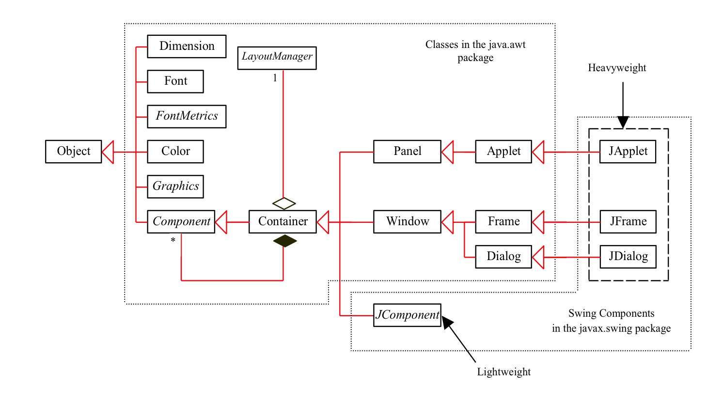
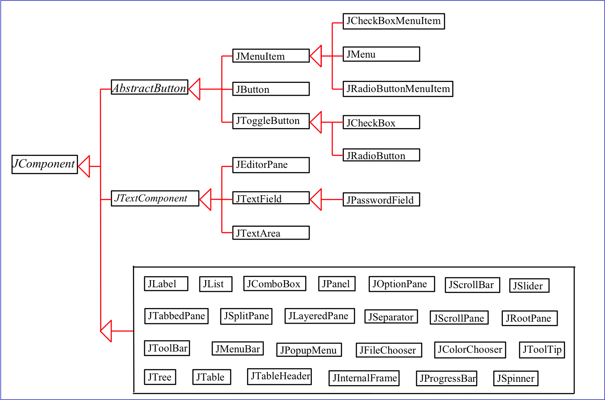
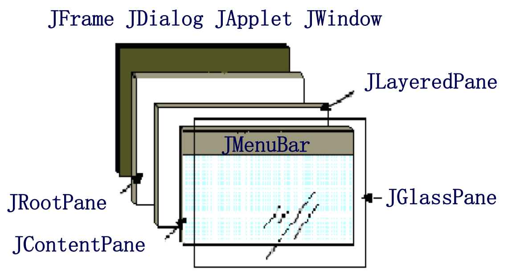
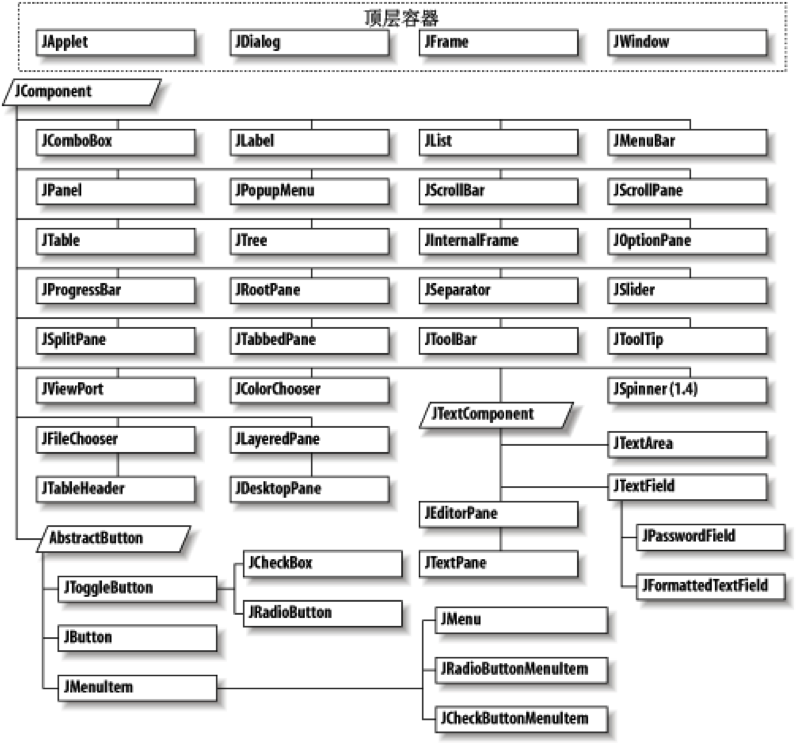
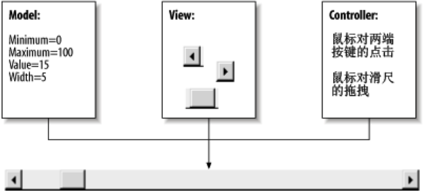
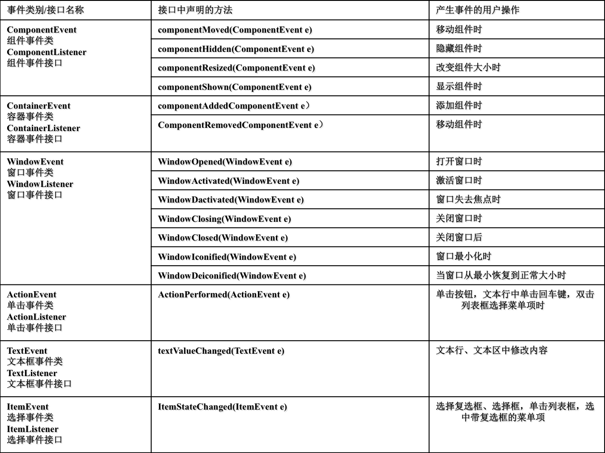

[TOC]

#GUI程序设计

Java图形用户界面由各种可视化组件构成，如窗口、文本框、下拉列表框、按钮等。

##GUI Class Hierarchy

###AWT
AWT（Abstract Window ToolKit，抽象窗口工具包）是最原始的Java GUI工具包，提供了一套与本地图形界面进行交互的接口。

- AWT包括一些基本的GUI组件、布局管理器和事件的工具包，可以用于构建图形化用户界面的Java应用程序
- AWT中的图形函数与操作系统所提供的图形函数之间有着一一对应的关系

###Swing

Swing是在AWT的基础上构建的一套新的图形界面系统，它提供了AWT所能够提供的所有功能，并且对AWT的功能进行了大幅度的扩充，提供了大量复杂的组件（例如表、树、进度条等）。

- Swing组件是用100%的Java代码来实现的，因此在一个平台上设计的树形控件可以在其他平台上使用
Swing是AWT的扩展。
- Swing使用了AWT的事件模型和支持类，例如Colors、Images和Graphics
- 一般情况下，建议使用Swing组件构建图形用户界面应用程序

在javax.swing包中，Swing组件都是AWT的Container类的直接子类或间接子类
Swing组件中定义了4种顶层容器（窗体）：JFrame、JApplet、JDialog和JWindow

####Swing中的类主要分为两类 

#####JComponent及其子类，称为Swing组件。

Swing组件分为两类：

－ 一类是Swing自带的基础Swing组件，包括如图所示的JComponent及其全部子类。
－ 另一类是自定义组件，程序员可以通过继承JComponent及其子类创建自定义的Swing组件。

Swing组件中有一部分组件具有图形外观能在图形界面上与用户进行交互，称为可视化组件，例如JButton、JLabel、JTextField等。

Swing组件中的另外一些组件没有图形外观，称为非可视化组件。非可视化组件通常需要与可视化组件相结合，共同完成特定的图形功能。

####顶层容器（container）。
所谓容器，是指该Swing类能够包含其他的容器或Swing组件。
顶层容器是容器中最顶层的，不能被其他容器所包含，但可以在其上放置其他的非顶层容器和Swing组件。
顶层容器包含JApplet、JDialog、JFrame和JWindow及其子类。
例如JFrame是描述窗体的顶层容器，在JFrame之上可以放置按键（JButton）、表格（JTable）、树形组件（JTree）等Swing组件，但不能在按键（JButton）之上放置JApplet或者JDialog及其子类。

除了顶层容器，Swing中JComponent及其子类都具有容器的能力，都能够包含其他的容器或者Swing组件，但其显示效果是有差异的。
例如JPanel（面板）是一种专用的轻量级容器类，在JPanel之上可以放置其他容器或者Swing组件，同时JPanel也可以被加入到其他的中间容器和顶层容器中，但JPanel不能包含顶层容器。
原则上JButton也具有容器的能力，可以在JButton上包含其他的Swing组件，但是否能将添加的Swing组件显示出来，则是不确定的 

容器(Container)也是一个类，实际上是Component的子类，因此容器本身也是一个组件，具有组件的所有性质，但是它的主要功能是容纳其它组件和容器。

1)容器可以简化图形化界面的设计，以整体结构来布置界面。

2)所有的容器都可以通过add()方法向容器中添加组件。

Swing容器层次结构

#####容器分类

－ 顶层容器窗体
JFrame; JWindow; JApplet;
对话框JDialog(JOptionPane)

－ 中间层容器
面板JPanel; 滚动窗格JScrollPane, JScrollBar; 拆分窗格JSplitPane; 索查标签窗格JTabbedPane
－ 特殊容器
内部窗体JInternalFrame; 分层窗格JLayeredPane; 根窗格JRootPane

#####MVC模式

Swing中的类在设计时采用了模型、视图、控制器（Model View Controller，MVC）模式作为每个组件的基本设计。
MVC模式是GUI程序设计中比较常见的一种设计方法，因此理解MVC模式不仅有利于学习Swing，更有助于设计GUI程序。
MVC模式将GUI组件拆分为模型、视图、控制器三个基本要素，每一个要素都对组件的表现起着至关重要的作用。

######模型(Model)

－ 包含每个组件的数据状态，不同类型的组件有不同的模型。
－ 什么是组件的数据状态呢？例如滚动条组件（JScrollBar）的数据状态就包含滚动条的当前位置、最大值、最小值以及滚动条的宽度等。这些数据信息就是滚动条组件的模型。

######视图(View)

－ 是组件在屏幕上的表现形式。
－ 由于Java是跨平台的语言，同一个组件在不同的平台上的显示是不相同的，在不同的外观风格下也是不相同的。为了让Java的GUI程序也应该做到“Write once，run anywhere”，Swing组件依据组件的模型和当前所处的显示环境进行组件绘制。

######控制器(Controller)

－ 控制组件如何与事件进行交互。
－ 事件的形式有多种，例如鼠标单击、获得或者失去焦点、键盘点击等。当这些事件发生时，控制器根据事件的类型，决定组件如何响应 

#####顶层容器类 

######框架窗口（Jframe）

窗口是最基本的用户界面元素。框架窗口是一种窗体，其中带有边框、标题栏及用于关闭和最大/最小化窗口的图标等。
在GUI的应用程序中，一般至少应使用一个框架窗口。
通常将框架窗口简称为窗口。

使用JFrame类显示一个简单的窗体 
~~~java
import javax.swing.JFrame;
public class JFrameDemo {
	public static void main(String[] args) {
                JFrame frame=new JFrame();	//JFrame实例化
                frame.setSize(300,300);		//设置窗体大小为300x300
	frame.setLocation(400, 400);	//设置窗体显示位置在(400,400)
	frame.setTitle(“JFrameDemo”);	//设置窗体标题为
              //设置关闭按键的默认操作
               frame.setDefaultCloseOperation(JFrame.EXIT_ON_CLOSE);	
	frame.setVisible(true);		//显示窗体
	}
}
~~~

使用继承方式创建窗体 

~~~java
import javax.swing.JFrame;
public class MyFrame extends JFrame {
	public MyFrame()
	{
		setSize(300,300);		//设置窗体大小为300x300
		setLocation(400, 400);	//设置窗体显示位置在(400,400)
		setTitle("MyFrame");	//设置窗体标题为MyFrame
                               //设置关闭按键的默认操作
		setDefaultCloseOperation(JFrame.EXIT_ON_CLOSE);	
	}
	public static void main(String[] args) {
		MyFrame myFrame=new MyFrame();	//MyFrame实例化
		myFrame.setVisible(true);		//显示窗体
	}
}
~~~

JFrame作为容器 

~~~java
import java.awt.FlowLayout;
import javax.swing.JButton;
import javax.swing.JFrame;
public class ButtonFrame extends JFrame{
	private JButton button=new JButton("按键");
	public ButtonFrame()
	{
		setSize(300,300);		
		setLocation(400, 400);	
		setTitle("ButtonFrame");	
		setDefaultCloseOperation(JFrame.EXIT_ON_CLOSE);
		setLayout(new FlowLayout());	//设置布局
		add(button);	//添加按键
	}
	public static void main(String[] args) {
		ButtonFrame frame=new ButtonFrame();	
		frame.setVisible(true);		
	}
}

~~~

######JDialog、JWindow和JApplet

- JDialog是创建对话框的顶层容器类。JDialog的使用方式以及其所包含的方法和属性与JFrame都有许多类似。但JDialog创建的对话框与JFrame创建的窗体在外观上是不同的，例如对话框没有最大化和最小化按键。在GUI编程时可以根据需要选择使用JDialog还是JFrame。 

- JWindow也可以创建一个窗体容器，但是JWindow创建的窗体没有标题栏，没有最大化、最小化按键。在某些GUI应用中，可能需要编写这种不带修饰的窗体，或者用户希望用自己编写的标题栏、最大化、最小化按键来替换Windows自带的窗体风格，此时就可以选择通过创建JWindow来实现这些窗体效果。JWindow的使用方式以及其所包含的方法和属性与JFrame也基本类似。

- Applet是一种能够嵌入到网页中执行的Java图形程序。JApplet是创建这种程序的顶层容器 。 

#####布局管理 

Swing提供了setLocation()，setSize()，setBounds() 等布局方法，但Swing的组件中存在一个默认的布局管理器，因此这些设置方法都会失效。如果需要设置组件大小或位置，则应取消该容器的布局管理器，方法为调用容器的setLayout方法，并将布局管理器设置为null。

相对于基于布局管理器的布局方式在对组件的大小和位置的控制上较为灵活，但这种布局方式会导致平台相关，在不同的平台上可能产生不同的显示效果。如果想让GUI程序以一致的外观在不同的平台上运行，则需要采用基于布局管理器的布局方式。 

######无布局管理器的布局 

~~~java
import java.awt.FlowLayout;
import javax.swing.JButton;
import javax.swing.JFrame;
import javax.swing.JLabel;
import javax.swing.JTextField;
public class AbsoluteLayoutDemo extends JFrame {
	private JButton button=new JButton("JButton");;
	private JTextField textField=new JTextField("JTextField ");
	public AbsoluteLayoutDemo()
	{
		setSize(300, 300);	
		setLocation(400, 400);		
		setDefaultCloseOperation(JFrame.EXIT_ON_CLOSE);
		//设置布局管理为null
		setLayout(null);
		
                             //设置按键的位置为(20,20)，宽100，高20
		button.setLocation(20, 20);
		button.setSize(100, 20);
		add(button);
		//设置输入框的位置为(20,50)，宽200，高100
		textField.setBounds(20,50,200,100);
		add(textField);
	}
	public static void main(String[] args) {
		AbsoluteLayoutFrame frame=new AbsoluteLayoutFrame();
		frame.setVisible(true);
	}
}~~~

######FlowLayout

容器采用FlowLayout布局其组件的放置规律是从左到右、从上到下进行放置，如果容器足够宽，第一个组件先添加到容器中第一行的最左边，后续的组件依次添加到上一个组件的右边，如果当前行已放置不下该组件，则放置到下一行的最左边。 当容器的大小发生变化时，用FlowLayout管理的组件会发生变化，其变化规律是：组件的大小不变，但是相对位置会发生变化。 

~~~java
import java.awt.FlowLayout;
import javax.swing.JButton;
import javax.swing.JFrame;
public class FlowLayoutDemo extends JFrame {
	private JButton button1 = new JButton("First Button");
	private JButton button2 = new JButton("Second Button");
	private JButton button3 = new JButton("Third Button");
	private JButton button4 = new JButton("Fourth Button");
	public FlowLayoutDemo() {
		setSize(300, 150);
		setLocation(400, 400);
		setDefaultCloseOperation(JFrame.EXIT_ON_CLOSE);
		//设置布局方式为FlowLayout
		setLayout(new FlowLayout());
				
                             //添加按键，注意设置布局方式之后任何对
                             / /组件进行设置的方法，例如setSize、
		//setLocation等都会失效
		add(button1);
		add(button2);
		add(button3);
		add(button4);
	}
	public static void main(String arg[]) {
		FlowLayoutDemo frame = new FlowLayoutDemo();
		frame.setVisible(true);
	}
}

~~~

######BorderLayout

BorderLayout布局管理器把容器分成5个区域：North，South，East，West和Center，每个区域只能放置一个组件。
如果使用了BorderLayout布局，当容器的大小发生变化，其变化规律为：组件的相对位置不变，大小发生变化。例如容器变高了，则North、South区域不变，West、Center、East区域变高；如果容器变宽了，West、East区域不变，North、Center、South区域变宽。不一定所有的区域都有组件，如果四周的区域（West、East、North、South区域）没有组件，则由Center区域去补充。 

~~~java
import java.awt.GridLayout;
import javax.swing.JButton;
import javax.swing.JFrame;
public class GridlayoutDemo extends JFrame {
	private JButton button1 = new JButton("First Button");
	private JButton button2 = new JButton("Second Button");
	private JButton button3 = new JButton("Third Button");
	private JButton button4 = new JButton("Fourth Button");
	public GridlayoutDemo() {
		setSize(300, 300);
		setLocation(400, 400);
		setDefaultCloseOperation(JFrame.EXIT_ON_CLOSE);
		
                          //设置布局方式为GridLayout,2行，2列
		setLayout(new GridLayout(2,2));
		//添加组件时不需要设置组件所在行、列
		add(button1);
		add(button2);
		add(button3);
		add(button4);
	}
	public static void main(String arg[]) {
		GridlayoutDemo frame = new GridlayoutDemo();
		frame.setVisible(true);
	}
}

~~~

######其他布局管理器

- CardLayout布局管理器能够帮助用户处理两个以至更多的成员共享同一显示空间，它把容器分成许多层，每层的显示空间占据整个容器的大小，但是每层只允许放置一个组件，当然每层都可以利用容器来实现复杂的用户界面。
- GridBagLayout生成的布局管理器与GridLayout一样是使用网格来进行布局管理的，所不同之处在于GridBagLayout可以通过类GridBagConstraints 来控制容器内各个组件的大小。
- SpringLayout是在JDK1.4中加入的布局管理器，该布局管理器功能强大，布局灵活，能够模拟其他布局管理器的布局。
- JDK1.6加入了GroupLayout。它是以Group(组)为单位来管理布局，也就是把多个组件(如：JLable、JButton)按区域划分到不同的Group(组),再根据各个Group(组)相对于水平轴(Horizontal)和垂直轴(Vertical)的排列方式来管理。

#####事件处理

- Swing采用了委托（delegation）事件模型，也叫授权事件模型来处理系统发生的各类事件。授权事件模型是JDK1.1开始采用的事件处理模型，而在JDK1.1之前Java采用的是层次（hierarchal）模型 。
- 在授权事件模型中，主要包含了三个对象：事件：发生在用户界面上的用户交互行为所产生的一种效果。事件源：产生事件的对象。事件监听器：接受事件并对其进行处理的对象。
- 组件作为事件源可以触发事件，一个事件源注册一个或多个事件监听器。当特定事件发生时，事件被委托到具体的事件监听器进行处理。 

######委托事件模型具有优点

- 事件对象只传给注册的监听器，不会意外地被其他组件或上层容器捕获和处理。
- 可以实现过滤器的功能，只监听和处理感兴趣的事件。
- 实现了将事件源和事件监听器分开处理的功能。

######编写事件处理程序

下面我们以JButton组件的单击事件为例，说明如何编写事件处理程序。

- 编写事件监听器
按键点击事件可以由实现了ActionListener接口的类进行处理。因此首先需要编写一个实现了ActionListener接口的类。
ActionListener接口中只有有唯一的方法：		                

>public void actionPerformed( ActionEvent e)

参数ActionEvent e是对应点击事件的对象。
通过调用该对象的方法可以获取事件的相关属性，例如调用getSource方法将返回事件发生的对象。程序员需要为该方法编写特定的事件处理代码。

- 为按键注册事件监听程序 
为JButton注册事件监听程序，需要调用JButton的addActionListener方法：

>public void addActionListener (ActionListener handler)

该方法能够接受一个实现了ActionListener接口的类。如果要对按键注册多个监听器，则需要编写多个事件监听器，并多次调用addActionListener方法，将每个监听器都注册到组件中。

~~~java
import java.awt.BorderLayout;
import java.awt.event.ActionEvent;
import java.awt.event.ActionListener;
import javax.swing.JButton;
import javax.swing.JFrame;
public class EventDemo extends JFrame{
	JButton button=new JButton("press me");
	public EventDemo() {
		setSize(300,300);		
		setLocation(400, 400);	
		setDefaultCloseOperation(JFrame.EXIT_ON_CLOSE);
		//设置按键事件，使用了匿名类
button.addActionListener(new ActionListener(){
//获取被点击的按键
public void actionPerformed(ActionEvent e) {			JButton clickedButton=(JButton) e.getSource();
	//改变被点击按键的标题
	clickedButton.setText("I have been pressed");
			}
		});
	setLayout(new BorderLayout());
	add(button,BorderLayout.NORTH);
	}
	public static void main(String[] args) {
		EventDemo frame=new EventDemo();
		frame.setVisible(true);
	}
}

~~~

#####事件类

在委托事件模型中，事件既是基础，又是联系各个部分的桥梁。首先，组件作为事件源产生事件，不同类型的组件会产生不同类型的事件。事件发生后，事件被传递给对应事件监听器中实现的事件处理方法，并且在事件中，包含着用户传递给系统的交互信息，如文本框中的输入内容等。不同类型的事件由不同的Java类来表示，基类是java.util.EventObject, 所有的事件都是从它继承而来的 。

######事件监听器

接收事件并对事件做出相应反映的对象称为事件监听器。java.awt.event包中按照不同的事件类型定义了多个监听器接口，每类事件都有对应的事件监听器接口，接口中定义了事件发生时可调用的方法。

######事件适配器

采用实现监听器接口的方法时，不管你是否对相关事件进行处理，都必须实现所有这些方法，比如，你实现了WindowListener接口，你可能只对处理窗口关闭的windowClosing方法感兴趣，但是你不得不实现其余六个方法。事件适配器就是为了解决这一问题的。

使用适配器，只须重写需要实现的方法，无关方法不用实现，这简化了程序代码。同监听器不同的是，监听器是一个接口，而适配器是一个类，要使用适配器，就必须继承对应的适配器类。

######键盘与鼠标事件

键盘事件和鼠标事件是GUI程序中最常见的两类事件。
与键盘事件相关的监听器是KeyListener，与鼠标事件相关的监听器包括：MouseListener、MouseMotionListener和MouseWheelListener。
为了处理相应的事件，需要调用相应的addXXXlistener方法，添加相应的事件监听器。

键盘和鼠标事件还有对应的适配器KeyAdapter和MouseAdapter。 

键盘事件处理

~~~java
import java.awt.BorderLayout;
import java.awt.event.KeyAdapter;
import java.awt.event.KeyEvent;
import javax.swing.JFrame;
import javax.swing.JLabel;
public class KeyEventDemo extends JFrame{
	JLabel label=new JLabel("按下了按键：");
	public KeyEventDemo() {
		setSize(300,300);		
		setLocation(400, 400);	
		setDefaultCloseOperation(JFrame.EXIT_ON_CLOSE);
this.addKeyListener(new KeyAdapter(){
	public void keyPressed(KeyEvent event) {
	              switch(event.getKeyCode())
		{
			case KeyEvent.VK_UP:
				label.setText("按下了按键：UP");
					break;

			case KeyEvent.VK_DOWN:
				label.setText("按下了按键：DOWN");
					break;
			case KeyEvent.VK_LEFT:
				label.setText("按下了按键：LEFT");
					break;
			case KeyEvent.VK_RIGHT:
				label.setText("按下了按键：RIGHT");
					break;
			default:
			label.setText("按下了按键："+event.getKeyChar());
		}
			}
		});
		setLayout(new BorderLayout());
		add(label,BorderLayout.CENTER);
	}
	}

~~~

鼠标事件处理

~~~java
import java.awt.BorderLayout;
import java.awt.event.MouseAdapter;
import java.awt.event.MouseEvent;
import java.awt.event.MouseWheelEvent;
import javax.swing.JFrame;
import javax.swing.JLabel;
public class MouseEventDemo extends JFrame{
	JLabel label=new JLabel("");
	public MouseEventDemo() {
	setSize(300,300);		
	setLocation(400, 400);	
	setDefaultCloseOperation(JFrame.EXIT_ON_CLOSE);
	this.addMouseListener(new MouseAdapter(){		
                     public void mouseClicked(MouseEvent event) 
                       {
	        label.setText("鼠标在"+event.getX()+","+event.getY()+"进行了点击");
	        }
		});
		
this.addMouseMotionListener(new MouseAdapter(){
    public void mouseMoved(MouseEvent event) {
		label.setText("鼠标移动到了"+event.getX()+","+event.getY());
			}
		});
 this.addMouseWheelListener(new MouseAdapter(){
	public void mouseWheelMoved(MouseWheelEvent event) {
		label.setText("鼠标滚轮进行了滚动");
			}
		});
	setLayout(new BorderLayout());
	add(label,BorderLayout.CENTER);
	}
public static void main(String[] args) {
		MouseEventDemo frame=new MouseEventDemo();
		frame.setVisible(true);
	}
}

~~~

---

本文档 Github ：
https://github.com/bushehui/Java_tutorial

